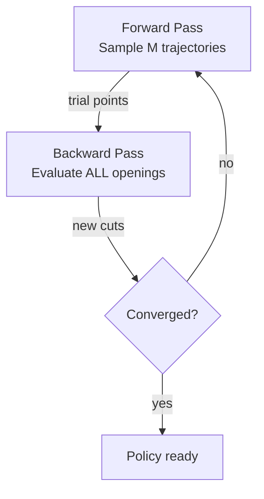

# Cobre Documentation Diagram Pipeline

Production guide for generating branded diagrams across four tools.

---

## 1. Tool → diagram type mapping

| Diagram type                         | Tool                  | Output             | Example diagrams                                                              |
| ------------------------------------ | --------------------- | ------------------ | ----------------------------------------------------------------------------- |
| Power system one-line diagrams       | Excalidraw (tablet)   | SVG                | D-04 system overview                                                          |
| Flowcharts, architecture, data flow  | Mermaid (in-markdown) | Client-side render | D-01 iteration cycle, D-05 execution phases, D-07 HPC, D-18 validation layers |
| Mathematical plots, convex functions | matplotlib (Python)   | SVG or PNG         | D-02 value function, D-21 convergence, D-22 CVaR                              |
| Animated math explanations           | Manim (Python)        | GIF or WebM        | Forward/backward pass walkthrough, convergence animation                      |

---

## 2. Mermaid in mdBook

### Installation

Already done in this repo. For reference, the steps were:

```bash
cargo install mdbook-mermaid
mdbook-mermaid install .
```

`mdbook-mermaid install` drops `mermaid.min.js` + `mermaid-init.js` at the repo root (where `book.toml` lives) and appends a `[preprocessor.mermaid]` block to `book.toml`. mdBook resolves `additional-js` paths relative to the repo root — **do not move these files into `src/`**.

### Brand theming

The generated `mermaid-init.js` at the repo root has been replaced with the branded version (originally staged at `pipeline/mermaid-init.js`). It applies:

- `theme: "base"` with full `themeVariables` override
- Midnight background, copper borders, body-colored text
- IBM Plex Sans font
- Copper/blue/patina/amber as the node color progression

### book.toml addition

```toml
[preprocessor.mermaid]
command = "mdbook-mermaid"

[output.html]
additional-js = ["mermaid.min.js", "mermaid-init.js"]
# Append to existing additional-css/additional-js lists
```

### Usage in markdown

````markdown

````

### Mermaid conventions for Cobre

- **Node shapes**: `["text"]` for process boxes, `{"text"}` for decisions, `(["text"])` for stadiums (start/end)
- **Subgraphs** for grouping (use for MPI ranks, NUMA domains)
- **Direction**: `TB` (top-bottom) for pipelines, `LR` (left-right) for timelines
- **Styling individual nodes**: Use `style` directives with brand colors when default theme isn't enough:


### Limitations to accept

- Layout will occasionally reorganize when you add nodes. Live with it or add invisible edges to constrain.
- No nested containers that render well. Use subgraphs, but don't nest more than 2 levels.
- For diagrams where layout precision matters (the HPC NUMA diagram, the one-line power system), use Excalidraw instead.

---

## 3. matplotlib for mathematical diagrams

### Setup

```bash
pip install matplotlib numpy
# Install IBM Plex Sans system-wide or via matplotlib font manager
```

Layout in this repo:

```
diagrams/matplotlib/
├── cobre_brand.py          # Brand constants module (COLORS, GEN_COLORS, FONTS)
├── cobre_manim.py          # Manim base scene + colors (optional manim group)
├── cobre.mplstyle          # Light style sheet
├── cobre-dark.mplstyle     # Dark style sheet (for coal theme)
├── d02_value_function.py   # One script per diagram
└── Makefile                # Renders every d*.py through `uv run`
```

Script filenames use `_` (Python convention); output asset names use `-`
(web convention). Each script derives its output from `__file__.stem.replace("_", "-")`,
so `d02_value_function.py` writes `src/images/d02-value-function.svg`.

Scripts emit SVG only. mdBook serves the SVG directly; PNG fallbacks aren't
needed for a web target and just double the review surface.

### Usage pattern

Every diagram script follows this structure:

```python
#!/usr/bin/env python3
"""D-02: Value function approximation via Benders cuts."""

import numpy as np
import matplotlib.pyplot as plt
from pathlib import Path
from cobre_brand import COLORS, apply_cobre_style

# Apply brand style (use dark=True for coal-themed mdBook)
apply_cobre_style(dark=False)

# --- Mathematical content (correct by construction) ---
v = np.linspace(0, 100, 500)
Q = 0.005 * (v - 50) ** 2 + 5  # convex parabola, minimum at v=50

# Trial points ON the curve
trials = [25, 75]
trial_Q = [0.005 * (t - 50) ** 2 + 5 for t in trials]


# Tangent lines (computed from derivative, not guessed)
def tangent(v0, v_range):
    dQ = 0.01 * (v0 - 50)  # derivative of Q at v0
    Q0 = 0.005 * (v0 - 50) ** 2 + 5
    return Q0 + dQ * (v_range - v0)


fig, (ax1, ax2) = plt.subplots(1, 2, figsize=(12, 5), sharey=True)

for ax, title, n_cuts in [
    (ax1, "Iteration k — 2 cuts", 2),
    (ax2, "Iteration k+1 — 3 cuts", 3),
]:
    # True Q
    ax.plot(
        v, Q, color=COLORS.DARK_TEXT, linewidth=2.5, label="$Q(v)$", zorder=5
    )

    # Tangent cuts
    active_trials = trials[:n_cuts]
    if n_cuts == 3:
        active_trials = trials + [48]  # near-minimum trial point

    for i, t in enumerate(active_trials):
        tang = tangent(t, v)
        alpha = 0.4 if (n_cuts == 3 and i < 2) else 0.8
        ax.plot(
            v,
            tang,
            color=COLORS.SIGNAL_RED,
            linewidth=1,
            linestyle="--",
            alpha=alpha,
            zorder=3,
        )
        # Trial point dot ON the curve
        Q_t = 0.005 * (t - 50) ** 2 + 5
        color = (
            COLORS.COPPER if i == n_cuts - 1 and n_cuts == 3 else COLORS.PATINA
        )
        ax.plot(t, Q_t, "o", color=color, markersize=7, zorder=6)

    # Outer approximation (piecewise max of tangents)
    outer = np.full_like(v, -np.inf)
    for t in active_trials:
        outer = np.maximum(outer, tangent(t, v))

    approx_color = COLORS.FLOW_BLUE if n_cuts == 2 else COLORS.PATINA
    ax.plot(
        v,
        outer,
        color=approx_color,
        linewidth=2,
        label="outer approx",
        zorder=4,
    )

    # Shade gap
    mask = Q > outer
    ax.fill_between(
        v, outer, Q, where=mask, alpha=0.08, color=approx_color, zorder=2
    )

    ax.set_title(title, fontsize=13, fontweight=600)
    ax.set_xlabel("storage $v$")
    ax.set_xlim(0, 100)
    ax.set_ylim(0, 20)
    ax.legend(loc="upper right", fontsize=9)

ax1.set_ylabel("cost-to-go $Q(v)$")

fig.suptitle(
    "Value function approximation via Benders cuts",
    fontsize=15,
    fontweight=600,
    y=1.02,
)
fig.tight_layout()

# Output name is derived from the script's stem (underscores → hyphens).
out = Path(__file__).resolve().parents[2] / "src" / "images"
stem = Path(__file__).stem.replace("_", "-")
fig.savefig(out / f"{stem}.svg", format="svg")
print(f"Saved {stem}.svg to {out}")
```

### Key principle

**The math IS the diagram.** The derivative `dQ = 0.01 * (v0 - 50)` computes the tangent slope from the function definition. If `Q` is convex, the tangent lines automatically lie below `Q`. If the trial point is on the curve, `ax.plot(t, Q_t)` is on the curve by definition. No guessing, no pixel estimation.

### Makefile

See `diagrams/matplotlib/Makefile`. Invoke from the repo root:

```bash
make diagrams       # render every d*.py
make -C diagrams/matplotlib d02_value_function.py   # render one
make clean          # remove generated d-*.svg
```

The Makefile uses `uv run python3` so the project venv is picked up regardless
of which shell has which venv activated.

### Dark vs light

- Use `apply_cobre_style(dark=False)` for **white-background SVGs**. These look clean inside the coal-themed mdBook because the `` tag renders on its own background.
- Use `apply_cobre_style(dark=True)` if you want the plot background to match the page. This looks seamless but requires the image to always be viewed on the coal theme.

Recommendation: **use light style** for all matplotlib diagrams. It's safer across themes and looks professional in isolation (PDF exports, presentations, papers).

---

## 4. Manim for animated math

### Installation

```bash
pip install manim
# Manim requires: cairo, pango, ffmpeg (brew install on macOS)
# IBM Plex Sans must be installed system-wide for Manim to find it
```

### Usage pattern

```python
#!/usr/bin/env python3
"""Animated value function approximation — Benders cuts accumulating."""

from manim import *
from cobre_manim import CobreScene, C
import numpy as np


class ValueFunctionAnimation(CobreScene):
    def construct(self):
        title = self.cobre_title("Value Function Approximation")
        self.play(Write(title))
        self.wait(0.5)
        self.play(title.animate.to_edge(UP, buff=0.3).scale(0.7))

        # Axes
        axes = self.cobre_axes(
            x_range=[0, 100, 20],
            y_range=[0, 20, 5],
            x_length=9,
            y_length=4.5,
        ).shift(DOWN * 0.3)
        x_label = axes.get_x_axis_label("v", direction=RIGHT)
        y_label = axes.get_y_axis_label("Q(v)", direction=UP)

        self.play(Create(axes), Write(x_label), Write(y_label))

        # True Q (convex)
        Q_graph = axes.plot(
            lambda v: 0.005 * (v - 50) ** 2 + 5,
            x_range=[5, 95],
            color=C.BRIGHT,
            stroke_width=3,
        )
        Q_label = self.cobre_label("Q(v)").next_to(Q_graph, UR, buff=0.1)
        self.play(Create(Q_graph), Write(Q_label))
        self.wait(1)

        # Iteratively add cuts
        trial_points = [25, 75, 48, 60, 35]
        for i, t in enumerate(trial_points):
            Q_t = 0.005 * (t - 50) ** 2 + 5
            dQ = 0.01 * (t - 50)

            # Trial point dot
            dot = Dot(axes.c2p(t, Q_t), color=C.COPPER, radius=0.08)
            self.play(FadeIn(dot, scale=1.5), run_time=0.5)

            # Tangent line
            tangent = axes.plot(
                lambda v, t=t, Q_t=Q_t, dQ=dQ: Q_t + dQ * (v - t),
                x_range=[5, 95],
                color=C.SIGNAL_RED,
                stroke_width=1.5,
                stroke_opacity=0.6,
            )
            tangent.set_stroke(dash_length=0.15)
            self.play(Create(tangent), run_time=0.8)
            self.wait(0.3)

        self.wait(2)


# Render:
# manim render d02_animated.py ValueFunctionAnimation -qh --format=gif
# Output goes to media/videos/d02_animated/1080p30/ValueFunctionAnimation.gif
```

### Output formats for mdBook

- **GIF**: `manim render file.py Scene -ql --format=gif` — embeddable in mdBook via `` tag, autoplay, no video player needed. Use `-ql` (480p) or `-qm` (720p) for reasonable file sizes.
- **WebM**: `manim render file.py Scene -qh --format=webm` — smaller file, better quality, but needs `<video>` tag in mdBook.
- **Static SVG frame**: `manim render file.py Scene -s --format=svg` — single frame, no animation. Good for extracting a specific state of the animation as a static diagram.

### mdBook embedding

For GIF:

```markdown

```

For video (requires raw HTML in markdown):

```html
<video autoplay loop muted playsinline width="100%">
  <source src="../../images/d02-value-function.webm" type="video/webm" />
</video>
```

---

## 5. Excalidraw for human-designed diagrams

### When to use

- Power system one-line diagrams (bus bars, generators, reservoir cross-sections)
- Any diagram where spatial layout communicates meaning
- Diagrams with domain-specific symbols not available in Mermaid

### Workflow

1. Open Excalidraw (app or VS Code extension)
2. Load the Cobre color palette (see `excalidraw/design-system.md`)
3. Draw using grid snap (20px) for alignment
4. Build symbols from the library spec (bus bars, generators, etc.)
5. Export as SVG with white background
6. Place SVG in `src/images/`, source `.excalidraw` in `diagrams/excalidraw/`

### Tablet workflow

With an iPad or Android tablet:

1. Use excalidraw.com in the browser (works with Apple Pencil / stylus)
2. Set stroke style to "sharp" for final diagrams
3. Save the `.excalidraw` file (auto-saved to browser storage)
4. Export SVG and transfer to repo

### Key rules

- **Grid snap ON** — always. Misaligned elements look amateur.
- **IBM Plex Sans** for text (install on device or use Excalidraw's sans-serif fallback)
- **Consistent stroke widths**: 1.5px for connectors, 2px for bus bars, 1px for dashed lines
- **Color from palette only** — no ad-hoc colors
- **Minimum 12px font size** — anything smaller is illegible on mobile

---

## 6. File organization in the repo

```
cobre-docs/
├── book.toml                     # mdBook config (with mermaid preprocessor)
├── Makefile                      # Top-level convenience targets
├── pyproject.toml                # uv-managed Python deps (matplotlib + optional manim)
├── uv.lock
├── mermaid-init.js               # Branded mermaid config (at repo root — see §2)
├── mermaid.min.js                # Mermaid library (auto-generated)
├── src/
│   ├── images/                   # ALL rendered outputs go here
│   │   ├── d02-value-function.svg    # matplotlib output
│   │   ├── d04-system-overview.svg   # excalidraw export
│   │   └── ...
│   └── specs/
│       └── math/
│           └── sddp-algorithm.md     # References images + contains mermaid blocks
├── diagrams/
│   ├── README.md                 # This file
│   ├── excalidraw/               # Source .excalidraw files
│   │   ├── design-system.md
│   │   ├── d04-system-overview.excalidraw
│   │   └── ...
│   └── matplotlib/               # Python scripts + brand module
│       ├── cobre_brand.py
│       ├── cobre_manim.py
│       ├── cobre.mplstyle
│       ├── cobre-dark.mplstyle
│       ├── d02_value_function.py
│       └── Makefile
└── theme/
    └── css/
        └── custom.css            # Existing brand CSS
```

### Mermaid diagrams live inline

Mermaid diagrams don't have separate source files — they're fenced code blocks
inside the markdown. The mermaid preprocessor renders them at build time (client-side).

### matplotlib diagrams have a build step

```bash
make diagrams       # from repo root; renders every d*.py via uv run
# Outputs land in src/images/
```

**CI does NOT re-render** (D2 policy). SVGs + PNGs are committed alongside the
script that produced them. If a script changes, render locally and commit the
refreshed outputs in the same PR — reviewers see the visual diff directly.

### Excalidraw diagrams are manually exported

No build step. You export SVG from Excalidraw and commit it.
The `.excalidraw` source file is committed for future editing.

---

## 7. Diagram authoring decision tree

```
Need a new diagram?
│
├── Is it a mathematical function, plot, or distribution?
│   └── YES → matplotlib script (correct by construction)
│       └── Need animation? → Manim scene → export GIF
│
├── Is it a flowchart, state machine, pipeline, or data flow?
│   └── YES → Mermaid inline block
│       └── Does layout precision matter a lot?
│           └── YES → Excalidraw instead
│
├── Is it a power system one-line diagram or spatial layout?
│   └── YES → Excalidraw (tablet)
│
└── None of the above → Think harder about whether you need a diagram.
    Prose with a well-structured table might communicate better.
```
