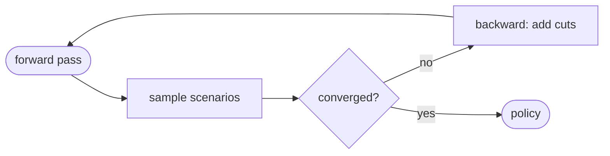

import ValueFunctionPlot from "../../components/ValueFunctionPlot.astro";

Methodology reference for the Cobre SDDP-based hydrothermal dispatch ecosystem.

## Math renderer check

This page exercises the D4 math pipeline (manual `remark-math` +
`rehype-katex`). Inline math such as $x^2$ renders alongside text, while
display math is centred on its own line:

$$
\sum_{i=1}^N x_i
$$

The risk-aversion weight $\bar{\alpha}$ uses a `\command`-in-brace construct —
the exact LaTeX shape that broke the `starlight-versions` acorn parser, here
proving `rehype-katex` handles real LaTeX at build time:

$$
\bar{\alpha}
$$

## Diagram renderer check

This page also exercises both diagram toolchains so the build proves them.

`astro-mermaid` renders the inline-in-prose flow below; `autoTheme: true` makes
it follow Starlight's light/dark toggle:



`astro-d2` renders the committed conceptual diagram below to inline SVG with the
ELK layout. The `.d2-svg` keystone CSS re-keys d2's palette classes
(`fill-N*` / `stroke-*`) to `:root[data-theme]`, so the figure flips with the
manual theme toggle rather than only the OS preference:

```d2
direction: right

hydro: Hydro plant
thermal: Thermal plant
bus: System bus {shape: hexagon}
demand: Demand
deficit: Deficit slack {style.stroke-dash: 4}

hydro -> bus: generation
thermal -> bus: generation
bus -> demand: supply
deficit -> bus: shortfall
```

## Compute-plot harness check

This page also exercises the tested-compute Observable Plot harness — the
canonical pattern for every math figure. The curve and Benders tangents below
are derived from the unit-tested `figures/valueFunction.ts` compute module
(slope == analytic derivative) and rendered by an Observable Plot island that
reads the `--dgm-*` palette CSS vars and re-renders on the theme toggle:

<ValueFunctionPlot />
