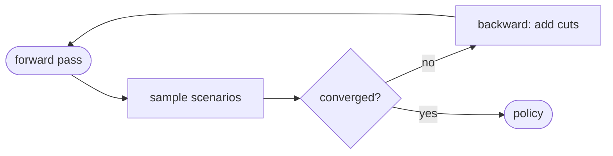

import ValueFunctionPlot from "../../components/ValueFunctionPlot.astro";

This page proves four claims at once. **Toggle the theme** (top-right) and watch
every figure follow — none of them are baked to a single theme.

## 1. Heavy KaTeX (Tier 1, build-time)

A representative dense block lifted from the corpus — sums, fractions, nested
`\sqrt`, inner products, expectation/CVaR, cases:

$$
\mathcal{Q}_t(x_{t-1}, \xi_t) \;=\; \min_{x_t \in \mathcal{X}_t}\;
c_t^\top x_t \;+\; (1-\lambda)\,\mathbb{E}\!\left[\mathcal{Q}_{t+1}\right]
\;+\; \lambda\,\mathrm{CVaR}_{\alpha}\!\left[\mathcal{Q}_{t+1}\right]
$$

$$
\theta_{t+1} \;\ge\; \bar{\mathcal{Q}}^{(k)} \;+\;
\bigl\langle \pi^{(k)},\, x_t - x_t^{(k)} \bigr\rangle,
\qquad k = 1,\dots,K
$$

$$
\sigma_m \;=\; \sqrt{\frac{1}{N-1}\sum_{i=1}^{N}\bigl(\varepsilon_i - \bar{\varepsilon}\bigr)^2},
\qquad
\rho_{\mathrm{eq}} \;=\;
\begin{cases}
\dfrac{\sum_t \gamma_V\, v_t}{\sqrt{\sum_t v_t^2}} & \text{computed FPHA} \\[1.2em]
0 & \text{run-of-river}
\end{cases}
$$

Inline math flows too: the cut subgradient $\pi^{(k)} = \partial \mathcal{Q}_{t+1}(x_t^{(k)})$
is unscaled by dividing by $\mathrm{col\_scale}[j]$.

## 2. Inline `currentColor` / CSS-var SVG (Tier 1, the crux)

This SVG is **authored once**. Its fills are `var(--dgm-*)`, its strokes are
`currentColor` — so the page theme drives it. No light/dark variants, no
re-render, no JS.

<svg class="dgm-svg" viewBox="0 0 420 120" width="420" xmlns="http://www.w3.org/2000/svg">
  <rect x="10" y="35" width="150" height="50" rx="6"
        fill="var(--dgm-storage)" fill-opacity="0.18"
        stroke="var(--dgm-storage)" stroke-width="2" />
  <text x="85" y="65" text-anchor="middle" fill="var(--dgm-text)"
        font-family="system-ui" font-size="14">parquet (on-disk)</text>

  <rect x="260" y="35" width="150" height="50" rx="6"
        fill="var(--dgm-runtime)" fill-opacity="0.18"
        stroke="var(--dgm-runtime)" stroke-width="2" />
  <text x="335" y="65" text-anchor="middle" fill="var(--dgm-text)"
        font-family="system-ui" font-size="14">in-memory state</text>

  <line x1="160" y1="60" x2="255" y2="60" stroke="currentColor" stroke-width="2"
        marker-end="url(#arrow)" />
  <text x="207" y="50" text-anchor="middle" fill="var(--dgm-text)"
        font-family="system-ui" font-size="11" font-style="italic">load</text>

  <defs>
    <marker id="arrow" markerWidth="9" markerHeight="9" refX="7" refY="3"
            orient="auto" markerUnits="strokeWidth">
      <path d="M0,0 L7,3 L0,6 Z" fill="currentColor" />
    </marker>
  </defs>
</svg>

## 3. Mermaid with `autoTheme` (Tier 1)



## 4. Observable Plot from a tested compute module (Tier 2)

The curve, the three Benders tangents, and the pin markers are all **computed**
by `src/figures/valueFunction.ts` (unit-tested: tangent slope = analytic
derivative, cut underestimates convex Q). The renderer reads the palette from
CSS vars and re-renders on theme toggle.

<ValueFunctionPlot />

## 5. D2 conceptual diagram (`astro-d2`)

A power-system one-line — D2's sweet spot (containers, topology, clean layout).
This tests whether the D2-generated SVG follows Starlight's **manual** theme
toggle, or only the OS `prefers-color-scheme`.

```d2
direction: right

hydro: Hydro plant
thermal: Thermal plant
bus: System bus {shape: hexagon}
demand: Demand
deficit: Deficit slack {style.stroke-dash: 4}

hydro -> bus: generation
thermal -> bus: generation
bus -> demand: supply
deficit -> bus: shortfall
```
