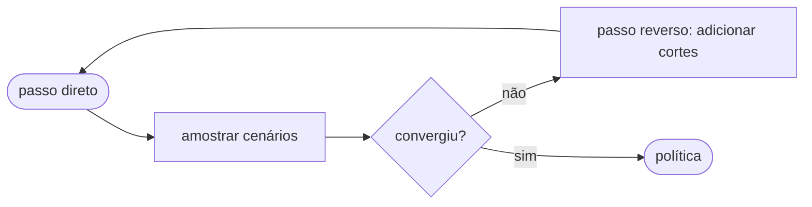

import ValueFunctionPlot from "../../../components/ValueFunctionPlot.astro";

Esta página prova quatro afirmações de uma vez. **Alterne o tema** (canto
superior direito) e veja cada figura acompanhar — nenhuma está fixada a um
único tema. _(Versão em português — demonstra o roteamento i18n do Starlight.)_

## 1. KaTeX pesado (Nível 1, em tempo de build)

Um bloco denso representativo extraído do corpus — somatórios, frações, `\sqrt`
aninhada, produtos internos, esperança/CVaR, casos:

$$
\mathcal{Q}_t(x_{t-1}, \xi_t) \;=\; \min_{x_t \in \mathcal{X}_t}\;
c_t^\top x_t \;+\; (1-\lambda)\,\mathbb{E}\!\left[\mathcal{Q}_{t+1}\right]
\;+\; \lambda\,\mathrm{CVaR}_{\alpha}\!\left[\mathcal{Q}_{t+1}\right]
$$

$$
\sigma_m \;=\; \sqrt{\frac{1}{N-1}\sum_{i=1}^{N}\bigl(\varepsilon_i - \bar{\varepsilon}\bigr)^2}
$$

## 2. SVG embutido com `currentColor` / variável CSS (Nível 1, o ponto-chave)

Este SVG é **escrito uma única vez**. Seus preenchimentos são `var(--dgm-*)`, seus
traços são `currentColor` — então o tema da página o controla. Sem variantes
claro/escuro, sem re-renderização, sem JS.

<svg class="dgm-svg" viewBox="0 0 420 120" width="420" xmlns="http://www.w3.org/2000/svg">
  <rect x="10" y="35" width="150" height="50" rx="6"
        fill="var(--dgm-storage)" fill-opacity="0.18"
        stroke="var(--dgm-storage)" stroke-width="2" />
  <text x="85" y="65" text-anchor="middle" fill="var(--dgm-text)"
        font-family="system-ui" font-size="14">parquet (em disco)</text>

  <rect x="260" y="35" width="150" height="50" rx="6"
        fill="var(--dgm-runtime)" fill-opacity="0.18"
        stroke="var(--dgm-runtime)" stroke-width="2" />
  <text x="335" y="65" text-anchor="middle" fill="var(--dgm-text)"
        font-family="system-ui" font-size="14">estado em memória</text>

  <line x1="160" y1="60" x2="255" y2="60" stroke="currentColor" stroke-width="2"
        marker-end="url(#arrow-pt)" />
  <text x="207" y="50" text-anchor="middle" fill="var(--dgm-text)"
        font-family="system-ui" font-size="11" font-style="italic">carregar</text>

  <defs>
    <marker id="arrow-pt" markerWidth="9" markerHeight="9" refX="7" refY="3"
            orient="auto" markerUnits="strokeWidth">
      <path d="M0,0 L7,3 L0,6 Z" fill="currentColor" />
    </marker>
  </defs>
</svg>

## 3. Mermaid com `autoTheme` (Nível 1)



## 4. Observable Plot a partir de um módulo de cálculo testado (Nível 2)

A curva, as três tangentes de Benders e os marcadores dos pinos são todos
**calculados** por `src/figures/valueFunction.ts` (com testes unitários). O
renderizador lê a paleta das variáveis CSS e re-renderiza ao alternar o tema.

<ValueFunctionPlot />

## 5. Diagrama conceitual D2 (`astro-d2`)

Um diagrama unifilar de sistema de potência — o forte do D2 (contêineres,
topologia, layout limpo).

```d2
direction: right

hydro: Usina hidrelétrica
thermal: Usina térmica
bus: Barramento {shape: hexagon}
demand: Demanda
deficit: Déficit {style.stroke-dash: 4}

hydro -> bus: geração
thermal -> bus: geração
bus -> demand: suprimento
deficit -> bus: falta
```
