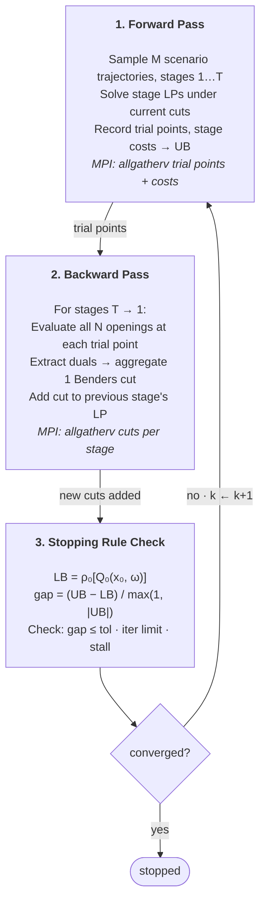

import ValueFunctionPlot from "../../../components/ValueFunctionPlot.astro";

## Purpose

This spec describes the Stochastic Dual Dynamic Programming (SDDP) algorithm as implemented in Cobre: the multistage stochastic formulation, the iterative forward/backward pass structure, convergence monitoring, policy graph topologies, state variable requirements, and the single-cut formulation. It serves as the algorithmic foundation referenced by all other mathematical specs.

For notation conventions (index sets, parameters, decision variables, dual variables), see [Notation Conventions](/overview/notation-conventions).

## 1. Problem Context

Cobre solves the **hydrothermal dispatch problem**: determining optimal generation schedules for hydro and thermal plants over a multi-year planning horizon under inflow uncertainty. Key characteristics:

- **Flexible for short or long horizons**: 1 month - 5 years (daily, weekly or monthly stages)
- **Large state space**: 160+ hydro reservoirs with AR inflow models $\approx$ 2000 state dimensions
- **Stochastic inflows**: PAR(p) autoregressive models with seasonal patterns
- **Customize modeling complexity stagewise**: Scenario generation, hydro production and others are configurable stagewise and elementwise

## 2. Multistage Stochastic Programming Formulation

The hydrothermal dispatch problem is formulated as a multistage stochastic program:

$$
\min_{x_1, \ldots, x_T} \mathbb{E}\left[ \sum_{t=1}^{T} c_t(\omega_t)^\top x_t(\omega_{t}) \right]
$$

subject to stage-linking constraints and uncertainty realization. The nested formulation uses **value functions**:

$$
V_t(x_{t-1}) = \mathbb{E}_{\omega_t}\left[ \min_{x_t} \left\{ c_t^\top x_t + V_{t+1}(x_t) : A_t x_t = b_t - E_t x_{t-1}, \; x_t \in \mathcal{X}_t \right\} \right]
$$

with terminal condition $V_{T+1}(x) = 0$.

**Key insight**: The value function $V_t(x)$ is convex and piecewise linear (for LP subproblems), enabling outer approximation via Benders cuts.

<ValueFunctionPlot />

_Value function approximation via Benders cuts — each cut is a tangent at a trial point (its slope is the analytic derivative $Q'(v)$), tightening the outer approximation toward the true convex cost-to-go function._

## 3. The SDDP Algorithm

SDDP iteratively builds piecewise-linear approximations $\hat{V}_t^k$ at iteration $k$ of the true value functions through:

1. **Forward pass**: Sample scenarios, make decisions using current approximation
2. **Backward pass**: Compute cuts to improve the approximation
3. **Convergence check**: Evaluate stopping criteria



### 3.1 Forward Pass

The forward pass simulates the system under the current policy to generate **trial points** — the visited states that will be used by the backward pass to construct cuts.

For each of $M$ independent scenario trajectories:

1. Start from the known initial state $x_0$ (initial storage volumes and inflow history)
2. At each stage $t = 1, \ldots, T$, sample a scenario realization $\omega_t$ from the stage's scenario set, then solve the stage LP using the incoming state $\hat{x}_{t-1}$ and the sampled scenario. The LP includes all current Benders cuts as constraints on the future cost variable $\theta$
3. Record the optimal state $\hat{x}_t$ (end-of-stage storage volumes and updated AR lags) as the trial point for stage $t$
4. Pass $\hat{x}_t$ as the incoming state to stage $t+1$

:::note[Scenario sampling]
"Sample a scenario realization $\omega_t$" is controlled by the **forward sampling scheme** — a configurable abstraction that determines the forward pass noise source. The default scheme (`InSample`) draws a random index $j \in \{0, \ldots, N_{\text{openings}}-1\}$ from the **fixed opening tree** — a set of pre-generated noise vectors generated once before training begins. Alternative schemes (`External`, `Historical`) draw from user-provided data instead. See [Scenario Generation](/math/scenario-generation) for the sampling scheme abstraction.
:::

The forward pass produces: (a) trial points $\{\hat{x}_t\}$ at each stage for each trajectory, and (b) stage costs for upper bound estimation.

**Parallelization**: Forward trajectories are independent — Cobre distributes $M$ trajectories across MPI ranks, with threads solving individual stage LPs within each rank.

**Warm-starting**: The forward pass LP solution at stage $t$ provides a near-optimal basis for the backward pass solves at the same stage, significantly reducing solve times.

### 3.2 Backward Pass

The backward pass improves the value function approximation by generating new Benders cuts, walking stages in reverse order from $T$ down to $1$.

At each stage $t$, for each trial point $\hat{x}_{t-1}$ collected during the forward pass:

1. Solve the stage $t$ LP for **every** scenario $\omega \in \Omega_t$ (branching), using the trial state $\hat{x}_{t-1}$ as incoming state
2. From each LP solution, extract the optimal objective value $Q_t(\hat{x}_{t-1}, \omega)$ and the **reduced costs** of the pinned incoming-state columns (incoming storage and AR lags). These reduced costs give the cut coefficients directly — no combination with FPHA or generic constraint duals is needed. See [Cut Management](/math/cut-management)
3. Compute per-scenario cut coefficients $(\alpha(\omega), \pi(\omega))$ from the duals and trial point
4. Aggregate into a single cut via probability-weighted expectation — see [Cut Management](/math/cut-management)
5. Add the aggregated cut to stage $t-1$'s cut pool

:::note[Backward branching]
"Every scenario $\omega \in \Omega_t$" refers to all $N_{\text{openings}}$ noise vectors in the **fixed opening tree** for stage $t$. This is the **Complete** backward sampling scheme — the backward pass evaluates ALL openings (the same set across all iterations), regardless of the forward pass noise source. An alternative variant would sample $n$ openings instead of the full tree; the Complete scheme is the production default because it guarantees that cut coefficients average over the full scenario distribution at each stage. The aggregation probabilities $p(\omega)$ in [Cut Management](/math/cut-management) are uniform over these openings ($p(\omega) = 1/N_{\text{openings}}$). See [Scenario Generation](/math/scenario-generation).
:::

The backward pass produces one new cut per stage per trial point per iteration.

:::note[Feasibility]
Every backward LP solve must be feasible. This is guaranteed by the recourse slack system (Category 1 penalties) — see [Penalty System](/math/penalty-system). The relatively complete recourse property ensures valid cuts; see [Cut Management](/math/cut-management).
:::

:::note[Discount factor]
When discount rates are active, the discount factor is applied to the $\theta$ variable in the stage $t-1$ objective (i.e., $d_{t-1 \to t} \cdot \theta$), not to the cut coefficients. The cuts themselves remain unmodified. See [Discount Rate](/math/discount-rate).
:::

Scenario tree — the forward pass samples M sparse paths through the branching
tree, while the backward pass evaluates all N openings at each trial point and
aggregates them into one Benders cut. The sparse-forward / exhaustive-backward
asymmetry is why SDDP converges where full-tree evaluation is infeasible.

```d2
forward: "Forward pass — sparse sampling (M = 2 paths)" {
  direction: right
  x0: "x₀  root"
  n1: "t=2"
  n2: "t=2"
  n3: "t=2"
  a1: "t=3"
  a2: "t=3"
  a3: "t=3"
  b1: "t=3"
  b2: "t=3"
  b3: "t=3"
  c1: "t=3"
  c2: "t=3"
  c3: "t=3"

  x0 -> n1: "path A" {style.stroke-width: 3}
  x0 -> n2
  x0 -> n3: "path B" {style.stroke-width: 3}
  n1 -> a1
  n1 -> a2: "sampled" {style.stroke-width: 3}
  n1 -> a3
  n2 -> b1
  n2 -> b2
  n2 -> b3
  n3 -> c1
  n3 -> c2
  n3 -> c3: "sampled" {style.stroke-width: 3}
}

backward: "Backward pass — exhaustive evaluation (N = 3 openings)" {
  direction: down
  xhat: "trial point x̂"
  o1: "ξ₁  →  solve LP  →  dual π₁"
  o2: "ξ₂  →  solve LP  →  dual π₂"
  o3: "ξ₃  →  solve LP  →  dual π₃"
  cut: "Benders cut:  π̄ = E[π],  ᾱ = E[α]" {style.stroke-dash: 4}

  xhat -> o1
  xhat -> o2
  xhat -> o3
  o1 -> cut
  o2 -> cut
  o3 -> cut
}
```

### 3.3 Convergence Monitoring

**Lower Bound**: The risk-adjusted lower bound is computed by solving the stage-0 LP for every opening in the stage-0 scenario set, collecting the per-opening objectives, and aggregating them through the stage-0 risk measure:

$$
\underline{z}^k = \rho_0 \Big[ Q_0^k(x_0, \omega) \;\Big|\; \omega \in \Omega_0 \Big]
$$

where $Q_0^k(x_0, \omega)$ is the optimal objective of the stage-0 LP under opening $\omega$ with the current cut approximation at iteration $k$, $x_0$ is the known initial state, and $\rho_0$ is the stage-0 risk measure (expected value under risk-neutral, or CVaR under risk-averse). The per-opening probabilities are uniform: $p(\omega) = 1 / |\Omega_0|$.

Under risk-neutral settings ($\rho_0 = \mathbb{E}$), this reduces to a simple average over all stage-0 opening objectives. Because cuts are added monotonically and never removed within a training run, this bound is non-decreasing across iterations — see [Cut Management](/math/cut-management) for the append-only guarantee.

**Upper Bound**: Estimated via Monte Carlo simulation over the forward pass trajectories (see [Upper Bound Evaluation](/math/upper-bound-evaluation)):

$$
\bar{z}^k = \frac{1}{M} \sum_{m=1}^{M} \sum_{t=1}^{T} c_t^\top x_t^{(m)}
$$

**Optimality Gap**:

$$
\text{gap}^k = \frac{\bar{z}^k - \underline{z}^k}{\max(1, |\bar{z}^k|)}
$$

### 3.4 Execution Model and Performance Considerations

The SDDP iteration structure has specific properties that guide the parallelization strategy and solver lifecycle design. These are summarized here as architectural constraints.

**Thread-trajectory affinity**: The dominant parallelization strategy assigns each thread ownership of a complete forward trajectory. With $N$ threads (summed across all ranks), $N$ forward passes execute in parallel, each thread solving its trajectory's stage LPs sequentially from $t = 1$ to $T$. The same thread that executed forward pass $k$ also performs the backward pass for the scenarios sampled by forward pass $k$. This affinity pattern preserves cache locality (solver basis, scenario data, LP coefficients remain warm in the thread's cache lines) and simplifies implementation by eliminating cross-thread data handoff.

**Backward pass synchronization**: The backward pass enforces a per-stage synchronization barrier: cut construction at stage $t$ completes before cuts at stage $t-1$ are computed. This serializes the algorithm at stage boundaries and is the dominant scaling factor for parallel speedup. Within a stage, each thread's branching scenarios are solved sequentially, reusing the warm solver basis saved from the forward pass at that stage.

**Forward pass state saving**: When the number of forward passes $M$ exceeds the number of available threads $N$, threads must process multiple trajectories in batches. This requires efficiently saving and restoring forward pass state (solver basis, scenario realization, visited states) at stage boundaries — analogous to CPU context switching for threads, but simpler because suspension only occurs at well-defined stage boundaries, not at arbitrary points.

**LP rebuild cost**: Memory constraints prevent keeping all stage LPs with their full cut sets resident simultaneously. The solver must rebuild LPs and add cut constraints when transitioning between stages, which lies on the critical performance path. The design minimizes this rebuild cost through strategies such as cut preallocation, basis persistence, and incremental constraint updates.

**Reduced-cost cut extraction**: Each state variable (incoming storage and inflow lag) is pinned by column bounds, and the reduced cost of that pinned column gives the cut coefficient directly — no preprocessing or dual combination is needed. FPHA hyperplane and generic constraint effects are captured automatically by the LP solver through the pinned column's reduced cost. See [Cut Management](/math/cut-management).

For implementation, see the cobre developer-guide.

## 4. Policy Graph Structure

### 4.1 Finite Horizon (Acyclic Graph)

The standard SDDP formulation uses an acyclic directed graph:

- **Nodes**: Stages $t \in \{1, \ldots, T\}$
- **Arcs**: Transitions with probabilities (typically deterministic: $p = 1$)
- **Terminal**: $V_{T+1}(x) = 0$ (no future cost beyond stage $T$)

### 4.2 Cyclic Graph (Infinite Horizon)

For long-term planning, Cobre supports **infinite periodic horizon** with cyclic graphs:

- **Cycle**: Stage $T$ transitions back to stage $1$ (or a cycle start)
- **Discount**: Cycle transitions require a discount factor $d < 1$ for convergence
- **Cut sharing**: Cuts at equivalent cycle positions are shared

:::note[Symbol note]
All specs use $d$ for the discount factor. The deficit variable uses $\delta$ (lowercase delta), so there is no conflict.
:::

See [Discount Rate](/math/discount-rate) for the discounted Bellman equation and [Horizon Modes](/math/horizon-modes) for the complete cyclic formulation.

## 5. State Variables and the Markov Property

For SDDP to generate valid cuts, the subproblem must satisfy the **Markov property**: future costs depend only on the current state, not on the path by which the current state was reached.

**State variables in Cobre**:

| Component      | Variable     | Count        | Description                      |
| -------------- | ------------ | ------------ | -------------------------------- |
| Hydro storage  | $v_h$        | $N_{hydro}$  | Reservoir volume at end of stage |
| AR inflow lags | $a_{h,\ell}$ | $\sum_h P_h$ | Lagged inflows for AR(P) models  |

### 5.1 AR Lag State Expansion

The PAR(p) inflow model requires past inflows $a_{h,t-1}, a_{h,t-2}, \ldots$ to compute current inflow. To maintain the Markov property, these lags are included as state variables **pinned by column bounds** to the corresponding incoming state value:

$$
\underline{a}_{h,\ell} = \bar{a}_{h,\ell} = \hat{a}_{h,\ell} \quad \forall h \in \mathcal{H}, \; \ell \in \{1, \ldots, P_h\}
$$

where $\hat{a}_{h,\ell}$ is the lag $\ell$ inflow value passed from the previous stage. The reduced costs of these pinned columns ($\pi^{lag}_{h,\ell}$) contribute to cut coefficients, capturing the marginal value of inflow history — see [Cut Management](/math/cut-management).

See [PAR Inflow Model](/math/par-inflow-model) for the complete autoregressive formulation and [LP Formulation](/math/lp-formulation) for how these constraints appear in the stage LP.

## 6. Single-Cut Formulation

One aggregated cut per iteration:

$$
\theta_{t-1} \geq \bar{\alpha} + \bar{\pi}^\top x_{t-1}
$$

where $\bar{\alpha} = \mathbb{E}[\alpha(\omega)]$ and $\bar{\pi} = \mathbb{E}[\pi(\omega)]$.

- **Pros**: Fewer cuts, smaller LP, faster solves
- **Cons**: May require more iterations to converge

An alternative multi-cut formulation creates one cut per scenario per iteration, with per-scenario future cost variables $\theta_\omega$. This formulation yields a tighter approximation per iteration at the cost of a larger LP. The trade-off analysis and convergence comparison are in [Cut Management](/math/cut-management).

## 7. Terminal Boundary Cuts

A **terminal boundary cut** is a Benders cut on the terminal future-cost function that originates from an external Cobre run rather than from the current run's backward pass. Terminal boundary cuts couple a downstream run's policy with an upstream run's value function at the time-horizon boundary.

**What they represent**: In a chained study, the upstream run builds a policy over a longer or earlier horizon. The future-cost function approximation at the upstream run's terminal stage — a set of Benders cuts — captures the expected cost of continuing from any state at that stage boundary. When the downstream run imports these cuts, they serve as the initial approximation of the cost-to-go at the downstream run's terminal stage $T$.

**The methodology guarantee**: Imported terminal cuts are valid Benders cuts — they satisfy the same lower-bound and convexity conditions as any cut generated internally. Adding them to the initial cut set at stage $T$ is equivalent to seeding the outer approximation with information from the upstream run. The backward pass then generates additional cuts as usual, tightening the approximation from that informed starting point. The append-only property of the cut pool ensures the lower-bound estimate remains non-decreasing throughout training, whether cuts were imported or generated internally.

**The use case**: Chaining Cobre runs for studies that span different horizons or temporal resolutions — for example, a long-horizon strategic study feeding a shorter-horizon detailed study — without re-running the upstream model. The downstream run starts with an already-informed terminal cost, which typically reduces the number of iterations needed for the lower bound to reach the convergence threshold.

**Trade-off**: The imported cuts reflect the upstream run's stochastic model and state discretization. If the downstream run uses a different inflow model, a different set of reservoirs, or a different penalty structure, the imported cuts may be inconsistent with the downstream subproblems. Inconsistencies do not cause infeasibility (the backward pass will generate corrective cuts) but they may slow convergence or produce a looser initial approximation than a consistent import would provide.

For the full treatment of chained studies and horizon coupling, see [Horizon Modes](/math/horizon-modes) in Coupling & Boundary Conditions.

## Cross-References

- [Notation Conventions](/overview/notation-conventions) — All index sets, parameters, decision variables, and dual variable definitions
- [LP Formulation](/math/lp-formulation) — Complete stage subproblem LP that the forward/backward passes solve
- [Cut Management](/math/cut-management) — Cut generation, aggregation, selection, validity conditions, and the append-only monotonicity guarantee
- [PAR Inflow Model](/math/par-inflow-model) — Stochastic inflow model driving uncertainty in the forward pass
- [Discount Rate](/math/discount-rate) — Discounted Bellman equation, stage-dependent rates, discount factor on θ
- [Horizon Modes](/math/horizon-modes) — Finite vs cyclic policy graphs; cyclic-mode formal structure (season function, cycle convergence inequality, season-indexed cut pool, fixed-point Bellman operator)
- [Upper Bound Evaluation](/math/upper-bound-evaluation) — Upper bound estimation methods
- [Stopping Rules](/math/stopping-rules) — Convergence criteria that terminate the iterative process
- [Risk Measures](/math/risk-measures) — CVaR and risk-averse extensions to the Bellman recursion
- [Penalty System](/math/penalty-system) — Recourse slacks guaranteeing feasibility (relatively complete recourse)
- [Equipment Formulations](/math/equipment-formulations) — Thermal equipment modelling
- [Scenario Generation](/math/scenario-generation) — Fixed opening tree, sampling scheme abstraction, complete tree mode
