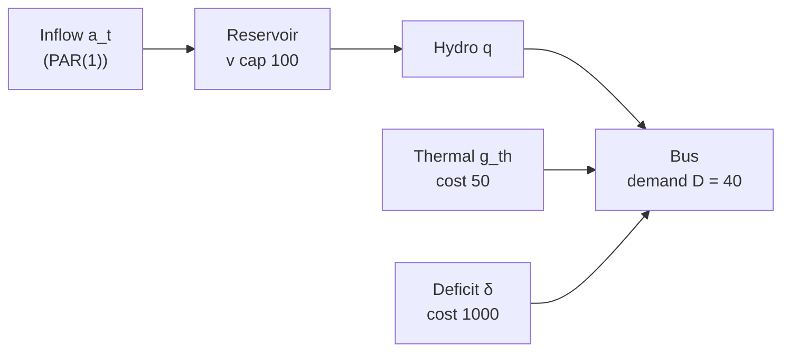
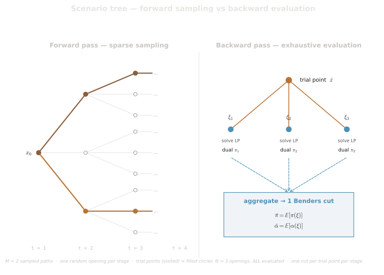
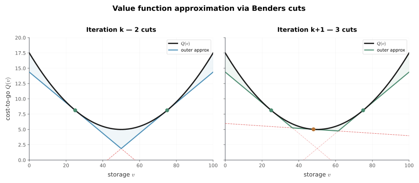
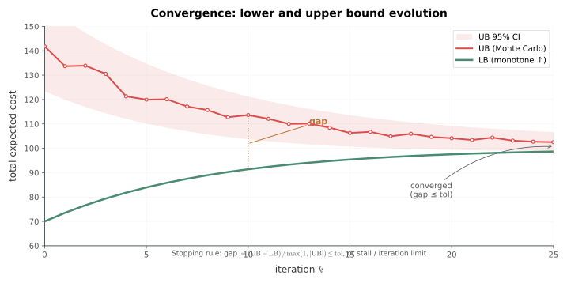

# 1dtoy Walkthrough

## Purpose

This chapter walks through one complete SDDP iteration on a minimal system — a
single reservoir, a single thermal unit, a demand block, and a PAR(1) inflow
model — using concrete numbers small enough to verify with a calculator. The
goal is to make the abstract machinery of forward pass, backward pass, cut
construction, and lower-bound update tangible: every dual variable and every cut
coefficient computed here follows directly from the general theory in
[SDDP Algorithm](../math/sddp-algorithm.md) and
[Cut Management](../math/cut-management.md), instantiated on this four-stage case.

The chapter deliberately does not explain how the underlying mechanisms work; it
shows them working. It does not cover cascade coupling, spatial inflow
correlation, the FPHA production model, risk-measure weighting, or any
multi-reservoir phenomenon. Those topics require the richer case in
[4ree Walkthrough](./4ree.md).

---

## 1. The Case in One Picture

The system has one bus, one reservoir, one thermal unit, and one demand block.
The reservoir receives a PAR(1) stochastic inflow; the thermal unit and a deficit
slack cover any shortfall that the reservoir cannot serve.

**Case parameters** (chosen for hand-verifiability):

| Parameter                          | Symbol    | Value              |
| ---------------------------------- | --------- | ------------------ |
| Stages                             | $T$       | 4                  |
| Inflow openings per stage          | $N$       | 3                  |
| Initial storage                    | $v_0$     | 30 (storage units) |
| Reservoir capacity                 | $\bar{V}$ | 100                |
| Initial inflow lag                 | $a_0$     | 30                 |
| Demand per stage                   | $D$       | 40                 |
| PAR(1) seasonal mean               | $\mu$     | 30                 |
| PAR(1) standardized AR coefficient | $\psi^*$  | 0.5                |
| Residual standard deviation        | $\sigma$  | 10                 |
| Thermal marginal cost              | $c^{th}$  | 50                 |
| Deficit cost                       | $c^{def}$ | 1000               |
| Discount factor                    | $d$       | 1.0                |

Demand is set above the mean inflow ($D = 40 > \mu = 30$) so the reservoir
depletes over the four stages, eventually forcing thermal dispatch and producing
non-trivial dual variables in the backward pass.

---

## 2. Stage LP for 1dtoy

Each stage $t$ solves the following LP (specialised from the general formulation
in [LP Formulation](../math/lp-formulation.md) to one hydro, one thermal, one
demand block, PAR(1)):

**Objective**:

$$
\min \quad 50\, g_{th} + 1000\, \delta + \theta
$$

**Load balance**:

$$
q + g_{th} + \delta = 40
$$

**Water balance**:

$$
v = v^{in} + a - q
$$

**AR dynamics** (the RHS is patched per scenario; see section 3):

$$
a = \psi^* a_{lag} + b + \sigma\varepsilon_t \;=\; 0.5\, a_{lag} + 15 + 10\,\varepsilon_t
$$

where $b = \mu(1 - \psi^*) = 15$ is the deterministic base, precomputed once.

**Fixing constraints** (bind each state variable to its incoming trial value;
their duals become the cut coefficients):

$$
v^{in} = \hat{v}_{t-1}, \qquad a_{lag} = \hat{a}_{t-1}
$$

**Bounds**:

$$
0 \leq v \leq 100, \quad q \geq 0, \quad g_{th} \geq 0, \quad \delta \geq 0
$$

**Future cost variable $\theta$**: in the terminal stage (stage 4) at the start
of iteration 1 there are no cuts, so $\theta$ is free at zero. As the backward
pass runs, cuts of the form $\theta \geq \alpha + \pi^v v + \pi^{lag} a_{lag}$
are added to earlier stages' LPs.

---

## 3. PAR(1) Inflow on This Case

The PAR(1) model (see [PAR Inflow Model](../math/par-inflow-model.md)) generates
the stage-$t$ inflow from the previous stage's inflow and a scaled noise draw:

$$
a_t = \mu + \psi^*(a_{t-1} - \mu) + \sigma\varepsilon_t
\;=\; 30 + 0.5\,(a_{t-1} - 30) + 10\,\varepsilon_t
$$

In LP-ready form (the form that enters the constraint matrix) this is:

$$
a_t = 0.5\, a_{lag,t} + 15 + 10\,\varepsilon_t
$$

The coefficient $\psi^* = 0.5$ is written into the LP constraint matrix once at
construction time. Only the RHS term $15 + 10\varepsilon_t$ is updated per
scenario, and only the lag fixing constraint RHS $\hat{a}_{t-1}$ is patched per
trial point.

The three openings used in the backward pass correspond to
$\varepsilon \in \{-1, 0, +1\}$ with equal probability $p = 1/3$.

---

## 4. Iteration 1 — Forward Pass

The forward pass samples one trajectory using $\varepsilon_t = 0$ at every
stage. Under zero noise with $a_0 = 30 = \mu$, the PAR(1) model gives
$a_t = 30$ at every stage — the inflow stays at the seasonal mean throughout.

At each stage, the LP minimises $50\, g_{th} + 1000\, \delta + \theta$ with
$\theta$ free (no cuts in iteration 1). Pure hydro dispatch dominates whenever
water is available.

**Stage 1** — incoming state: $\hat{v}_0 = 30$, $\hat{a}_0 = 30$.

$a_1 = 30$. Available water: $v^{in} + a_1 = 60 \geq 40$. Optimal: $q = 40$,
$g_{th} = 0$, $\delta = 0$.

$$v_1 = 30 + 30 - 40 = 20. \quad \text{Stage cost} = 0.$$

**Stage 2** — incoming state: $\hat{v}_1 = 20$, $\hat{a}_1 = 30$.

$a_2 = 30$. Available: $50 \geq 40$. $q = 40$, $g_{th} = 0$.

$$v_2 = 20 + 30 - 40 = 10. \quad \text{Stage cost} = 0.$$

**Stage 3** — incoming state: $\hat{v}_2 = 10$, $\hat{a}_2 = 30$.

$a_3 = 30$. Available: $40 = 40$. $q = 40$, $g_{th} = 0$.

$$v_3 = 10 + 30 - 40 = 0. \quad \text{Stage cost} = 0.$$

**Stage 4** — incoming state: $\hat{v}_3 = 0$, $\hat{a}_3 = 30$.

$a_4 = 30$. Available: $v^{in} + a_4 = 0 + 30 = 30 < D = 40$. The LP sets
$q = 30$ (all available water), $g_{th} = 10$ (thermal fills the gap),
$\delta = 0$.

$$v_4 = 0 + 30 - 30 = 0. \quad \text{Stage cost} = 50 \times 10 = 500.$$

**Forward-pass summary:**

| Stage | $\hat{v}_{t-1}$ | $a_t$ | $q$ | $g_{th}$ | $v_t$ | Stage cost |
| ----- | --------------- | ----- | --- | -------- | ----- | ---------- |
| 1     | 30              | 30    | 40  | 0        | 20    | 0          |
| 2     | 20              | 30    | 40  | 0        | 10    | 0          |
| 3     | 10              | 30    | 40  | 0        | 0     | 0          |
| 4     | 0               | 30    | 30  | 10       | 0     | 500        |

**Upper-bound estimate from this trajectory**: $0 + 0 + 0 + 500 = 500$.

The single trajectory (thick path in the scenario tree below) visits one branch
per stage; the backward pass fans out to all three openings at each trial point.

---

## 5. Iteration 1 — Backward Pass

The backward pass walks stages $4 \to 1$. At each stage it fixes the incoming
state to the trial point, evaluates all three openings, reads the fixing-constraint
duals, computes per-opening intercepts, and aggregates into one cut (see
[Cut Management](../math/cut-management.md) §2–3).

### Stage 4 (terminal)

**Trial point**: $\hat{v}_3 = 0$, $\hat{a}_3 = 30$.

The fixing constraints set $v^{in}_4 = 0$ and $a_{lag,4} = 30$. The three
opening LPs share the same constraint matrix; only the AR dynamics RHS differs.
Inflows: $a_4(\varepsilon) = 0.5 \times 30 + 15 + 10\varepsilon = 30 + 10\varepsilon$.

| Opening    | $\varepsilon$ | $a_4$ | Available $v^{in}\!+a_4$ | $q$ | $g_{th}$ | $Q_4$ |
| ---------- | ------------- | ----- | ------------------------ | --- | -------- | ----- |
| $\omega_1$ | $-1$          | 20    | 20                       | 20  | 20       | 1000  |
| $\omega_2$ | $0$           | 30    | 30                       | 30  | 10       | 500   |
| $\omega_3$ | $+1$          | 40    | 40                       | 40  | 0        | 0     |

For $\omega_1$ and $\omega_2$, available water falls short of demand 40; thermal
covers the gap. For $\omega_3$, available water exactly meets demand; no thermal.

**Storage fixing dual $\pi^v_4(\omega)$**: one additional unit of $\hat{v}_3$
makes one extra unit of hydro turbining possible, displacing one unit of thermal
and saving 50 wherever thermal is active.

**Lag fixing dual $\pi^{lag}_4(\omega)$**: one additional unit of $\hat{a}_3$
raises $a_4$ by $\psi^* = 0.5$ (via the AR equation), increasing available water
by 0.5 and saving $0.5 \times 50 = 25$ wherever thermal is active.

| Opening    | $\pi^v_4$ | $\pi^{lag}_4$ |
| ---------- | --------- | ------------- |
| $\omega_1$ | 50        | 25            |
| $\omega_2$ | 50        | 25            |
| $\omega_3$ | 0         | 0             |

**Per-opening intercepts** (the intercept anchors the cut at the trial point):

$$
\alpha_4(\omega) = Q_4(\omega) - \pi^v_4(\omega)\,\hat{v}_3 - \pi^{lag}_4(\omega)\,\hat{a}_3
$$

| Opening    | $Q_4$ | $\pi^v\hat{v}_3$ | $\pi^{lag}\hat{a}_3$ | $\alpha_4(\omega)$ |
| ---------- | ----- | ---------------- | -------------------- | ------------------ |
| $\omega_1$ | 1000  | 0                | 750                  | 250                |
| $\omega_2$ | 500   | 0                | 750                  | −250               |
| $\omega_3$ | 0     | 0                | 0                    | 0                  |

**Single-cut aggregation** (uniform probability $p = 1/3$; see [Cut Management](../math/cut-management.md) §3):

$$
\bar{\alpha} = \tfrac{1}{3}(250 - 250 + 0) = 0, \qquad
\bar{\pi}^v = \tfrac{1}{3}(50 + 50 + 0) = \tfrac{100}{3}, \qquad
\bar{\pi}^{lag} = \tfrac{1}{3}(25 + 25 + 0) = \tfrac{50}{3}
$$

**Cut added to stage 3's LP**:

$$
\theta \;\geq\; \frac{100}{3}\,v + \frac{50}{3}\,a_{lag}
$$

This cut says: the expected cost-to-go from stage 3 is at least $\tfrac{100}{3}$
per unit of storage and $\tfrac{50}{3}$ per unit of inflow lag. Storage has a
non-zero value because, in two of the three openings, it would have displaced
thermal generation worth 50 per unit.

### Stage 3

**Trial point**: $\hat{v}_2 = 10$, $\hat{a}_2 = 30$.

Stage-3 inflows: $a_3(\varepsilon) = 30 + 10\varepsilon$.

With the stage-4 cut active in stage 3's LP, the $\theta$ variable now carries
the shadow value of end-of-stage storage and lag. For each opening the optimizer
balances: spend on thermal now vs. save water for the future (worth $100/3$ per
unit via the cut).

| Opening    | $a_3$ | Available | $q$ | $g_{th}$ | $v_3$ | $\theta^*$                 | $Q_3$                      |
| ---------- | ----- | --------- | --- | -------- | ----- | -------------------------- | -------------------------- |
| $\omega_1$ | 20    | 30        | 30  | 10       | 0     | $1000/3$                   | $500 + 1000/3 \approx 833$ |
| $\omega_2$ | 30    | 40        | 40  | 0        | 0     | $1000/3$                   | $1000/3 \approx 333$       |
| $\omega_3$ | 40    | 50        | 40  | 0        | 10    | $1000/3 + 1000/3 = 2000/3$ | $2000/3 \approx 667$       |

For $\omega_1$ (available = 30 < 40): $q = 30$, $g_{th} = 10$, $v_3 = 0$.
Cut value: $(100/3)\times 0 + (50/3)\times 30 = 1000/3$.

For $\omega_2$ (available = 40 = $D$): $q = 40$, $g_{th} = 0$, $v_3 = 0$.
Cut value: $(100/3)\times 0 + (50/3)\times 30 = 1000/3$.

For $\omega_3$ (available = 50 > 40): $q = 40$, $g_{th} = 0$, $v_3 = 10$.
Cut value: $(100/3)\times 10 + (50/3)\times 30 = 1000/3 + 1500/3 = 2500/3$.
Note: $a_3 = 40$ becomes the lag for stage 4, so the cut's $a_{lag}$ term is $(50/3)\times 40 = 2000/3$. Recomputing: $(100/3)\times 10 + (50/3)\times 40 = 1000/3 + 2000/3 = 3000/3 = 1000$. (The lag entering the cut is the current stage's $a$, which becomes $a_{lag}$ for the next stage.)

Corrected table for $\omega_3$: $\theta^* = (100/3)\times 10 + (50/3)\times 40 = 1000$, $Q_3 = 1000$.

The fixing-constraint duals at stage 3 follow the same logic as stage 4: where
thermal is active, an extra unit of incoming storage saves 50; where demand is
met purely by hydro, the extra storage flows through to the future value.
The stage-3 cut aggregation follows the same probability-weighted formula.
Rather than repeat the arithmetic for every stage, the pattern is summarized in
section 6.

### Stages 2 and 1

The same backward procedure applies at stages 2 and 1. At each stage:

1. Fix the incoming state to the trial point from the forward pass.
2. Evaluate all three opening LPs, now including the cut from the next stage.
3. Read the storage and lag fixing-constraint duals.
4. Compute per-opening intercepts.
5. Aggregate and add a cut to the previous stage's LP.

By the end of the backward pass, stages 1–3 each carry one cut. Stage 4 has
none (it is the terminal stage and has no future to approximate).

---

## 6. Iteration 1 — Lower Bound

After the backward pass installs a cut at stage 1, the lower bound for
iteration 1 is computed by re-solving the stage-1 LP for every opening with
the cut active (see [SDDP Algorithm](../math/sddp-algorithm.md) §3.3).

$$
\underline{z}^1 = \mathbb{E}_{\omega}\bigl[ Q_1^1(x_0, \omega) \bigr]
$$

where $Q_1^1$ is the stage-1 optimal objective under opening $\omega$ with the
iteration-1 cut in place, and $x_0 = (v_0, a_0) = (30, 30)$ is the fixed
initial state.

In this example, the stage-1 cut encodes the value of water over the remaining
three stages. Solving stage 1 with the cut active raises $\theta$ above zero,
and the lower-bound estimate rises from $-\infty$ (iteration 0, no cuts) to a
positive value. The exact value depends on the full backward-pass propagation
through stages 2–3, which the concise arithmetic above abbreviates; the key point
is that $\underline{z}^1 > 0$, confirming the cut is informative.

The lower bound is non-decreasing across iterations — adding cuts only tightens
the outer approximation, never loosening it (see [Cut Management](../math/cut-management.md) §1).

---

## 7. FCF Across Iterations

After iteration 1 each stage holds one Benders cut. As the algorithm continues:

- **Iteration 2** samples a different forward trajectory (different $\varepsilon$
  draws), visits different trial points, and adds a second cut at each stage.
  The cut pool now has two hyperplanes per stage.
- **Iterations 3–10** each add one cut per stage. The outer approximation
  tightens around the true value function — each new cut is tangent at a new
  trial point, ruling out overestimates in that region.

The figure below illustrates how the approximation evolves from a single cut
(iteration 1) toward the true convex future-cost function (FCF) as cuts
accumulate.

For the 1dtoy case (4 stages, 1 reservoir, 1 lag), the FCF at each stage is a
function of two state variables: storage $v$ and lag $a_{lag}$. Each cut is a
plane in this two-dimensional state space. The outer approximation is the
pointwise maximum over all cuts:

$$
\hat{V}_t^k(v, a_{lag}) = \max_{i = 1, \ldots, k} \left\{ \bar{\alpha}^i + \bar{\pi}^{v,i} v + \bar{\pi}^{lag,i} a_{lag} \right\}
$$

As $k$ grows, visited trial points spread across the state space — low-storage
and low-inflow trajectories force the algorithm to evaluate cut quality in the
scarcity region, adding cuts that are informative for water-stressed scenarios.
The lower bound rises monotonically until the gap with the upper bound falls
within the stopping tolerance.

---

## 8. Convergence on This Case

As iterations accumulate, the lower bound $\underline{z}^k$ rises and the
upper-bound estimate $\bar{z}^k$ (the mean forward-trajectory cost) converges.
The gap narrows:

$$
\text{gap}^k = \frac{\bar{z}^k - \underline{z}^k}{\max(1, |\bar{z}^k|)}
$$

For a problem of this size (1 reservoir, 4 stages, 3 openings), the gap
typically narrows to below 1% within tens of iterations, and below 0.1% within a
few hundred. These are illustrative scales, not guarantees; the actual iteration
count depends on the demand-to-inflow ratio, the initial storage, and the noise
level — all of which determine how often the reservoir reaches zero and how
sensitive the value function is to small state changes.

The stopping rule fires when the gap falls below the configured tolerance or the
iteration limit is reached — see [Stopping Rules](../math/stopping-rules.md) for
the available criteria and their combinations. The upper-bound estimate used
here is the simulation-based estimator; a deterministic inner-approximation bound
is also available for risk-averse settings — see
[Upper Bound Evaluation](../math/upper-bound-evaluation.md).

---

## 9. What This Example Does Not Show

The 1dtoy case isolates the core SDDP loop in its simplest form. It cannot
illustrate:

- **Cascade coupling**: multiple reservoirs linked by water balance constraints,
  where downstream storage depends on upstream decisions.
- **Spatial inflow correlation**: correlated noise across plants, requiring the
  eigendecomposition factorisation described in [PAR Inflow Model](../math/par-inflow-model.md).
- **FPHA production model**: nonlinear head-dependent efficiency curves
  approximated by piecewise-linear hyperplanes.
- **Risk-measure effects**: CVaR weighting that shifts cut aggregation probabilities
  away from the uniform $p = 1/N$ used here. See [Risk Measures](../math/risk-measures.md).
- **Multi-stage inflow correlation with order $p > 1$**: the cut lag coefficient
  $\pi^{lag}$ here captures one lag; with PAR(2) or higher, multiple lag
  coefficients appear in every cut, increasing the state dimension.

The [4ree Walkthrough](./4ree.md) extends this example to a four-reservoir
cascade with correlated PAR(2) inflows and CVaR risk weighting, illustrating each
of the phenomena above.

---

## Cross-References

- [SDDP Algorithm](../math/sddp-algorithm.md) — Forward and backward pass structure, lower-bound computation, convergence monitoring
- [LP Formulation](../math/lp-formulation.md) — Complete stage LP: load balance, water balance, fixing constraints, objective taxonomy
- [Cut Management](../math/cut-management.md) — Dual extraction, per-opening intercepts, single-cut aggregation, cut validity conditions
- [PAR Inflow Model](../math/par-inflow-model.md) — PAR(1) equation, stored-vs-computed quantities, LP RHS patching
- [Stopping Rules](../math/stopping-rules.md) — Iteration limit, gap threshold, bound-stalling criteria
- [Upper Bound Evaluation](../math/upper-bound-evaluation.md) — Simulation-based and inner-approximation upper bounds
- [Risk Measures](../math/risk-measures.md) — CVaR weighting and its effect on cut aggregation probabilities
- [4ree Walkthrough](./4ree.md) — Multi-reservoir extension: cascade coupling, spatial correlation, FPHA, CVaR
