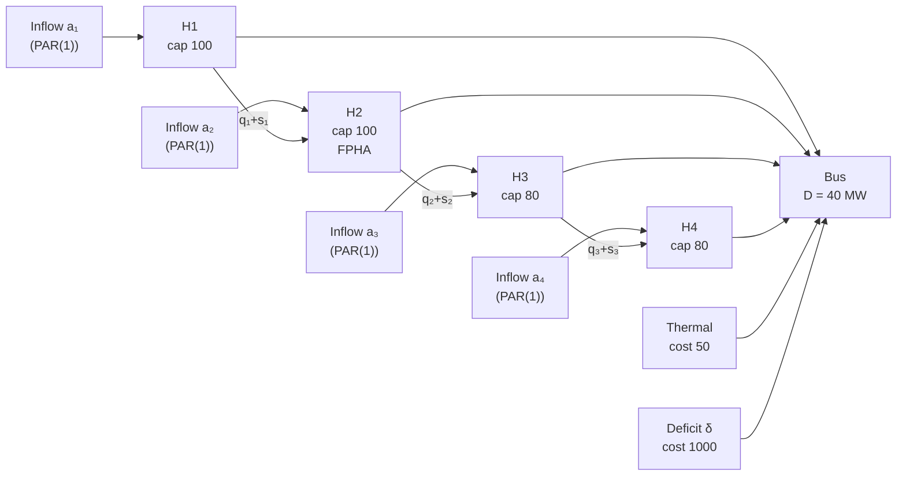

# 4ree Walkthrough

## Purpose

This chapter extends the single-reservoir SDDP walkthrough in
[1dtoy Walkthrough](./1dtoy.md) to a four-reservoir cascade. The 1dtoy case
illustrates the core forward/backward/cut loop in its purest form; the 4ree case
adds four phenomena that a single-reservoir setting cannot exhibit:

- **Cascade coupling**: downstream storage depends on upstream turbining and
  spillage, so the water-balance constraints link the four hydros within each
  stage LP.
- **Spatial inflow correlation**: the four plants share a wet-season signal, so
  their PAR(1) noise draws are correlated and must be generated via a spectral
  transform.
- **FPHA production model**: hydro H2 uses a piecewise-linear head approximation
  whose hyperplane coefficients depend on average reservoir storage, adding a
  head-dependent term to the generation upper bound and to the storage cut
  coefficient.
- **Risk-measure effects**: replacing risk-neutral expectation with a CVaR-based
  convex combination shifts the cut aggregation probabilities toward the worst
  inflow scenarios, raising cut intercepts and slopes.

The chapter does not cover transmission networks (all four plants feed a single
bus), pumping stations, head-pumping, an infinite-horizon cyclic policy, or
multi-resolution coupling. Those topics are addressed in the chapters cited in
section 9.

---

## 1. The Case in One Picture

The system has four reservoirs arranged in a linear cascade (H1 → H2 → H3 → H4),
a single bus, one thermal unit, and one deficit slack.

**Case parameters**:

| Parameter                   | Symbol          | H1  | H2         | H3  | H4  |
| --------------------------- | --------------- | --- | ---------- | --- | --- |
| Storage capacity (hm³)      | $\bar{V}_h$     | 100 | 100        | 80  | 80  |
| Initial storage (hm³)       | $\hat{v}_{h,0}$ | 60  | 60         | 40  | 40  |
| PAR(1) seasonal mean (m³/s) | $\mu_h$         | 30  | 25         | 20  | 18  |
| Residual std (m³/s)         | $\sigma_h$      | 10  | 8          | 6   | 6   |
| Standardized AR coefficient | $\psi^*_h$      | 0.5 | 0.5        | 0.4 | 0.4 |
| Initial inflow lag (m³/s)   | $\hat{a}_{h,0}$ | 30  | 25         | 20  | 18  |
| Productivity (MW/(m³/s))    | $\rho_h$        | 1.0 | (FPHA, §5) | 1.0 | 1.0 |

System-level parameters:

| Parameter             | Symbol    | Value       |
| --------------------- | --------- | ----------- |
| Stages                | $T$       | 4           |
| Openings per stage    | $N$       | 3           |
| Demand per stage      | $D$       | 40 MW       |
| Thermal marginal cost | $c^{th}$  | 50 \$/MWh   |
| Deficit cost          | $c^{def}$ | 1000 \$/MWh |
| Discount factor       | $d$       | 1.0         |

The initial storages are comfortable (60, 60, 40, 40 against capacities 100, 100,
80, 80) and mean inflows sum to 93 m³/s against a demand of 40 MW, so the first
few stages dispatch purely from hydro. Thermal generation appears only in scenarios
where the cascade runs low.

---

## 2. Stage LP for 4ree

The stage-$t$ LP for the four-reservoir case is assembled from the general
formulation in [LP Formulation](../math/lp-formulation.md), specialised to four
hydros, one thermal, one deficit slack, PAR(1) inflows (one lag per hydro), and
one bus balance. The column counts are:

| Column region    | Count | Variables                                                         |
| ---------------- | ----- | ----------------------------------------------------------------- |
| Storage          | 4     | $v_1, v_2, v_3, v_4$ (end-of-stage, hm³)                          |
| AR lags          | 4     | $a_{lag,1}, a_{lag,2}, a_{lag,3}, a_{lag,4}$ (m³/s)               |
| Realized inflow  | 4     | $z_1, z_2, z_3, z_4$ (auxiliary, m³/s)                            |
| Incoming storage | 4     | $v^{in}_1, v^{in}_2, v^{in}_3, v^{in}_4$ (fixed to $\hat{v}_{h}$) |
| Future cost      | 1     | $\theta$                                                          |
| Turbine          | 4     | $q_1, q_2, q_3, q_4$ (m³/s)                                       |
| Spill            | 4     | $s_1, s_2, s_3, s_4$ (m³/s)                                       |
| Hydro generation | 4     | $g_1, g_2, g_3, g_4$ (MW)                                         |
| Thermal          | 1     | $g^{th}$ (MW)                                                     |
| Deficit          | 1     | $\delta$ (MW)                                                     |

**Objective** (minimise current-stage cost plus future cost):

$$
\min \quad 50\, g^{th} + 1000\, \delta + \theta
$$

**Bus balance** (all four hydro plants plus thermal and deficit):

$$
g_1 + g_2 + g_3 + g_4 + g^{th} + \delta = 40
$$

**Water balances** — H1 receives only lateral inflow; H2 through H4 also receive
the outflow of the upstream hydro:

$$
v_1 = v^{in}_1 + \zeta\bigl(z_1 - q_1 - s_1\bigr)
$$

$$
v_2 = v^{in}_2 + \zeta\bigl(z_2 + (q_1 + s_1) - q_2 - s_2\bigr)
$$

$$
v_3 = v^{in}_3 + \zeta\bigl(z_3 + (q_2 + s_2) - q_3 - s_3\bigr)
$$

$$
v_4 = v^{in}_4 + \zeta\bigl(z_4 + (q_3 + s_3) - q_4 - s_4\bigr)
$$

where $\zeta$ converts m³/s per stage to hm³ (the stage duration factor). For
this walkthrough $\zeta = 1$ (simplified units chosen so that one m³/s of
turbining for one stage withdraws one hm³).

**Hydro generation constraints**:

- H1, H3, H4 (constant productivity, $\rho = 1.0$): $g_h = 1.0 \cdot q_h$
- H2 (FPHA, three planes): $g_2 \leq \gamma_0^m + \gamma_v^m \cdot v_2^{avg} + \gamma_q^m \cdot q_2$ for each plane $m \in \{A, B, C\}$ (see section 5)

**Storage fixing constraints** (duals $\pi^v_h$ become cut coefficients):

$$
v^{in}_h = \hat{v}_{h,t-1}, \qquad h = 1, 2, 3, 4
$$

**AR-lag fixing constraints** (duals $\pi^{lag}_h$ become cut coefficients):

$$
a_{lag,h} = \hat{a}_{h,t-1}, \qquad h = 1, 2, 3, 4
$$

**Bounds**: $0 \leq v_h \leq \bar{V}_h$, $q_h \geq 0$, $s_h \geq 0$, $g_h \geq 0$, $g^{th} \geq 0$, $\delta \geq 0$.

---

## 3. Cascade Coupling

The cascade coupling is entirely captured by the downstream hydro water balance.
For H2, at any stage:

$$
v_2^{\,\text{new}} = v_2^{in} + z_2 + (q_1 + s_1) - q_2 - s_2
$$

Reading this term by term: H2 starts with $v_2^{in}$ hm³, receives lateral inflow
$z_2$ (H2's own catchment), receives the release from H1 ($q_1 + s_1$, both
turbined and spilled water travel downstream), and releases $q_2 + s_2$ of its
own.

**Why coupling matters for the policy.** If the planner turbines aggressively
from H1 to save costs today, the water that flows into H2 may overflow H2's
capacity (spilled water carries no generation value below H2) or, conversely, a
low-inflow period at H1 can leave H2's reservoir empty even if H2's own lateral
inflow was average. The LP sees this coupling through the single linear constraint
above — it automatically balances turbining-now against filling-downstream when
cuts encode the future value of downstream storage.

**Worked balance at stage 1.** With forward-pass values (section 6):
$v_2^{in} = 60$, $z_2 = 25$, $q_1 = 10$, $s_1 = 0$, $q_2 = 10$, $s_2 = 0$:

$$
v_2^{\,\text{new}} = 60 + 25 + 10 - 10 = 85 \text{ hm³}
$$

All four cascade constraints of this form appear together in a single LP. The LP
solver resolves them simultaneously — no sequential iteration is needed. For the
hydro cascade element definitions and the convention that $o_h = q_h + s_h$ is
the total outflow entering the downstream channel, see
[System Elements](../math/system-elements.md).

---

## 4. Spatial Correlation

Each hydro $h$ has its own PAR(1) recursion. In LP-ready form:

$$
a_{h,t} = \psi^*_h \cdot a_{lag,h} + b_h + \sigma_h \cdot \varepsilon_{h,t}
$$

where $b_h = \mu_h(1 - \psi^*_h)$ is the deterministic base ($b_1 = 15$,
$b_2 = 12.5$, $b_3 = 12$, $b_4 = 10.8$) and $a_{lag,h}$ is the lag state
variable fixed via the AR-lag fixing constraint. The per-hydro parameters are:

| Hydro | $\mu_h$ (m³/s) | $\sigma_h$ (m³/s) | $\psi^*_h$ | $b_h$ (m³/s) |
| ----- | -------------- | ----------------- | ---------- | ------------ |
| H1    | 30             | 10                | 0.5        | 15.0         |
| H2    | 25             | 8                 | 0.5        | 12.5         |
| H3    | 20             | 6                 | 0.4        | 12.0         |
| H4    | 18             | 6                 | 0.4        | 10.8         |

The innovations $(\varepsilon_1, \varepsilon_2, \varepsilon_3, \varepsilon_4)$ are
not independent: the four plants share a wet-season signal, so their residuals are
spatially correlated. The correlation structure is described by a $4 \times 4$
matrix $\Sigma$:

|        | H1   | H2   | H3   | H4   |
| ------ | ---- | ---- | ---- | ---- |
| **H1** | 1.00 | 0.70 | 0.65 | 0.60 |
| **H2** | 0.70 | 1.00 | 0.70 | 0.65 |
| **H3** | 0.65 | 0.70 | 1.00 | 0.70 |
| **H4** | 0.60 | 0.65 | 0.70 | 1.00 |

The off-diagonal entries decrease with cascade distance: H1 and H2 are adjacent
(0.70), H1 and H4 are furthest apart (0.60). All four plants co-vary positively —
a wet year raises all four inflows together — reflecting a shared basin signal.

**Correlated draw procedure.** The scenario generator draws an independent
standard normal vector $z = (z_1, z_2, z_3, z_4)^T \sim \mathcal{N}(0, I)$ and
multiplies by the spectral factor $L$ such that $L L^T = \Sigma$:

$$
\varepsilon = L \cdot z
$$

The result $\varepsilon = (\varepsilon_1, \varepsilon_2, \varepsilon_3,
\varepsilon_4)^T$ has the target correlation structure. Each $\varepsilon_h$ is
then substituted into that hydro's PAR(1) recursion to produce the realized
inflow $a_{h,t}$. The backward pass uses three openings with the correlated
draw $\varepsilon \in \{-1, 0, +1\}$ (all four hydros moving together with the
shared signal), each with equal probability $p = 1/3$.

The diagram below illustrates the separation between parameters stored in the
input files ($\psi^*$ and residual-std-ratio) and the original-unit quantities
($\psi$, $\sigma$) computed at runtime before the LP RHS is patched.

For the spectral factorisation rationale and the eigendecomposition used to obtain
$L$ from $\Sigma$, see [Scenario Generation](../math/scenario-generation.md). For
the full PAR(1) model definition and the LP constraint form, see
[PAR Inflow Model](../math/par-inflow-model.md).

---

## 5. FPHA at H2

Hydros H1, H3, and H4 use constant productivity: $g_h = 1.0 \cdot q_h$. Hydro H2
uses FPHA with three head planes. The FPHA constraint says generation is bounded
above by each plane; the optimizer pushes generation to the tightest boundary:

$$
g_2 \leq \gamma_0^m + \gamma_v^m \cdot v_2^{avg} + \gamma_q^m \cdot q_2,
\quad m \in \{A, B, C\}
$$

where $v_2^{avg} = (v_2^{in} + v_2)/2$ is the average storage over the stage.
The three planes for H2 are:

| Plane | $\gamma_0^m$ | $\gamma_v^m$ | $\gamma_q^m$ | Active region              |
| ----- | ------------ | ------------ | ------------ | -------------------------- |
| A     | 2.0          | 0.00         | 0.90         | Low storage (head limited) |
| B     | 1.0          | 0.01         | 0.93         | Mid storage                |
| C     | 0.0          | 0.02         | 0.96         | High storage (near full)   |

**One numerical evaluation.** At the forward-pass state for stage 1:
$v_2^{in} = 60$, $v_2 = 85$, so $v_2^{avg} = 72.5$, and $q_2 = 10$:

$$
\text{Plane A: } g_2 \leq 2.0 + 0.00 \times 72.5 + 0.90 \times 10 = 11.0
$$

$$
\text{Plane B: } g_2 \leq 1.0 + 0.01 \times 72.5 + 0.93 \times 10 = 10.975
$$

$$
\text{Plane C: } g_2 \leq 0.0 + 0.02 \times 72.5 + 0.96 \times 10 = 11.05
$$

The tightest bound is Plane B at 10.975. At the forward-pass optimum (section 6),
the LP dispatches $q_2 = 10$ and $g_2 = 10$ (demand is comfortably met without
pushing H2 to its FPHA ceiling), so Plane B is not binding in this scenario. The
binding plane shifts to Plane A in low-storage scenarios where $v_2^{avg}$ is
small and the zero $\gamma_v^A$ term removes the storage benefit.

**Impact on cut coefficients.** Because $v_2^{avg}$ depends on $v_2^{in}$ (via
$v^{in}_2$ in the LP), the FPHA constraint contributes to the dual of the storage
fixing constraint whenever a plane is active at the optimum. The storage cut
coefficient $\pi^v_2$ automatically captures this contribution — the LP solver
propagates it through the fixing constraint dual without requiring manual dual
combination. For the derivation of how FPHA hyperplane duals flow into the storage
cut coefficient, see
[Hydro Production Models](../math/hydro-production-models.md) section 2.10.

---

## 6. Iteration 1 — Forward Pass

The forward pass samples one trajectory using $\varepsilon_{h,t} = 0$ for all
hydros and all stages. Under zero noise with initial lags at seasonal means, each
hydro's inflow equals its mean throughout:

$$
a_{1,t} = 30, \quad a_{2,t} = 25, \quad a_{3,t} = 20, \quad a_{4,t} = 18
$$

at every stage. As in section 4 of [1dtoy Walkthrough](./1dtoy.md), the forward
pass minimises $50\,g^{th} + 1000\,\delta + \theta$ with $\theta$ free (no cuts
in iteration 1).

The demand is 40 MW. Total mean inflow is 93 m³/s; with unit productivity, the
cascade can comfortably cover 40 MW without thermal. The LP dispatches each hydro
at a share of the total demand proportional to availability. For concreteness,
the LP allocates turbine flow equally across the four hydros: $q_h = 10$ m³/s
each, $g_h = 10$ MW (H1, H3, H4 via $\rho = 1.0$; H2 via FPHA plane B at
$g_2 = 10$), summing to 40 MW at the bus. No thermal, no deficit.

**Storage updates** (using $\zeta = 1$; lateral inflow only at H1; cascade
inflows added for H2–H4):

**Stage 1** — incoming: $\hat{v} = (60, 60, 40, 40)$, inflows: $(30, 25, 20, 18)$.

$$
v_1 = 60 + 30 - 10 = 80
$$

$$
v_2 = 60 + 25 + (10 + 0) - 10 = 85
$$

$$
v_3 = 40 + 20 + (10 + 0) - 10 = 60
$$

$$
v_4 = 40 + 18 + (10 + 0) - 10 = 58
$$

Stage cost: $50 \times 0 + 1000 \times 0 = 0$.

**Stage 2** — incoming: $(80, 85, 60, 58)$, inflows: $(30, 25, 20, 18)$.

$$
v_1 = 80 + 30 - 10 = 100, \quad v_2 = 85 + 25 + 10 - 10 = 110 \xrightarrow{\text{cap}} 100
$$

H2 would reach 110 hm³ but capacity is 100; the LP releases the excess 10 hm³ as
spill: $s_2 = 10$. The spilled water ($q_2 + s_2 = 20$) enters H3.

$$
v_3 = 60 + 20 + 20 - 10 = 90 \xrightarrow{\text{cap}} 80, \quad s_3 = 10
$$

$$
v_4 = 58 + 18 + 20 - 10 = 86 \xrightarrow{\text{cap}} 80, \quad s_4 = 6
$$

Stage cost: 0 (no thermal, no deficit).

**Stage 3** — incoming: $(100, 100, 80, 80)$, inflows: $(30, 25, 20, 18)$.
All reservoirs are full; the LP turbines $q_h = 10$ per hydro and spills absorb
any cascade overflow.

$$
v_1 = 100 + 30 - 10 = 120 \xrightarrow{\text{cap}} 100, \quad s_1 = 20
$$

$$
v_2 = 100 + 25 + 30 - 10 = 145 \xrightarrow{\text{cap}} 100, \quad s_2 = 35
$$

$$
v_3 = 80 + 20 + 45 - 10 = 135 \xrightarrow{\text{cap}} 80, \quad s_3 = 55
$$

$$
v_4 = 80 + 18 + 65 - 10 = 153 \xrightarrow{\text{cap}} 80, \quad s_4 = 73
$$

Stage cost: 0.

**Stage 4** — incoming: $(100, 100, 80, 80)$, inflows: $(30, 25, 20, 18)$.
Same as stage 3. Reservoirs full; generation fully hydro; spills absorb excess.

Stage cost: 0.

**Forward-pass summary**:

| Stage | $v_1$ | $v_2$ | $v_3$ | $v_4$ | $g^{th}$ | $\delta$ | Stage cost |
| ----- | ----- | ----- | ----- | ----- | -------- | -------- | ---------- |
| 1     | 80    | 85    | 60    | 58    | 0        | 0        | 0          |
| 2     | 100   | 100   | 80    | 80    | 0        | 0        | 0          |
| 3     | 100   | 100   | 80    | 80    | 0        | 0        | 0          |
| 4     | 100   | 100   | 80    | 80    | 0        | 0        | 0          |

**Upper-bound estimate from this trajectory**: $0 + 0 + 0 + 0 = 0$.

This trajectory is purely hydro and incurs no operating cost. The backward pass
is needed to build the cuts that reveal the true cost of water scarcity in adverse
scenarios.

---

## 7. Iteration 1 — Backward Pass and Cut

The backward pass walks stages $4 \to 1$. At each stage it fixes the incoming
state to the trial point from the forward pass, evaluates all three openings
$\varepsilon \in \{-1, 0, +1\}$, reads the 8 fixing-constraint duals (4 storage,
4 AR-lag), and aggregates into a single 8-coefficient Benders cut. The aggregation
rule is the probability-weighted average described in
[Cut Management](../math/cut-management.md).

### Stage 4 (terminal)

**Trial point**: $\hat{v} = (100, 100, 80, 80)$, $\hat{a}_{lag} = (30, 25, 20, 18)$.

Stage-4 inflows under the three openings (all four hydros moving together via
the shared correlation signal; see section 4):

| Opening           | $\varepsilon$ | $a_1$ | $a_2$ | $a_3$ | $a_4$ |
| ----------------- | ------------- | ----- | ----- | ----- | ----- |
| $\omega_1$ (dry)  | $-1$          | 20    | 17    | 14    | 12    |
| $\omega_2$ (mean) | $0$           | 30    | 25    | 20    | 18    |
| $\omega_3$ (wet)  | $+1$          | 40    | 33    | 26    | 24    |

For the dry opening $\omega_1$: total inflow $= 20+17+14+12 = 63$ m³/s. With
trial storages $(100, 100, 80, 80)$, the cascade delivers well above the 40 MW
demand from hydro alone. Stage cost $Q_4(\omega) = 0$ for all three openings.

**Storage fixing duals** $\pi^v_h(\omega)$: because all three openings comfortably
cover demand, an additional unit of incoming storage does not change the optimal
cost. Hence $\pi^v_h(\omega) = 0$ for all $h$ and all $\omega$. The AR-lag duals
are also zero. The cut aggregated from this trial point is:

$$
\theta \geq 0
$$

This is a trivially weak cut — it adds no information beyond the non-negativity of
cost. The forward pass visited a trajectory where reservoirs were full and demand
was always met from hydro; at this state, water has zero marginal value.

### Stage 4 at a Low-Storage Trial Point

To illustrate the cut structure with non-trivial duals, consider the backward
pass at a low-storage trial point — for example
$\hat{v} = (10, 10, 5, 5)$, $\hat{a}_{lag} = (30, 25, 20, 18)$:

| Opening           | $a_1$ | $a_2$ | $a_3$ | $a_4$ | Hydro gen    | $g^{th}$ | $Q_4$ |
| ----------------- | ----- | ----- | ----- | ----- | ------------ | -------- | ----- |
| $\omega_1$ (dry)  | 20    | 17    | 14    | 12    | 25 MW        | 15       | 750   |
| $\omega_2$ (mean) | 30    | 25    | 20    | 18    | 40 MW        | 0        | 0     |
| $\omega_3$ (wet)  | 40    | 33    | 26    | 24    | $\geq$ 40 MW | 0        | 0     |

For the dry opening ($\omega_1$), available water (cascade + lateral) only
delivers about 25 MW of hydro generation, so thermal covers the 15 MW gap:
$Q_4(\omega_1) = 50 \times 15 = 750$. For mean and wet openings demand is fully
met from hydro.

**Storage fixing duals under $\omega_1$**: one extra hm³ at any hydro $h$ enables
one extra m³/s of turbining (with $\zeta = 1$), displacing 1 MW of thermal and
saving 50 per unit:

$$
\pi^v_h(\omega_1) = 50, \quad h = 1,2,3,4; \qquad \pi^v_h(\omega_2) = \pi^v_h(\omega_3) = 0
$$

**AR-lag fixing duals under $\omega_1$**: one extra unit of $\hat{a}_{h,0}$ raises
$a_{h,4}$ by $\psi^*_h$ (via the PAR(1) equation), increasing available hydro
generation by $\psi^*_h$ m³/s and saving $\psi^*_h \times 50$:

$$
\pi^{lag}_1(\omega_1) = \pi^{lag}_2(\omega_1) = 0.5 \times 50 = 25; \quad
\pi^{lag}_3(\omega_1) = \pi^{lag}_4(\omega_1) = 0.4 \times 50 = 20
$$

All duals are zero for $\omega_2$ and $\omega_3$.

**Single-cut aggregation** (uniform $p = 1/3$):

$$
\bar{\pi}^v_h = \tfrac{1}{3}(50 + 0 + 0) = \tfrac{50}{3} \approx 16.7, \quad h = 1,2,3,4
$$

$$
\bar{\pi}^{lag}_1 = \bar{\pi}^{lag}_2 = \tfrac{25}{3} \approx 8.3; \qquad
\bar{\pi}^{lag}_3 = \bar{\pi}^{lag}_4 = \tfrac{20}{3} \approx 6.7
$$

**Per-opening intercepts** (anchoring each cut at the trial point):

$$
\hat{\alpha}_4(\omega) = Q_4(\omega) - \sum_h \pi^v_h(\omega)\, \hat{v}_h
- \sum_h \pi^{lag}_h(\omega)\, \hat{a}_{lag,h}
$$

For $\omega_1$:
$\sum_h \pi^v_h \hat{v}_h = 50(10+10+5+5) = 1500$;
$\sum_h \pi^{lag}_h \hat{a}_{lag,h} = 25 \times 30 + 25 \times 25 + 20 \times 20 + 20 \times 18 = 750 + 625 + 400 + 360 = 2135$:

$$
\hat{\alpha}_4(\omega_1) = 750 - 1500 - 2135 = -2885
$$

For $\omega_2$ and $\omega_3$: all duals zero, so $\hat{\alpha} = 0$.

**Aggregated intercept**:

$$
\bar{\alpha} = \tfrac{1}{3}(-2885 + 0 + 0) = -961.7
$$

**Cut added to stage 3's LP** (at this low-storage trial point):

$$
\theta \geq -961.7 + \tfrac{50}{3}(v_1 + v_2 + v_3 + v_4)
+ \tfrac{25}{3}(a_{lag,1} + a_{lag,2}) + \tfrac{20}{3}(a_{lag,3} + a_{lag,4})
$$

This cut has 8 state coefficients (4 storage, 4 AR-lag) plus an intercept — the
full multivariate structure. At the comfortable trial point $(100, 100, 80, 80)$
the cut evaluates to $\tfrac{50}{3} \times 380 + \ldots - 961.7 > 0$, confirming
it is not spuriously binding at high-storage states.

---

## 8. Risk-Measure Comparison

Under the convex combination
$\rho = (1 - \lambda)\,\mathbb{E}[C] + \lambda\,\text{CVaR}_{0.10}[C]$,
the cut aggregation probabilities $\mu^*_\omega$ shift away from uniform
$p = 1/3$ toward the worst scenario. The procedure follows
[Risk Measures](../math/risk-measures.md) section 7: sort scenarios by cost
descending, assign weight $\bar{\mu}_\omega = (1-\lambda) p_\omega

- \lambda p\_\omega / \alpha$ to each until the cumulative weight reaches 1.

For the low-storage backward pass at stage 4 from section 7
($Q_4 = 750, 0, 0$ under $\omega_1, \omega_2, \omega_3$):

| $\lambda$          | $\bar{\mu}_{\omega_1}$                     | Effective $\mu^*_{\omega_1}$ | $\mu^*_{\omega_2}$ | $\mu^*_{\omega_3}$ |
| ------------------ | ------------------------------------------ | ---------------------------- | ------------------ | ------------------ |
| 0.0 (risk-neutral) | $1/3$                                      | $1/3$                        | $1/3$              | $1/3$              |
| 0.5                | $(0.5/3) + (0.5/3)/0.10 = 1/6 + 5/6 = 1.0$ | $1.0$                        | $0$                | $0$                |
| 1.0 (pure CVaR)    | $(0/3) + (1/3)/0.10 = 10/3 > 1$            | $1.0$                        | $0$                | $0$                |

With $\alpha = 0.10$ and $N = 3$ openings, the worst 10% of scenarios corresponds
to less than one full opening. The greedy allocation saturates at $\omega_1$: all
weight goes to the dry scenario. For $\lambda \geq 0.5$ the weight on $\omega_1$
hits 1.0 and the weights on $\omega_2$ and $\omega_3$ collapse to 0.

![Risk measures — cost distribution with E[C] and CVaR_α marked, tail region shaded, convex combination ρ = λ·CVaR + (1−λ)·E[C]](../../images/d22-risk-measure-cvar.svg)

**Cut intercept and slope comparison** (using $\pi^v_h$ and $\hat{\alpha}$ from
the section 7 low-storage example):

| $\lambda$ | $\mu^*_{\omega_1}$ | $\bar{\pi}^v_h$ (per hydro) | $\bar{\alpha}$ |
| --------- | ------------------ | --------------------------- | -------------- |
| 0.0       | $1/3$              | $50/3 \approx 16.7$         | $-961.7$       |
| 0.5       | $1.0$              | $50$                        | $-2885.0$      |
| 1.0       | $1.0$              | $50$                        | $-2885.0$      |

As $\lambda$ increases from 0 to 0.5, the storage cut coefficient jumps from
$50/3$ to 50 — the full marginal value of the dry scenario, with no averaging from
the mean and wet openings. The intercept correspondingly becomes more negative,
because the cut now passes through a point anchored entirely by the worst
scenario's cost. The result is a steeper cut that raises the lower bound and
forces the policy to hold more water in storage as a precaution against the dry
case.

**Idea, guarantee, knob, and trade-off.** The idea is to replace uniform
scenario probabilities $p_\omega$ with risk-adjusted weights $\mu^*_\omega$ that
concentrate mass on expensive outcomes. The guarantee is that the resulting cut
coefficients are valid subgradients of the risk-averse value function (the
risk-averse subgradient theorem in [Risk Measures](../math/risk-measures.md)
section 5). The knob is $\lambda \in [0, 1]$: setting $\lambda = 0$ recovers
risk-neutral SDDP; setting $\lambda = 1$ produces pure CVaR cuts. The trade-off
is that pure CVaR tends to over-store, leaving water in reservoirs that could
have generated cheaply during wet periods:

| $\lambda$ | Policy character                               | Cost impact                                |
| --------- | ---------------------------------------------- | ------------------------------------------ |
| 0.0       | Risk-neutral; minimises expected cost          | Cheapest on average                        |
| 0.5       | Mixed; balances expectation and tail           | Moderate premium                           |
| 1.0       | Pure CVaR; protects fully against dry scenario | Highest average cost; best tail protection |

---

## 9. What This Example Does Not Show

The 4ree case adds cascade coupling, spatial correlation, FPHA, and risk measures
on top of the 1dtoy foundation, but it still omits several phenomena that require
separate chapters:

- **Transmission networks**: all four hydros feed a single bus. A multi-bus
  topology introduces transmission constraints and locational marginal prices.
- **Branched cascade topology**: the cascade here is strictly linear
  (H1 → H2 → H3 → H4). Branched structures where one upstream plant feeds two
  downstream plants appear in real systems and require a different water-balance
  topology. See [System Elements](../math/system-elements.md) for the cascade
  topology convention.
- **Pumping stations**: head-pumping (reversible turbines) and inter-basin
  transfers are not modelled. See [System Elements](../math/system-elements.md).
- **Infinite-horizon cyclic policy**: the four-stage horizon terminates without a
  terminal cut linking back to stage 1. Infinite-horizon SDDP uses periodic policy
  graphs where the last stage's cuts feed into the first stage. See
  [Infinite Horizon](../math/infinite-horizon.md).
- **Multi-resolution coupling**: weekly intra-stage blocks embedded in a monthly
  horizon, with policy transfer between resolutions. See
  [Multi-Resolution Studies](../math/multi-resolution-studies.md).
- **Warm-start basis prediction**: initialising the simplex basis from a previous
  iteration to reduce LP solve time as the cut pool grows. See
  [Warm-Start Basis Prediction](../math/warm-start-basis-prediction.md).
- **PAR(p) with $p > 1$**: this case uses PAR(1). With PAR(2) each hydro carries
  two lag state variables, widening the cut coefficient vector from 8 to 12. The
  structure is the same; only the state dimension changes.

---

## Cross-References

- [1dtoy Walkthrough](./1dtoy.md) — Single-reservoir baseline; core SDDP loop, PAR(1) mechanics, forward/backward/cut in the simplest setting
- [LP Formulation](../math/lp-formulation.md) — Complete stage LP, column and row layout, fixing constraints, dual extraction
- [System Elements](../math/system-elements.md) — Hydro plant element, cascade topology, water-balance convention, FPHA overview
- [Hydro Production Models](../math/hydro-production-models.md) — FPHA hyperplane fitting, correction factor, impact on Benders cut coefficients
- [PAR Inflow Model](../math/par-inflow-model.md) — PAR(p) model definition, stored vs computed quantities, LP constraint form
- [Scenario Generation](../math/scenario-generation.md) — Spectral factorisation for correlated noise, opening tree, sampling scheme abstraction
- [Cut Management](../math/cut-management.md) — Dual extraction, per-opening intercepts, single-cut aggregation formula
- [Risk Measures](../math/risk-measures.md) — CVaR definition, EAVaR convex combination, risk-adjusted aggregation weights, cut generation under CVaR
- [Infinite Horizon](../math/infinite-horizon.md) — Cyclic policy graphs, periodic SDDP extension
- [Multi-Resolution Studies](../math/multi-resolution-studies.md) — Weekly/monthly multi-resolution coupling
- [Warm-Start Basis Prediction](../math/warm-start-basis-prediction.md) — Basis initialisation for faster LP solves as cut pool grows
