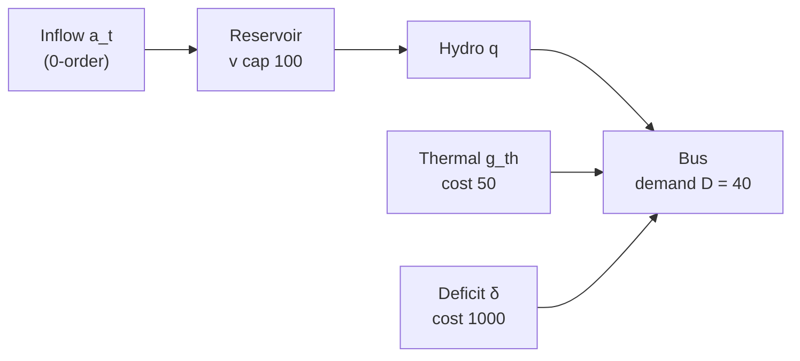

# Toy Single-Reservoir SDDP Walkthrough

## Purpose

This chapter walks through one complete SDDP iteration on a deliberately
small system — one reservoir, one thermal unit, one demand block, four
stages, and a 0-order (pure seasonal-sampling) inflow model — using
numbers chosen so every cut coefficient and every dual variable can be
verified by hand. The goal is to make the abstract machinery of forward
pass, backward pass, cut construction, and lower-bound update tangible.

Cobre ships an actual reference case at `examples/1dtoy/` that a curious
reader can run end-to-end (`cobre run examples/1dtoy`). That case has
two thermals, eight monthly stages, and ten openings per stage; the
chapter here uses simpler numbers — one thermal, four stages, three
openings — chosen for tractability. **This walkthrough is a pedagogical
caricature, not a reproduction of the shipped case.**

The chapter does not explain how the underlying mechanisms work; it
shows them working. It does not cover multi-reservoir effects, spatial
inflow correlation, the FPHA production model, risk-measure weighting,
or autoregressive inflow memory. Those topics belong to the chapters
cited in section 9 and to the multi-reservoir companion in
[Toy Four-Reservoir Walkthrough](./toy-four-reservoir.md).

---

## 1. The Case in One Picture

The system has one bus, one reservoir, one thermal unit, and one demand
block. The reservoir receives a stochastic inflow drawn from a 0-order
seasonal-sampling model; the thermal unit and a deficit slack cover any
shortfall that the reservoir cannot serve.

**Case parameters** (chosen for hand-verifiability):

| Parameter                     | Symbol    | Value              |
| ----------------------------- | --------- | ------------------ |
| Stages                        | $T$       | 4                  |
| Inflow openings per stage     | $N$       | 3                  |
| Initial storage               | $v_0$     | 30 (storage units) |
| Reservoir capacity            | $\bar{V}$ | 100                |
| Demand per stage              | $D$       | 40                 |
| Inflow seasonal mean          | $\mu$     | 30                 |
| Inflow seasonal std deviation | $\sigma$  | 10                 |
| Thermal marginal cost         | $c^{th}$  | 50                 |
| Deficit cost                  | $c^{def}$ | 1000               |
| Discount factor               | $d$       | 1.0                |

Demand is set above the mean inflow ($D = 40 > \mu = 30$) so the
reservoir depletes over the four stages, eventually forcing thermal
dispatch and producing non-trivial dual variables in the backward pass.

---

## 2. Stage LP for This Case

Each stage $t$ solves the following LP (specialised from the general
formulation in [LP Formulation](../math/lp-formulation.md) to one hydro,
one thermal, one demand block, and a 0-order inflow):

**Objective**:

$$
\min \quad 50\, g_{th} + 1000\, \delta + \theta
$$

**Load balance**:

$$
q + g_{th} + \delta = 40
$$

**Water balance**:

$$
v = v^{in} + a - q
$$

**Storage fixing constraint** (binds incoming storage to the trial
value; its dual becomes the cut coefficient):

$$
v^{in} = \hat{v}_{t-1}
$$

**Inflow** (treated as data, not a state variable; see section 3):

$$
a = a_t(\omega) \quad \text{(realised from the 0-order sampler)}
$$

**Bounds**:

$$
0 \leq v \leq 100, \quad q \geq 0, \quad g_{th} \geq 0, \quad \delta \geq 0, \quad \theta \geq 0
$$

**Future cost variable $\theta$**: in the terminal stage 4 there are no
cuts, and $\theta$ is bound to zero. As the backward pass runs, cuts of
the form $\theta \geq \alpha + \pi^v\, v$ are added to earlier stages'
LPs. Because the value function $V(v)$ is decreasing in storage (more
water means lower future cost), the cut slope $\pi^v$ is negative.

Note the absence of any AR-lag state variable: the 0-order inflow has
no memory across stages, so storage is the only state.

---

## 3. The 0-Order Inflow Model on This Case

The inflow at every stage is sampled independently from a normal
distribution with stage-seasonal mean and standard deviation:

$$
a_t = \mu + \sigma\, \varepsilon_t, \qquad \varepsilon_t \sim \mathcal{N}(0, 1)
$$

with $\mu = 30$ and $\sigma = 10$ for every stage in this walkthrough.
The draws across stages are independent. This is the degenerate $p = 0$
case of the [PAR Inflow Model](../math/par-inflow-model.md): no lag
terms, no AR coefficients, no initial-lag state. The data file
`inflow_seasonal_stats.parquet` carries only $\mu_t$ and $\sigma_t$ per
hydro and per stage, and the `inflow_ar_coefficients.parquet` file is
absent — the order-selection procedure landed at $p_m = 0$ for every
season (the white-noise case described in section 4 of
[PAR Inflow Model](../math/par-inflow-model.md)).

The three openings used in the backward pass correspond to
$\varepsilon \in \{-1, 0, +1\}$ with equal probability $p = 1/3$,
giving inflows $a_t \in \{20, 30, 40\}$. Because the openings are
identical across stages and there is no AR memory, the same
three-point distribution applies at every stage.

---

## 4. Iteration 1 — Forward Pass

The forward pass samples one trajectory using $\varepsilon_t = 0$ at
every stage. Under zero noise the inflow stays at the seasonal mean
throughout: $a_t = 30$ for $t = 1, 2, 3, 4$.

At each stage, the LP minimises $50\, g_{th} + 1000\, \delta + \theta$
with $\theta$ free at zero (no cuts in iteration 1). Pure hydro
dispatch dominates whenever water is available.

**Stage 1** — incoming storage $\hat{v}_0 = 30$, inflow $a_1 = 30$.
Available water: $30 + 30 = 60 \geq 40$. Optimal: $q = 40$, $g_{th} = 0$,
$\delta = 0$. End storage $v_1 = 30 + 30 - 40 = 20$. Stage cost: $0$.

**Stage 2** — $\hat{v}_1 = 20$, $a_2 = 30$. Available: $50 \geq 40$.
$q = 40$, $g_{th} = 0$, $v_2 = 10$. Stage cost: $0$.

**Stage 3** — $\hat{v}_2 = 10$, $a_3 = 30$. Available: $40 = 40$.
$q = 40$, $g_{th} = 0$, $v_3 = 0$. Stage cost: $0$.

**Stage 4** — $\hat{v}_3 = 0$, $a_4 = 30$. Available: $30 < 40$. The LP
sets $q = 30$ (all water turbined), $g_{th} = 10$ (thermal fills the
gap), $\delta = 0$, $v_4 = 0$. Stage cost: $50 \times 10 = 500$.

**Forward-pass summary:**

| Stage | $\hat{v}_{t-1}$ | $a_t$ | $q$ | $g_{th}$ | $v_t$ | Stage cost |
| ----- | --------------- | ----- | --- | -------- | ----- | ---------- |
| 1     | 30              | 30    | 40  | 0        | 20    | 0          |
| 2     | 20              | 30    | 40  | 0        | 10    | 0          |
| 3     | 10              | 30    | 40  | 0        | 0     | 0          |
| 4     | 0               | 30    | 30  | 10       | 0     | 500        |

**Upper-bound estimate from this trajectory**: $0 + 0 + 0 + 500 = 500$.
This is one realisation of total cost; the statistical upper bound is
the average over many simulated trajectories.

---

## 5. Iteration 1 — Backward Pass

The backward pass walks stages $4 \to 1$. At each stage it fixes the
incoming storage to the trial point from the forward pass, evaluates
all three openings, reads the storage fixing-constraint dual, computes
per-opening intercepts, and aggregates into one cut (see
[Cut Management](../math/cut-management.md) sections 2–3).

### Stage 4 (terminal)

**Trial point**: $\hat{v}_3 = 0$. Inflows under the three openings:
$a_4(\omega) \in \{20, 30, 40\}$.

| Opening    | $\varepsilon$ | $a_4$ | Available $\hat{v}\!+a_4$ | $q$ | $g_{th}$ | $Q_4$ |
| ---------- | ------------- | ----- | ------------------------- | --- | -------- | ----- |
| $\omega_1$ | $-1$          | 20    | 20                        | 20  | 20       | 1000  |
| $\omega_2$ | $0$           | 30    | 30                        | 30  | 10       | 500   |
| $\omega_3$ | $+1$          | 40    | 40                        | 40  | 0        | 0     |

**Storage fixing dual** $\pi^v_4(\omega) = \partial Q_4/\partial \hat{v}_3$.
By the LP envelope theorem applied to the fixing constraint
$v^{in}_4 = \hat{v}_3$:

- For $\omega_1$ and $\omega_2$ (water-limited, thermal active): one
  extra unit of $\hat{v}_3$ enables one extra unit of turbining,
  displacing one unit of thermal worth $50$. Optimal cost falls by
  $50$, so $\pi^v_4(\omega) = -50$.
- For $\omega_3$ (demand met exactly by hydro alone): the LP already
  has $q = 40 = D$; extra storage flows into terminal $v_4$, which has
  zero value at the terminal stage. $\pi^v_4(\omega_3) = 0$.

| Opening    | $\pi^v_4$ |
| ---------- | --------- |
| $\omega_1$ | $-50$     |
| $\omega_2$ | $-50$     |
| $\omega_3$ | $0$       |

**Per-opening intercepts** (anchoring each cut at the trial point):

$$
\hat{\alpha}_4(\omega) = Q_4(\omega) - \pi^v_4(\omega)\,\hat{v}_3
$$

With $\hat{v}_3 = 0$ this simplifies to $\hat{\alpha}_4(\omega) = Q_4(\omega)$:
$\hat{\alpha}_4 = (1000,\, 500,\, 0)$.

**Single-cut aggregation** (uniform probability $p = 1/3$; see
[Cut Management](../math/cut-management.md) section 3):

$$
\bar{\alpha} = \tfrac{1}{3}(1000 + 500 + 0) = 500, \qquad
\bar{\pi}^v = \tfrac{1}{3}(-50 - 50 + 0) = -\tfrac{100}{3}
$$

**Cut added to stage 3's LP**:

$$
\theta \;\geq\; 500 \;-\; \tfrac{100}{3}\, v
$$

**Sanity check.** At $v = 0$ the cut gives $\theta \geq 500$, matching
the expected stage-4 cost from the table above. At $v = 15$ the cut
gives $\theta \geq 0$, after which the implicit $\theta \geq 0$ bound
takes over.

### Stage 3

**Trial point**: $\hat{v}_2 = 10$.

The stage-3 LP now carries the cut $\theta \geq 500 - (100/3)\, v_3$.
For each opening $a_3 \in \{20, 30, 40\}$ the optimiser balances
spending on thermal now against keeping more water for the future
(worth $100/3$ per unit via the cut).

| Opening    | $a_3$ | Available | $q$ | $g_{th}$ | $v_3$ | $\theta^*$ | $Q_3$   |
| ---------- | ----- | --------- | --- | -------- | ----- | ---------- | ------- |
| $\omega_1$ | 20    | 30        | 30  | 10       | 0     | $500$      | $1000$  |
| $\omega_2$ | 30    | 40        | 40  | 0        | 0     | $500$      | $500$   |
| $\omega_3$ | 40    | 50        | 40  | 0        | 10    | $500/3$    | $500/3$ |

For $\omega_1$ the system is water-limited; the LP turbines all 30
units of available water and dispatches 10 MW of thermal, ending with
$v_3 = 0$ and the cut binding at $500$.

For $\omega_2$ available water exactly meets demand; no thermal, end
$v_3 = 0$, cut value $500$.

For $\omega_3$ the optimiser must choose how much of the surplus to
release. Decreasing $q$ raises $g_{th}$ by one (cost $50$) and raises
$v_3$ by one (saves $100/3$ on the cut); the marginal cost of holding
more is $+50 - 100/3 \approx +16.7$, so the optimiser pushes $q$ to
its load-balance bound at $40$, leaving $v_3 = 10$ and the cut value
at $500/3 \approx 167$.

**Storage fixing duals** $\pi^v_3(\omega) = \partial Q_3/\partial \hat{v}_2$:

- $\omega_1$ (water-limited): one extra unit of $\hat{v}_2$ frees one
  extra turbine unit, saves $50$ of thermal. $\pi^v_3(\omega_1) = -50$.
- $\omega_2$ (demand exactly met): the LP is at a kink; both
  $\pi^v = -50$ (water-limited regime) and $\pi^v = -100/3$
  (storage-flow regime) are valid subgradients. The walkthrough takes
  the basis returning $\pi^v_3(\omega_2) = -50$.
- $\omega_3$ (water surplus, holding storage): one extra unit of
  $\hat{v}_2$ raises $v_3$ by one, lowers the cut value by $100/3$.
  $\pi^v_3(\omega_3) = -100/3$.

**Per-opening intercepts**
$\hat{\alpha}_3(\omega) = Q_3(\omega) - \pi^v_3(\omega)\,\hat{v}_2$:

| Opening    | $Q_3$   | $\pi^v_3 \cdot \hat{v}_2$ | $\hat{\alpha}_3$ |
| ---------- | ------- | ------------------------- | ---------------- |
| $\omega_1$ | $1000$  | $-500$                    | $1500$           |
| $\omega_2$ | $500$   | $-500$                    | $1000$           |
| $\omega_3$ | $500/3$ | $-1000/3$                 | $500$            |

**Aggregation** ($p = 1/3$):

$$
\bar{\alpha} = \tfrac{1}{3}(1500 + 1000 + 500) = 1000, \qquad
\bar{\pi}^v = \tfrac{1}{3}\!\left(-50 - 50 - \tfrac{100}{3}\right) = -\tfrac{400}{9}
$$

**Cut added to stage 2's LP**:

$$
\theta \;\geq\; 1000 \;-\; \tfrac{400}{9}\, v
$$

**Sanity check.** At $v = \hat{v}_2 = 10$ the cut evaluates to
$1000 - 4000/9 \approx 555.6$, matching the probability-weighted
expectation $\bar{Q}_3 = (1/3)(1000 + 500 + 500/3) = 5000/9 \approx 555.6$.

### Stages 2 and 1

The same procedure repeats at stages 2 and 1. At each stage:

1. Fix the incoming storage to the trial point from the forward pass.
2. Solve all three opening LPs, including the cut from the next stage.
3. Read the storage fixing-constraint dual.
4. Compute per-opening intercepts via $\hat{\alpha}(\omega) = Q(\omega) - \pi^v(\omega)\,\hat{v}_{t-1}$.
5. Aggregate by probability-weighted averaging.
6. Add the cut to the previous stage's LP.

By the end of the backward pass, stages 1 through 3 each carry one
cut. Stage 4 has none (it is the terminal stage and has no future to
approximate).

---

## 6. Iteration 1 — Lower Bound

After the backward pass installs a cut at stage 1, the lower bound for
iteration 1 is computed by solving the stage-1 LP for every opening
with the cut active and taking the probability-weighted expectation
(see [SDDP Algorithm](../math/sddp-algorithm.md) section 3.3):

$$
\underline{z}^1 = \mathbb{E}_{\omega}\bigl[\, Q_1^1(x_0, \omega) \,\bigr]
$$

where $Q_1^1$ is the stage-1 optimal objective under opening $\omega$
with the iteration-1 cut in place, and $x_0 = v_0 = 30$ is the fixed
initial storage. The lower bound rises from $0$ (iteration 0, no cuts)
to a positive value once the first cut is installed; the value
reflects the policy's expected cost given the partial information
encoded in the single iteration-1 cut at each stage.

The lower bound is non-decreasing across iterations — adding cuts only
tightens the outer approximation, never loosening it (see
[Cut Management](../math/cut-management.md) section 1).

---

## 7. The Future Cost Function Across Iterations

After iteration 1 each non-terminal stage holds one Benders cut. As the
algorithm continues:

- **Iteration 2** samples a different forward trajectory (different
  $\varepsilon$ draws), visits different trial points, and adds a
  second cut at each non-terminal stage.
- **Subsequent iterations** each add one cut per non-terminal stage.
  The outer approximation tightens around the true convex future-cost
  function (FCF) — each new cut is tangent at a new trial point,
  ruling out overestimates in that region.

For this case the FCF at each stage is a univariate function of
storage $v$. Each cut is a line in this one-dimensional state space,
and the outer approximation is the pointwise maximum over all cuts:

$$
\hat{V}_t^k(v) \;=\; \max_{i = 1, \ldots, k}
\bigl\{ \bar{\alpha}^i + \bar{\pi}^{v,i}\, v \bigr\}.
$$

Because $V_t$ is decreasing in storage (more water means lower future
cost) and convex, the slopes $\bar{\pi}^{v,i}$ are negative and the
approximation is a lower envelope of decreasing lines. As $k$ grows,
visited trial points spread across the state space — low-storage
trajectories force the algorithm to evaluate cut quality in the
scarcity region, adding cuts that are informative for water-stressed
scenarios.

---

## 8. Convergence on This Case

As iterations accumulate, the lower bound $\underline{z}^k$ rises and
the simulation-based upper-bound estimate $\bar{z}^k$ (the mean over
many forward trajectories) converges. The relative gap

$$
\text{gap}^k = \frac{\bar{z}^k - \underline{z}^k}{\max(1, |\bar{z}^k|)}
$$

narrows as cuts accumulate. For a problem of this size (one reservoir,
four stages, three openings) the gap typically narrows below 1% within
tens of iterations and below 0.1% within a few hundred. These are
illustrative scales, not guarantees: the actual iteration count
depends on the demand-to-inflow ratio, the initial storage, and the
noise level — all of which determine how often the reservoir reaches
zero and how sensitive the value function is to small state changes.

The stopping rule fires when the gap falls below the configured
tolerance or the iteration limit is reached — see
[Stopping Rules](../math/stopping-rules.md) for the available criteria
and their combinations. The upper-bound estimator used here is the
simulation-based estimator; a deterministic inner-approximation bound
is also available — see
[Upper Bound Evaluation](../math/upper-bound-evaluation.md).

---

## 9. What This Example Does Not Show

This case isolates the core SDDP loop in its simplest form. It cannot
illustrate:

- **Multi-reservoir effects**: the cut becomes a multivariate hyperplane
  with one storage coefficient per reservoir; the optimiser must
  balance releases across plants. See
  [Toy Four-Reservoir Walkthrough](./toy-four-reservoir.md).
- **Spatial inflow correlation**: when multiple plants share a wet/dry
  signal, their innovations $\varepsilon$ must be drawn from a
  correlated multivariate normal via the spectral factorisation
  described in [PAR Inflow Model](../math/par-inflow-model.md) section 8.
- **Autoregressive inflow memory**: a PAR(p) model with $p \geq 1$ adds
  one lag state variable per lag and one cut coefficient per lag; the
  cut becomes a hyperplane in storage _and_ lag state space. See
  [PAR Inflow Model](../math/par-inflow-model.md).
- **FPHA production model**: nonlinear head-dependent efficiency
  approximated by piecewise-linear hyperplanes; one of the planes can
  bind, contributing to the storage cut coefficient. See
  [Hydro Production Models](../math/hydro-production-models.md).
- **Risk-measure effects**: CVaR weighting that shifts cut aggregation
  probabilities away from uniform $p = 1/N$. See
  [Risk Measures](../math/risk-measures.md).

The [Toy Four-Reservoir Walkthrough](./toy-four-reservoir.md) extends
this case to four independent reservoirs at four buses with
transmission coupling, illustrating how the cut hyperplane and the
per-bus dispatch mechanics scale up.

---

## Cross-References

- [SDDP Algorithm](../math/sddp-algorithm.md) — Forward and backward pass structure, lower-bound computation, convergence monitoring
- [LP Formulation](../math/lp-formulation.md) — Complete stage LP: load balance, water balance, fixing constraints, objective taxonomy
- [Cut Management](../math/cut-management.md) — Dual extraction, per-opening intercepts, single-cut aggregation, cut validity, sign convention
- [PAR Inflow Model](../math/par-inflow-model.md) — Inflow model definition; the $p = 0$ degenerate case (white noise) used in this walkthrough; stored vs computed quantities
- [Stopping Rules](../math/stopping-rules.md) — Iteration limit, gap threshold, bound-stalling criteria
- [Upper Bound Evaluation](../math/upper-bound-evaluation.md) — Simulation-based and inner-approximation upper bounds
- [Toy Four-Reservoir Walkthrough](./toy-four-reservoir.md) — Multi-reservoir extension at 4 buses with transmission and independent 0-order inflows
