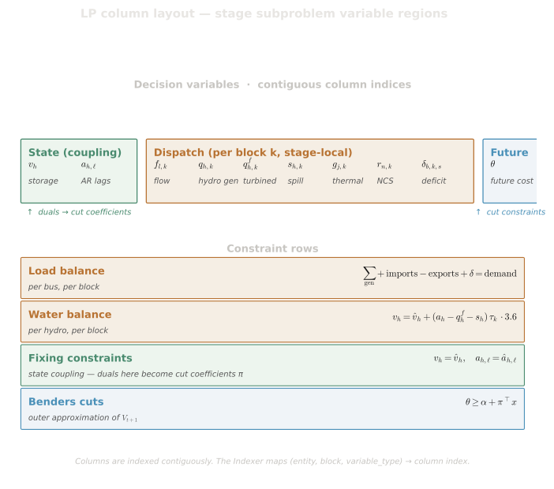

# LP Formulation

## Purpose

This spec presents the complete stage subproblem LP for the Cobre SDDP solver: the objective function with its cost taxonomy, all constraint families, slack/penalty variables, and the Benders cut interface to the future cost function. It uses the **parallel blocks** formulation by default.

**Reading order**: [SDDP algorithm](sddp-algorithm.md) → [system elements](system-elements.md) → **this spec** → [equipment formulations](equipment-formulations.md)

For what each physical element represents and its decision variables, see [system elements](system-elements.md). For variable naming conventions and index sets, see [notation conventions](../overview/notation-conventions.md).

## 1. Cost and Penalty Taxonomy

The objective function includes three categories of penalty/cost terms plus resource costs. This taxonomy aligns with [Penalty System](./penalty-system.md). Understanding these categories is essential for setting appropriate parameter values and interpreting solution reports.

### 1.1 Resource Costs (Actual Operating Expenses)

Resource costs represent actual generation or contractual expenditures:

| Cost               | Symbol         | Units  | Typical Values | Objective Term                                           |
| ------------------ | -------------- | ------ | -------------- | -------------------------------------------------------- |
| Thermal generation | $c^{th}_{j,s}$ | \$/MWh | 50-500         | $\sum_{j,k,s} \tau_k \cdot c^{th}_{j,s} \cdot g_{j,k,s}$ |
| Contract dispatch  | $c^{ctr}_c$    | \$/MWh | 50-300         | $\sum_{c,k} \tau_k \cdot c^{ctr}_c \cdot \chi_{c,k}$     |

Contract prices are positive for imports (cost) and negative for exports (revenue), so a single summation naturally handles both directions. See [system elements §8](system-elements.md) for the unidirectional contract model.

> **Note on Pumping**: Pumping stations do not have an explicit cost parameter. The cost of pumping is implicitly determined by the marginal cost of energy at the bus where the pump is connected — see [equipment formulations](equipment-formulations.md) for details.

### 1.2 Category 1: Recourse Slacks (LP Feasibility)

These ensure the SDDP algorithm has relatively complete recourse — every subproblem must be feasible regardless of scenario realization:

| Penalty           | Symbol          | Units  | Typical Values | Purpose                              |
| ----------------- | --------------- | ------ | -------------- | ------------------------------------ |
| Deficit           | $c^{def}_{b,s}$ | \$/MWh | 1,000-10,000   | Value of unserved energy (piecewise) |
| Excess generation | $c^{exc}_b$     | \$/MWh | 0.001-0.1      | Absorb uncontrollable surplus        |

### 1.3 Category 2: Constraint Violation Penalties (Policy Shaping)

These provide slack for physical or operational constraints that may be impossible to satisfy under extreme conditions. Their cost must be high enough to affect the value function in earlier stages:

| Penalty                  | Symbol       | Units       | Typical Values | Violated Constraint                                     |
| ------------------------ | ------------ | ----------- | -------------- | ------------------------------------------------------- |
| Storage below minimum    | $c^{sv-}_h$  | \$/hm³      | 10,000+        | $v_h \geq \underline{V}_h$                              |
| Filling target shortfall | $c^{fill}_h$ | \$/hm³      | 50,000+        | $v_h \geq \underline{V}_h$ (terminal)                   |
| Turbined flow minimum    | $c^{tv-}_h$  | \$/(m³/s·h) | 500-1,000      | $q_{h,k} \geq \underline{Q}_h$                          |
| Outflow minimum          | $c^{ov-}_h$  | \$/(m³/s·h) | 500-1,000      | $o_{h,k} \geq \underline{O}_h$                          |
| Outflow maximum          | $c^{ov+}_h$  | \$/(m³/s·h) | 500-1,000      | $o_{h,k} \leq \bar{O}_h$                                |
| Generation minimum       | $c^{gv-}_h$  | \$/MWh      | 1,000-2,000    | $g_{h,k} \geq \underline{G}_h$                          |
| Evaporation violation    | $c^{ev}_h$   | \$/(m³/s·h) | 5,000+         | Evaporation within physical limits                      |
| Withdrawal violation     | $c^{wv}_h$   | \$/(m³/s·h) | 1,000-5,000    | Water withdrawal commitment (bidirectional: under/over) |

### 1.4 Category 3: Regularization Costs (Solution Guidance)

Small costs that guide the solver toward physically preferred solutions when the LP would otherwise be indifferent. Must be orders of magnitude smaller than any economic cost:

| Cost               | Symbol          | Units       | Typical Values | Purpose                                         |
| ------------------ | --------------- | ----------- | -------------- | ----------------------------------------------- |
| Spillage           | $c^{spill}_h$   | \$/(m³/s·h) | 0.001-0.01     | Prefer turbining over spilling when indifferent |
| FPHA turbined flow | $c^{fpha}_h$    | \$/(m³/s·h) | 0.01-0.1       | Prevent interior FPHA solutions (FPHA-only)     |
| Diversion          | $c^{div}_h$     | \$/(m³/s·h) | 0.01-0.1       | Prefer main channel flow                        |
| Curtailment        | $c^{curt}_r$    | \$/MWh      | 0.001-0.01     | Prioritize using available NCS generation       |
| Exchange           | $c^{exch}_\ell$ | \$/MWh      | 0.01-1.0       | Prevent unnecessary power flows                 |

> **Note**: Regularization costs should be at least 2-3 orders of magnitude smaller than economic costs to avoid distorting the optimal solution.

### 1.5 Penalty Priority Ordering

The following ordering must be maintained (from highest to lowest):

$$c^{fill} > c^{sv-} > c^{def} > c^{tv-}, c^{ov\pm}, c^{gv-}, c^{ev}, c^{wv} > c^{th}, c^{ctr} > c^{spill}, c^{fpha}, c^{div}, c^{curt}, c^{exch}$$

1. **Filling target** ($c^{fill}$): Highest penalty — filling dead volume is prioritized above all other objectives
2. **Storage violation** ($c^{sv-}$): Above deficit — reservoir below dead volume risks dam safety
3. **Deficit** ($c^{def}$): Value of lost load; exceeds any generation cost
4. **Constraint violations** ($c^{tv-}$, $c^{ov\pm}$, $c^{gv-}$, $c^{ev}$, $c^{wv}$): Exceed typical marginal cost but allow violation when physically necessary
5. **Resource costs** ($c^{th}$, $c^{ctr}$): Market-based or fuel-based
6. **Regularization** ($c^{spill}$, $c^{fpha}$, $c^{div}$, $c^{curt}$, $c^{exch}$): Near-zero

For the full penalty specification, cascade resolution, and stage-varying overrides, see [Penalty System](./penalty-system.md).

> **Note on Thermal Plants**: Thermal bounds ($\underline{G}_j$, $\bar{G}_j$) are hard constraints with no slack variables. Thermal dispatch is directly controllable, unlike hydro constraints that may be violated due to exogenous inflow uncertainty.

> **FPHA validation rule**: For each hydro using the `fpha` production model, $c^{fpha}_h > c^{spill}_h$ must hold. See [Penalty System](./penalty-system.md).

### 1.6 Objective Function Structure

The complete stage objective is:

$$
\min \; \underbrace{C^{resource}}_{\text{thermal, contracts}} + \underbrace{C^{recourse}}_{\text{deficit, excess}} + \underbrace{C^{violation}}_{\text{constraint slacks}} + \underbrace{C^{regularization}}_{\text{spillage, exchange, ...}} + \theta
$$

where each component is summed over blocks with appropriate time weighting:

$$C^{component} = \sum_{k \in \mathcal{K}} \tau_k \cdot (\text{cost terms for component})$$

## 2. Objective Function

$$
\min \sum_{k \in \mathcal{K}} \tau_k \Bigg[
  \underbrace{\sum_{j \in \mathcal{T}} \sum_s c^{th}_{j,s} g_{j,k,s}}_{\text{Thermal cost}}
  + \underbrace{\sum_{c \in \mathcal{C}} c^{ctr}_c \chi_{c,k}}_{\text{Contract cost}}
$$

$$
  + \underbrace{\sum_{b \in \mathcal{B}} \sum_{s \in \mathcal{S}_b} c^{def}_{b,s} \delta_{b,k,s}}_{\text{Deficit (piecewise)}}
  + \underbrace{\sum_{b \in \mathcal{B}} c^{exc}_b \epsilon_{b,k}}_{\text{Excess}}
$$

$$
  + \underbrace{\sum_{h \in \mathcal{H}} c^{spill}_h s_{h,k}
  + \sum_{h \in \mathcal{H}^{fpha}} c^{fpha}_h q_{h,k}
  + \sum_{h \in \mathcal{H}} c^{div}_h u_{h,k}}_{\text{Hydro regularization}}
$$

$$
  + \underbrace{\sum_{r \in \mathcal{R}} c^{curt}_r (A_r - g^{nc}_{r,k})}_{\text{Curtailment (regularization)}}
  + \underbrace{\sum_{l \in \mathcal{L}} c^{exch}_l (f^+_{l,k} + f^-_{l,k})}_{\text{Exchange (regularization)}}
$$

$$
  + \underbrace{\text{Constraint violation penalties}}_{\text{See §9}}
\Bigg]
$$

$$
+ \underbrace{\sum_{h \in \mathcal{H}} \Big[ c^{sv-}_h \sigma^{v-}_h + c^{fill}_h \sigma^{fill}_h \Big]}_{\text{Storage violations (not per-block)}}
+ \; \theta
$$

> **Note**: Storage violation penalties ($\sigma^{v-}_h$, $\sigma^{fill}_h$) are **not** multiplied by $\tau_k$ because they apply to end-of-stage storage (hm³), not to per-block flow rates. All other penalty terms are per-block and carry the $\tau_k$ weighting. Contract prices $c^{ctr}_c$ are positive for imports and negative for exports, so a single sum handles both.

## 3. Load Balance Constraint

For each bus $b \in \mathcal{B}$ and block $k \in \mathcal{K}$:

$$
\sum_{h \in \mathcal{H}_b} g_{h,k} + \sum_{j \in \mathcal{T}_b} \sum_s g_{j,k,s}
+ \sum_{r \in \mathcal{R}_b} g^{nc}_{r,k}
+ \sum_{c \in \mathcal{C}^{imp}_b} \chi_{c,k}
$$

$$
+ \sum_{l: \text{target}=b} \eta_l f^+_{l,k} + \sum_{l: \text{source}=b} \eta_l f^-_{l,k}
$$

$$
- \sum_{l: \text{source}=b} f^+_{l,k} - \sum_{l: \text{target}=b} f^-_{l,k}
- \sum_{c \in \mathcal{C}^{exp}_b} \chi_{c,k}
- \sum_{j \in \mathcal{P}_b} \gamma_j p_{j,k}
+ \sum_{s \in \mathcal{S}_b} \delta_{b,k,s} - \epsilon_{b,k} = D_{b,k}
$$

**Dual variable**: $\pi^{lb}_{b,k}$ (marginal cost of energy at bus $b$, block $k$, in \$/MW; divide by $\tau_k$ for \$/MWh — see [Variable Units Convention](system-elements.md))

For the physical meaning of each element in the balance, see [system elements](system-elements.md).

## 4. Hydro Water Balance

For each hydro $h \in \mathcal{H}$ (parallel blocks formulation):

$$
v_h = v^{in}_h + \zeta \Bigg[ a_h + \sum_{k \in \mathcal{K}} w_k \Big(
  \underbrace{\sum_{i \in \mathcal{U}_h} (q_{i,k} + s_{i,k} + u_{i,k})}_{\text{Inflow from upstream}}
  + \underbrace{\sum_{i: \text{div}=h} u_{i,k}}_{\text{Diverted inflow}}
  + \underbrace{\sum_{j: \text{dest}=h} p_{j,k}}_{\text{Pumped inflow}}
$$

$$
  - \underbrace{q_{h,k} - s_{h,k} - u_{h,k}}_{\text{Outflows}}
  - \underbrace{e_{h,k}}_{\text{Evaporation}}
  - \underbrace{\sum_{j: \text{src}=h} p_{j,k}}_{\text{Pumped outflow}}
\Big) - \underbrace{r_h}_{\text{Withdrawal (signed target)}} \Bigg]
$$

where:

- $v^{in}_h$ = incoming storage LP variable, pinned to the previous stage's value via column bounds (§4a)
- $a_h$ = incremental inflow (from AR model, see [PAR(p) inflow model](par-inflow-model.md)); equivalently $z_h$ from the z-inflow constraint (§5b)
- $r_h$ = water withdrawal target (m³/s), a **signed fixed RHS parameter** from `water_withdrawal_m3s` (not a per-block LP decision variable). $r_h > 0$ schedules a consumptive removal; $r_h < 0$ schedules an inter-basin return/addition that adds water to the reservoir. The realized withdrawal removed from the reservoir is $R_h = r_h - \sigma^{w-}_h + \sigma^{w+}_h$; see §9 for the slack bounds that prevent the realized flow from flipping sign. Withdrawal is applied at the stage level, outside the per-block summation
- $e_{h,k}$ = signed net evaporation flow (m³/s): positive values represent net evaporative loss subtracted from storage; negative values represent net rainfall input on the lake surface that adds to storage through the same coefficient (the leading $-$ sign on $e_{h,k}$ flips the contribution automatically — see [penalty system §5](./penalty-system.md))
- $w_k = \tau_k / \sum_j \tau_j$ = block weight
- $\zeta = 0.0036 \times \sum_k \tau_k$ = time conversion factor

> **Dimensional Consistency** (see [Variable Units Convention](system-elements.md)):
>
> - LHS: $v_h$ [hm³]
> - RHS: $v^{in}_h$ [hm³] + $\zeta$ [hm³/(m³/s)] × (flow terms [m³/s])
> - The factor $\zeta$ converts all flow rates (m³/s) to volumes (hm³) accumulated over the stage
> - Block weights $w_k$ are dimensionless and sum to 1
> - The AR inflow $a_h$ is in m³/s (average rate over the stage)
> - All flow decision variables use rate units (m³/s) — the conversion to volume happens only through $\zeta$ in this constraint

**Dual variable**: $\pi^{wb}_h$ (water value — captures the marginal value of incoming storage as seen through the hydro balance, but is **not** used directly as a cut coefficient; the cut coefficient comes from the reduced cost of the pinned incoming-storage column, see §4a and [cut management](cut-management.md))

## 4a. Incoming-Storage Pinning

The water balance (§4), FPHA hyperplanes (§6), and generic constraints (§10) all involve the incoming storage value $\hat{v}_h$. Rather than embedding $\hat{v}_h$ as a constant in the RHS of each of these constraints (which would require collecting duals from all of them to compute cut coefficients), Cobre introduces an explicit **incoming storage LP variable** $v^{in}_h$ that every such constraint references, and **pins** it to the trial value.

For each hydro $h \in \mathcal{H}$, the incoming-storage column (`storage_in`, §4b) is pinned by setting equal lower and upper **column bounds**:

$$
\underline{v}^{in}_h = \bar{v}^{in}_h = \hat{v}_h
$$

where:

- $v^{in}_h$ = LP variable representing the incoming storage for hydro $h$
- $\hat{v}_h$ = incoming state value (end-of-stage storage from the previous stage), written into both bounds per scenario via bound patching

> **Pinning by bounds, not by a row.** Earlier Cobre releases pinned the incoming state with an explicit equality _constraint row_ $v^{in}_h = \hat{v}_h$ and read that row's dual. As of v0.8.0 the state is pinned by **column bounds** instead, and the equivalent fixing-row block is a permanent empty sentinel (§4b). Eliminating the per-state fixing rows removes $N(1+L)$ redundant equality rows per stage (plus the anticipated-state rows, §5c); the two formulations are KKT-equivalent — see below.

The variable $v^{in}_h$ then appears as an LP variable (not a constant) in all constraints that depend on incoming storage: the water balance (§4), the FPHA average storage computation (§6), and any generic constraints (§10) that reference incoming storage.

**Cut coefficient**: the storage cut coefficient $\pi^v_h$ is the **reduced cost** of the pinned `storage_in` column (unscaled by its prescaler column factor — see §12 and [cut management](cut-management.md)). No fixing-constraint dual is involved.

**Why this design**: By LP duality, when a column is pinned at $\underline{x} = \bar{x}$ its reduced cost equals the sensitivity $\partial Q_t / \partial \hat{v}_h$ of the optimal value to the pinned bound — exactly the multiplier the equivalent equality row $v^{in}_h = \hat{v}_h$ would have carried (KKT parity). This sensitivity automatically accounts for all downstream effects through water balance, FPHA, and generic constraints, so a single reduced-cost value suffices — no combination of duals from multiple constraint types is needed. This is the same "fishing" technique used by SDDP.jl, realised through column bounds rather than a fixing row, and is analogous to how the AR lags (section 5a) are pinned for inflow history.

**Column count**: $N$ pinned incoming-storage columns, where $N = |\mathcal{H}|$ is the number of operating hydros. There is no corresponding fixing-row block.

## 4b. LP Column and Row Layout

The stage LP uses a fixed column and row layout that places state variables first, followed by auxiliary and equipment columns. State is pinned by **column bounds** on the incoming-state columns (§4a, §5a, §5c), and cut coefficients are read as the **reduced costs** of those columns — so the fixed column order, not a fixed row order, is what enables contiguous coefficient extraction. With $N = |\mathcal{H}|$ hydros, $L$ = maximum AR order, $A$ = number of anticipated thermals, and $K = K_{\max} = \max_i K_i$:

**Column layout**:

| Region              | Count | Description                                                                |
| ------------------- | ----- | -------------------------------------------------------------------------- |
| `storage`           | $N$   | Outgoing storage volumes (state) — first                                   |
| `inflow_lags`       | $NL$  | AR lag variables (state) — after storage                                   |
| `anticipated_state` | $K A$ | Ring-buffer slots for anticipated thermals (state, slot-major plant-minor) |
| `z_inflow`          | $N$   | Realized inflow (auxiliary, not state) — after the state block             |
| `storage_in`        | $N$   | Incoming storage volumes (auxiliary, for §4a) — after z-inflow             |
| `theta`             | $1$   | Future cost variable — last of the state prefix                            |

Equipment columns (turbine, spillage, diversion, thermal, anticipated-decision and anticipated-state-out, line flows, deficit, excess, slacks) follow immediately after `theta`. Two auxiliary blocks are reserved for anticipated thermals: $A$ **anticipated-decision** columns $d^i_t$ carrying the commitment placed at this stage for delivery $K_i$ stages later, and $A$ **anticipated-state-out** columns $y^i_t$ used to decouple the post-shift state from the decision-write coefficient — see §5c.

The `z_inflow` region holds one free column per hydro representing the total realized inflow $z_h = a_h$ (m³/s) for each hydro at the current stage. These are auxiliary columns (zero objective cost, unbounded) whose primal values after solving give the realized inflow. They participate in the water balance (§4) and are defined by the z-inflow constraints (§5b).

**Row layout** (equality-constraint prefix):

Because state is pinned by column bounds (§4a, §5a, §5c) rather than by equality rows, there are **no** state-fixing rows: the former `storage_fixing` ($N$), `lag_fixing` ($NL$), and `anticipated_state_fixing` ($KA$) row blocks are permanent empty sentinels (zero rows). The equality-constraint prefix therefore begins directly with the z-inflow definitions:

| Region     | Count | Description                                                         |
| ---------- | ----- | ------------------------------------------------------------------- |
| `z_inflow` | $N$   | Realized-inflow definition constraints (§5b) — first equality block |

Equipment rows (water balance, load balance, FPHA, evaporation, outflow bounds, anticipated-fishing and anticipated-state-out equalities, generic constraints, etc.) follow after the z-inflow rows.

Cut coefficients are **not** read from a contiguous dual slice over a fixing-row prefix. Instead, each incoming-state coordinate is pinned on its own LP column — `storage_in` for storage, `inflow_lags` for AR lags, `anticipated_state` for anticipated-thermal slots — and its cut coefficient is the **reduced cost** of that column (§4a, [cut management](cut-management.md)). The map from a state coordinate to its pinned column is fixed (`state_to_lp_incoming_column`), and each of these incoming-state column regions is contiguous, so all storage, inflow-lag, and anticipated-state coefficients are still gathered by reading a few contiguous slices — of the reduced-cost vector rather than the dual vector.

**Worked example** ($N = 3$, $L = 2$, $A = 0$): the storage region holds 3 columns, the AR lag region holds 6 (3 hydros × 2 lags), the z-inflow region holds 3, and the incoming-storage region holds 3, so `theta` is the 16th column. The state count (outgoing storage + AR lags) is $N(1 + L) = 9$.

## 5. AR Inflow Dynamics

The incremental inflow $a_h$ is determined by the PAR(p) autoregressive model:

$$
a_h = \underbrace{\left( \mu_t - \sum_{\ell=1}^{P_h} \psi_\ell \mu_{t-\ell} \right)}_{\text{deterministic base}}
+ \underbrace{\sum_{\ell=1}^{P_h} \psi_\ell \cdot a_{h,\ell}}_{\text{lag contribution}}
+ \underbrace{\sigma_t \cdot \eta_t}_{\text{stochastic innovation}}
$$

To maintain the Markov property, lagged inflows $a_{h,\ell}$ are promoted to state variables pinned by column bounds — see section 5a below.

See [PAR(p) inflow model](par-inflow-model.md) for the complete PAR(p) model specification.

## 5a. AR Lag Pinning

The AR dynamics equation (section 5) uses lagged inflows $a_{h,\ell}$ as LP variables. To maintain the Markov property in the SDDP decomposition, each lag variable is pinned to its incoming state value via equal lower and upper **column bounds** on the `inflow_lags` column. This binds the lag variables to the known incoming state, and the **reduced cost** of each pinned column provides the cut coefficient $\pi^{lag}_{h,\ell}$ for the corresponding inflow-lag dimension of the Benders cuts (section 11).

For each hydro $h \in \mathcal{H}$ and each lag $\ell \in \{0, \ldots, L-1\}$:

$$
\underline{a}_{h,\ell} = \bar{a}_{h,\ell} = \hat{a}_{h,\ell}
$$

where:

- $a_{h,\ell}$ = LP variable representing the inflow at lag $\ell$ for hydro $h$
- $\hat{a}_{h,\ell}$ = incoming state value (inflow observation from $\ell$ stages ago), written into both bounds via bound patching
- $L$ = maximum AR order across all hydros (uniform lag storage convention)

**Column count**: $N \times L$ pinned lag columns, where $N = |\mathcal{H}|$ is the number of operating hydros and $L$ is the system-wide maximum lag. All hydros store $L$ lags regardless of their individual AR order $P_h$; hydros with $P_h < L$ have zero-valued AR coefficients ($\psi_\ell = 0$ for $\ell > P_h$) in the dynamics equation, but their lag columns are still present and pinned. This uniform layout keeps the `inflow_lags` columns contiguous, so all lag cut coefficients are read in a single slice of the reduced-cost vector (section 4b). There is no corresponding lag-fixing row block.

**Cut coefficient**: $\pi^{lag}_{h,\ell}$ (marginal value of inflow history at lag $\ell$ for hydro $h$) is the reduced cost of the pinned `inflow_lags` column, unscaled by its prescaler column factor (§12) — see [cut management](cut-management.md).

## 5b. Realized-Inflow Definition Constraints (z-inflow)

For each hydro $h \in \mathcal{H}$, the LP includes an auxiliary variable $z_h$ representing the total realized inflow (m³/s) at the current stage. These variables are defined by equality constraints that combine the deterministic base, lag contributions, and stochastic noise:

$$
z_h = b_{h,m(t)} + \sum_{\ell=1}^{P_h} \psi_{m(t),\ell} \cdot a_{h,\ell} + \sigma_{m(t)} \cdot \eta_t
$$

where:

- $z_h$ = LP variable representing the realized inflow for hydro $h$ (free column, zero cost)
- $b_{h,m(t)}$ = deterministic base (precomputed from seasonal means and AR coefficients — see [PAR(p) model §7.4](par-inflow-model.md))
- $\psi_{m(t),\ell}$ = original-unit AR coefficients (constraint matrix entries, set once at LP construction)
- $a_{h,\ell}$ = LP variables for lagged inflows (state variables, fixed by §5a)
- $\sigma_{m(t)} \cdot \eta_t$ = noise innovation (patched into the constraint RHS per scenario)

The z-inflow variable $z_h$ then enters the water balance constraint (§4) in place of the raw inflow term $a_h$, and its primal value after solving gives the realized inflow for reporting and simulation extraction.

The z-inflow columns sit between the AR lag columns and the incoming storage columns in the column layout (section 4b). Because state is pinned by column bounds rather than fixing rows, their constraint rows form the **first** equality block (section 4b). The RHS is patched per scenario with $b_{h,m(t)} + \sigma_{m(t)} \cdot \eta_t$, where $\eta_t$ is the effective noise (possibly clamped for inflow non-negativity — see [Inflow Non-Negativity](inflow-nonnegativity.md)). These are not state variables and do not contribute to cut coefficients.

**Constraint count**: $N$ total constraints, where $N = |\mathcal{H}|$ is the number of operating hydros. See section 4b for the row layout.

## 5c. Anticipated Thermal Dispatch

Anticipated thermals (see [System Elements §4](system-elements.md)) introduce a per-plant ring buffer of $K_i$ pending commitments and a per-stage commitment column. The incoming ring-buffer state is pinned by column bounds (like all other state, §4a); two constraint blocks then couple the remaining variables. The layout is engineered so that the reduced cost on slot 0 of the pinned anticipated-state column at stage $t + 1$ propagates back to the predecessor's commitment column via the standard SDDP cut machinery without any decision-side coefficient corrupting the routing.

### State pinning (column bounds, one per `(slot, plant)`)

For each plant $i \in \{0, \ldots, A - 1\}$ and slot $s \in \{0, \ldots, K - 1\}$, the anticipated-state slot column is pinned by equal column bounds:

$$
\underline{x}^{\mathrm{a}}_{s, i, t} \;=\; \bar{x}^{\mathrm{a}}_{s, i, t} \;=\; \widehat{x}^{\mathrm{a}}_{s, i, t}
$$

The value $\widehat{x}^{\mathrm{a}}_{s, i, t}$ is the incoming state from the previous stage's ring-buffer shift (or, at $t = 0$, the seed `past_anticipated_commitments[i].values_mw[s]`). The slot is **pinned** by its column bounds alone; no decision-write coefficient appears anywhere on the slot column. The cut subgradient with respect to the incoming-state coordinate, $\partial Q_t / \partial \widehat{x}^{\mathrm{a}}_{s, i, t}$, is the **reduced cost** of the pinned slot column (§4a). Padding slots $s \geq K_i$ are pinned to zero by the same bounds; their reduced cost is zero because the slot carries no information.

### Fishing equality (one row per anticipated plant, every stage)

For each plant $i$ and every stage $t \in [0, T - 1]$, the per-block generation of plant $i$ is bound to the matured commitment in slot 0:

$$
\sum_{b = 0}^{B - 1} h_b \cdot g_{i, b, t} \;-\; H_t \cdot x^{\mathrm{a}}_{0, i, t} \;=\; 0
$$

where $h_b$ is the block-$b$ duration and $H_t = \sum_b h_b$. The row is active at every study stage; at $t < K_i$ the slot-0 value comes from the seed `values_mw[t]` and the LP cannot freely choose the per-block generation. From $t \geq K_i$ onward, slot 0 carries a past LP decision delivered via the ring buffer.

### State-out equality (one row per active plant)

For each plant $i$ active at stage $t$ (i.e., $t + K_i < T$), one auxiliary row pins the **anticipated-state-out** column $y^i_t$ to the decision $d^i_t$:

$$
y^i_t \;-\; d^i_t \;=\; 0
$$

The ring-buffer shift between stages uses $y^i_t$ — not $d^i_t$ — as the value written into slot $K_i - 1$ of the next stage's incoming state. The auxiliary $y$ column carries zero objective cost and serves only as the "carrier" that decouples the post-shift state from the decision column. Without this decoupling, the decision column $d^i_t$ would feed directly into the slot whose pinned reduced cost the next stage's cut reads back, corrupting the subgradient routing at $K_i = 1$ (slot 0 = slot $K_i - 1$ collision).

### Objective contributions

Two terms enter the objective for each anticipated plant:

$$
\sum_{i = 0}^{A - 1} c_i(t + K_i) \cdot H_{t + K_i} \cdot d^{\mathrm{NPV}}_{t + K_i} \cdot d^i_t
\;-\;
\sum_{i \in \mathrm{deliver}(t)} \sum_b c_i(t) \cdot h_b \cdot d^{\mathrm{NPV}}_t \cdot g_{i, b, t}
$$

The first sum is the **commitment cost discounted to the delivery stage** $t + K_i$. The second sum subtracts the standard per-block thermal cost at every delivery stage so the same MWh is not charged twice — once through the matured commitment and once through the per-block dispatch. Anticipated-state columns and anticipated-state-out columns carry zero objective cost; they are pure carriers of state. In run cost output this commitment term is reported as its own `anticipated_thermal_cost` category (zero when no anticipated plants are present), distinct from the per-block `thermal_cost`, so the named cost categories sum to the stage's immediate cost.

### Cut subgradient remapping

When the backward pass returns a subgradient on slot $(s, i)$ of stage $t + 1$ — read as the reduced cost of that pinned slot column — the cut-row builder maps it to a column in the **predecessor's** stage problem as follows:

- $s + 1 = K_i$ (slot 0 viewed from the next stage equals slot $K_i - 1$ viewed from this stage): the coefficient targets the predecessor's commitment column $d^i_{t}$ directly. This is the only branch that fires for $K_i = 1$.
- $s + 1 < K_i$: the coefficient targets the predecessor's outgoing-state slot $s + 1$, which holds the same commitment one stage earlier in its journey through the ring buffer.
- $s \geq K_i$ (padding): identity remap; the reduced cost is structurally zero so the cut coefficient on the padded slot does not propagate any sensitivity.

The recursion guarantees that, no matter how many stages elapse between commitment and delivery, the marginal cost of a future obligation reaches the original $d^i$ column it should price.

## 6. Hydro Generation Constraints

Cobre supports two production models during training, in increasing order of complexity. A third model (linearized head) is available during simulation only — see [hydro production models §3](hydro-production-models.md). The model can vary by stage or season per hydro.

**Constant Productivity Model** (for each hydro $h \in \mathcal{H}^{const}$, block $k$):

$$
g_{h,k} = \rho_h \cdot q_{h,k}
$$

**FPHA Model** (for each plane $m \in \mathcal{M}_h$, hydro $h \in \mathcal{H}^{fpha}$, block $k$):

$$
g_{h,k} \leq \gamma^m_0 + \gamma^m_v \cdot v^{avg}_h + \gamma^m_q \cdot q_{h,k} + \gamma^m_s \cdot s_{h,k}
$$

where $v^{avg}_h = (v^{in}_h + v_h)/2$ is the average storage during the stage, with $v^{in}_h$ being the incoming storage LP variable (§4a) and $v_h$ the end-of-stage storage.

**Generation Bounds** (per hydro $h$, block $k$):

$$
\underline{G}_h - \sigma^{g-}_{h,k} \leq g_{h,k} \leq \bar{G}_h
$$

Generation bounds are user-defined (not derived from turbined flow). The lower bound is soft (with slack $\sigma^{g-}_{h,k}$); the upper bound is hard. See [system elements §5](system-elements.md).

For details on the FPHA construction and production function model variants, see [hydro production models](hydro-production-models.md).

## 7. Outflow Constraints

**Outflow Definition** (per hydro $h$, block $k$):

$$
o_{h,k} = q_{h,k} + s_{h,k}
$$

> **Clarification**: Outflow $o$ represents water released to the downstream channel (affecting tailrace level). It does NOT include:
>
> - **Withdrawal** $r_h$: A signed consumptive-use parameter (positive = removal from system for irrigation/water supply; negative = inter-basin return/addition). This is a fixed parameter (not a decision variable) — see §4 for the signed-target semantics and §9 for the slack bounds
> - **Diversion** $u_{h,k}$: Water bypassed to a separate channel (not affecting main tailrace)
>
> The water balance (§4) accounts for all flows: inflow $-$ $(q + s + u)$ $-$ evaporation $-$ withdrawal = storage change. Withdrawal $r_h$ enters as a signed fixed RHS parameter; bidirectional violation slacks ($\sigma^{w-}_h$, $\sigma^{w+}_h$) allow the LP to relax the withdrawal commitment when necessary (see §9).

**Outflow Bounds** (with slacks for soft enforcement):

$$
\underline{O}_h - \sigma^{o-}_{h,k} \leq o_{h,k} \leq \bar{O}_h + \sigma^{o+}_{h,k}
$$

## 8. Variable Bounds and Minimum Constraints

### Storage Bounds (per hydro $h$)

$$
\underline{V}_h - \sigma^{v-}_h \leq v_h \leq \bar{V}_h
$$

The lower bound (dead volume) is soft — the slack $\sigma^{v-}_h$ has a very high penalty above deficit cost. The upper bound (reservoir capacity) is hard; excess water is handled by emergency spillage. During the filling period, the lower bound is inactive (storage can be anywhere in $[0, \bar{V}_h]$).

**Filling terminal constraint** (at stage `entry_stage_id - 1`, for filling hydros only):

$$
v_h + \sigma^{fill}_h \geq \underline{V}_h
$$

with the highest penalty in the system ($c^{fill}_h$). See [Penalty System §7](./penalty-system.md).

### Turbined Flow Bounds (per hydro $h$, block $k$)

$$
\underline{Q}_h - \sigma^{q-}_{h,k} \leq q_{h,k} \leq \bar{Q}_h
$$

Lower bound is soft; upper bound is hard.

### Diversion Flow Bounds (per hydro $h$, block $k$)

$$
0 \leq u_{h,k} \leq \bar{U}_h
$$

Both bounds are hard. Diversion cost is a regularization term (see §1.4), not a violation penalty.

### Pumping Flow Bounds (per station $j$, block $k$)

$$
\underline{P}_j \leq p_{j,k} \leq \bar{P}_j
$$

Both bounds are hard.

## 9. Constraint Violation Penalty Terms

The per-block constraint violation penalties in the objective (referenced from §2) are:

$$
\sum_{k \in \mathcal{K}} \tau_k \sum_{h \in \mathcal{H}} \Big[
  c^{tv-}_h \sigma^{q-}_{h,k} + c^{ov-}_h \sigma^{o-}_{h,k} + c^{ov+}_h \sigma^{o+}_{h,k} + c^{gv-}_h \sigma^{g-}_{h,k}
  + c^{ev+}_h \sigma^{e+}_{h,k} + c^{ev-}_h \sigma^{e-}_{h,k}
\Big]
$$

$$
+ \sum_{h \in \mathcal{H}} T \cdot c^{wv}_h (\sigma^{w-}_h + \sigma^{w+}_h)
$$

where $T = \sum_k \tau_k$ is the total stage duration in hours. Withdrawal violation slacks ($\sigma^{w-}_h$, $\sigma^{w+}_h$) are stage-level (not per-block) and bidirectional: $\sigma^{w-}_h$ penalizes under-delivery (the realized withdrawal $R_h = r_h - \sigma^{w-}_h + \sigma^{w+}_h$ falls short of the target), and $\sigma^{w+}_h$ penalizes over-delivery. The **withdrawal target $r_h$ is signed** (§4), and the slack bounds ensure the realized withdrawal cannot flip sign relative to the target:

- $r_h > 0$ (scheduled removal): $\sigma^{w-}_h \leq r_h$ (under-delivery slack capped at the target magnitude; floors $R_h \geq 0$), $\sigma^{w+}_h$ unbounded.
- $r_h < 0$ (scheduled inter-basin return/addition): $\sigma^{w+}_h \leq |r_h|$ (over-delivery slack capped at $|r_h|$; caps $R_h \leq 0$), $\sigma^{w-}_h$ unbounded.
- $r_h = 0$: both slacks are pinned to zero (presolve-eliminated).

This cap was added in v0.8.1; previously the under-delivery slack was unbounded, which in degenerate cases allowed a run-of-river plant to "un-withdraw" past its target and inject phantom water into the reservoir.

Storage violation penalties ($c^{sv-}_h \sigma^{v-}_h$ and $c^{fill}_h \sigma^{fill}_h$) appear outside the $\tau_k$ sum because they apply to end-of-stage storage — see §2.

### Penalty Resolution

The effective penalty for any (entity, stage, penalty_type) tuple follows a three-level cascade:

1. **Stage-specific override** (from Parquet files in `constraints/`)
2. **Entity-specific override** (from entity registry JSON)
3. **Global default** (from `penalties.json`)

For the full resolution semantics and all penalty value definitions, see [Penalty System](./penalty-system.md).

## 10. Generic Constraints

User-defined linear constraints (per constraint $g \in \mathcal{G}$):

$$
\sum_{e} \gamma_{g,e} \cdot x_e \quad \{\leq, =, \geq\} \quad b_g
$$

where $x_e$ can reference any LP variable using expression syntax:

- `hydro_storage(id)`, `hydro_turbined(id)`, `hydro_spillage(id)`
- `thermal_generation(id)`, `bus_deficit(id)`, etc.

The coefficients $\gamma_{g,e}$ and the RHS $b_g$ may be either literal numeric values or **named scalar parameters**. A scalar parameter resolves to a single number per stage and can carry one of four kinds:

| Kind        | Value semantics                                                                                           |
| ----------- | --------------------------------------------------------------------------------------------------------- |
| `constant`  | One value for every stage                                                                                 |
| `per_stage` | Explicit value per stage                                                                                  |
| `seasonal`  | One value per season; stages inherit the value from their season                                          |
| `computed`  | Value derived from a small expression evaluated at LP-build time (e.g., a fraction of installed capacity) |

Resolution happens once at LP-build time, so the LP coefficients are still numeric at solve time — the parameter mechanism does not introduce LP-variable coupling between constraints. Methodology relevance: it lets the corpus express ramping limits, capacity caps, and operator-imposed quotas that vary by stage or season without authoring a separate constraint per stage. Coefficient and RHS values can therefore be **stage-varying constants**, not just literal numbers.

Generic constraints can have optional slack variables with configurable penalties.

**Row materialization**: a constraint bound declared with `block_id = None` over a **block-independent** expression — one whose every term references a stock variable (incoming storage $v^{in}_h$, outgoing storage $v_h$, evaporation outflow $e_{h,k}$ collapsed to its stage average, or an anticipated-thermal commitment) — is materialized as a **single stage-level row** priced by the total stage hours $T$, since per-block rows would be identical. A `block_id = None` bound on a block-level expression, or any `block_id = Some(k)` bound, still produces one row per relevant block. This is an LP row-count optimization that is cost- and parity-neutral.

## 11. Benders Cuts

For each active cut $i$ from previous iterations:

$$
\theta \geq \alpha_i + \sum_{h \in \mathcal{H}} \pi^v_{i,h} \cdot v_h + \sum_{h,\ell} \pi^{lag}_{i,h,\ell} \cdot a_{h,\ell}
$$

where:

- $\alpha_i$ = cut intercept (RHS)
- $\pi^v_{i,h}$ = coefficient for storage state variable
- $\pi^{lag}_{i,h,\ell}$ = coefficient for AR lag state variable

When anticipated thermals are present, the cut carries one additional coefficient per anticipated-state slot (§5c), read from the same reduced-cost mechanism.

Cuts live in an **append-only pool** at stable slot indices: every cut ever generated is retained for the lifetime of the run, and only the active subset is baked into each iteration's stage template. Deactivation toggles a cut row's bound to a trivially-satisfied $\pm\infty$ sentinel rather than removing the row, so slot indices stay stable and reactivation is exact. See [cut management](cut-management.md).

For cut coefficient derivation, aggregation, and selection strategies, see [cut management](cut-management.md).

## 12. LP Scaling

The stage LP is numerically conditioned via a three-step scaling procedure applied once at template construction time. Scaling improves solver convergence by reducing the condition number of the constraint matrix without changing the optimization argmin.

### 12.1 Cost Scaling (COST_SCALE_FACTOR)

All objective coefficients (except the future cost variable $\theta$) are divided by a constant factor $K = 1000$:

$$
\tilde{c}_j = \frac{c_j}{K} \quad \text{for all } j \neq \theta
$$

The $\theta$ variable retains its coefficient of 1.0 because the Benders cuts enforce $\theta \geq \alpha_{scaled}$ where $\alpha_{scaled} = Q_{successor} / K$, so $\theta$ already operates in scaled cost space. The LP objective is $\sum_j \tilde{c}_j x_j + 1.0 \cdot \theta$, and the total scaled objective equals $(C_{stage} + C_{future}) / K$. All cost-domain outputs (objective values, duals, cost breakdowns) are multiplied by $K$ at the reporting boundary to recover original units.

> **Impact on cut coefficients**: Cut intercepts and coefficients are stored in scaled cost space (divided by $K$). When evaluating or reporting cut values, the factor $K$ must be applied. Duals extracted from the LP are already in scaled cost space and must be multiplied by $K$ to obtain original-unit values.

### 12.2 Column Scaling (Geometric Mean)

After cost scaling, each column $j$ is assigned a scale factor:

$$
d_j^{col} = \frac{1}{\sqrt{\max_i |A_{ij}| \cdot \min_i |A_{ij}|}}
$$

where the max and min are taken over nonzero entries in column $j$. Columns with no nonzero entries receive $d_j^{col} = 1$. The transformation replaces:

- Matrix entries: $\tilde{A}_{ij} = A_{ij} \cdot d_j^{col}$
- Objective coefficients: $\tilde{c}_j = c_j \cdot d_j^{col}$
- Column bounds: $\tilde{l}_j = l_j / d_j^{col}$, $\tilde{u}_j = u_j / d_j^{col}$

### 12.3 Row Scaling (Geometric Mean)

After column scaling, each row $i$ is assigned a scale factor using the same geometric-mean formula applied to the already column-scaled matrix:

$$
d_i^{row} = \frac{1}{\sqrt{\max_j |\tilde{A}_{ij}| \cdot \min_j |\tilde{A}_{ij}|}}
$$

The transformation replaces:

- Matrix entries: $\hat{A}_{ij} = \tilde{A}_{ij} \cdot d_i^{row}$
- Row bounds: $\hat{l}_i^{row} = l_i^{row} \cdot d_i^{row}$, $\hat{u}_i^{row} = u_i^{row} \cdot d_i^{row}$

Column bounds and objective coefficients are not modified by row scaling.

The combined scaling produces the standard $D_r \cdot A \cdot D_c$ form where $D_r$ and $D_c$ are diagonal scaling matrices.

> **Dual unscaling**: LP row duals are in the scaled problem's space. To recover original-unit duals: $\pi_i^{original} = \pi_i^{scaled} \cdot d_i^{row} \cdot K$. The per-column and per-row scale factors are stored in the stage LP template for use during dual extraction and cut coefficient computation.

> **Reduced-cost unscaling for cut coefficients**: State cut coefficients are read as the **reduced costs** of the pinned incoming-state columns (§4a), not as row duals. A reduced cost is reported in the scaled problem's space; the original-unit sensitivity is $\pi_j^{original} = (\bar{c}_j^{scaled} / d_j^{col}) \cdot K$ — divide by the column factor, then multiply by $K$. The **division** by $d_j^{col}$ (not multiplication) follows from the column transform $\tilde{x}_j = x_j / d_j^{col}$ of §12.2: the LP solver/backend differentiates the scaled objective with respect to $\tilde{x}_j$, so recovering $\partial Q / \partial x_j$ divides the column factor back out. Because Cobre prescales the matrix itself and the solver's internal simplex scaler is disabled, no second scaling is applied and this single unscaling is exact. (Cut coefficients are stored in scaled cost space — the $\bar{c}_j^{scaled}/d_j^{col}$ value — with $K$ applied only at the reporting boundary, as for all cost-domain quantities.)

## Cross-References

- [Notation conventions](../overview/notation-conventions.md) — index sets, parameters, decision variable naming
- [System elements](system-elements.md) — physical meaning of each element, decision variables, Variable Units Convention
- [Penalty System](./penalty-system.md) — three-category taxonomy, penalty names, priority ordering, cascade resolution
- [SDDP algorithm](sddp-algorithm.md) — iterative structure that solves this LP at each stage
- [PAR(p) inflow model](par-inflow-model.md) — complete AR inflow model specification
- [Hydro production models](hydro-production-models.md) — constant, linearized head, and FPHA model details
- [Cut management](cut-management.md) — dual extraction, cut coefficients, aggregation, and selection
- [Equipment formulations](equipment-formulations.md) — per-equipment constraint derivations, pumping details
