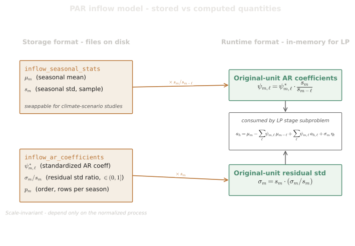

# PAR(p) Inflow Model

## Purpose

This spec defines the Periodic Autoregressive model of order $p$ (PAR(p)) used to capture temporal correlation in inflow time series, including the model definition, parameter semantics, the relationship between stored and computed quantities, the fitting procedure, model order selection, and validation invariants. Section 9 describes the optional PAR(p)-A extension that adds a single annual coefficient on top of the periodic AR structure to capture multi-year hydrological persistence.

## 1. Model Definition

The **Periodic Autoregressive model of order p** (PAR(p)) captures temporal correlation in inflow time series while accounting for seasonal variation in parameters. For hydro $h$ at stage $t$ corresponding to season $m(t)$:

$$
a_{h,t} = \mu_{m(t)} + \sum_{\ell=1}^{p} \psi_{m(t),\ell} \left( a_{h,t-\ell} - \mu_{m(t-\ell)} \right) + \sigma_{m(t)} \cdot \varepsilon_t
$$

where:

- $a_{h,t}$: Incremental inflow at stage $t$ (m³/s)
- $\mu_{m(t)}$: Seasonal mean for season $m(t)$
- $\psi_{m(t),\ell}$: Autoregressive coefficient for lag $\ell$ in season $m(t)$
- $\sigma_{m(t)}$: Residual standard deviation for season $m(t)$ (**computed** at runtime — see section 3)
- $\varepsilon_t \sim \mathcal{N}(0, 1)$: Innovation (standardized noise)
- $m(t)$: Season index for stage $t$ (e.g., month 1–12)

The model order $p$ can vary by season and by hydro plant.

## 2. Parameter Set

For each hydro $h$ and each season $m \in \{1, \ldots, M\}$ (e.g., $M = 12$ for monthly, $M = 52$ for weekly), the complete PAR(p) model requires:

| Parameter                   | Symbol                           | Description                 |
| --------------------------- | -------------------------------- | --------------------------- |
| Seasonal mean               | $\mu_m$                          | Mean inflow for season $m$  |
| AR coefficients             | $\psi_{m,1}, \ldots, \psi_{m,p}$ | Autoregressive coefficients |
| Residual standard deviation | $\sigma_m$                       | Scale of innovation term    |

## 3. Stored vs. Computed Quantities

The data model stores **seasonal sample statistics** and **standardized AR coefficients** with an explicit residual fraction. The relationship between stored and computed quantities is:

### Stored in input files

These are provided in `inflow_seasonal_stats.parquet` and `inflow_ar_coefficients.parquet`:

| Stored quantity      | Column               | File                     | Symbol              | Description                                                                     |
| -------------------- | -------------------- | ------------------------ | ------------------- | ------------------------------------------------------------------------------- |
| Seasonal sample mean | `mean_m3s`           | `inflow_seasonal_stats`  | $\mu_m = \bar{a}_m$ | Mean of historical observations for season $m$                                  |
| Seasonal sample std  | `std_m3s`            | `inflow_seasonal_stats`  | $s_m$               | Standard deviation of historical observations for season $m$                    |
| AR coefficients      | `coefficient`        | `inflow_ar_coefficients` | $\psi^*_{m,\ell}$   | AR coefficient **standardized by seasonal std** — the direct Yule-Walker output |
| Residual std ratio   | `residual_std_ratio` | `inflow_ar_coefficients` | $\sigma_m / s_m$    | Residual std as fraction of seasonal std, $\in (0, 1]$ — a pure model property  |

The AR order $p_m$ is **not stored explicitly**. It is derived at runtime from the count of coefficient rows per (hydro_id, stage_id) group in `inflow_ar_coefficients.parquet`.

The standardized coefficient $\psi^*_{m,\ell}$ is the direct output of the Yule-Walker fitting procedure (see section 5.4). It is dimensionless — the coefficient of the standardized process $(a_{h,t} - \mu_m) / s_m$. The relationship to the original-unit coefficient $\psi_{m,\ell}$ used in the LP is:

$$
\psi_{m,\ell} = \psi^*_{m,\ell} \cdot \frac{s_m}{s_{m-\ell}}
$$

### Computed at runtime

From the stored quantities, the LP requires two additional quantities computed once at initialization:

**Original-unit AR coefficients** (for LP constraint matrix entries):

$$
\psi_{m,\ell} = \psi^*_{m,\ell} \cdot \frac{s_m}{s_{m-\ell}}
$$

**Residual standard deviation** (for noise scaling):

$$
\sigma_m = s_m \cdot \texttt{residual\_std\_ratio}_m
$$

No autocorrelation values are needed at runtime. All required quantities are derived solely from the stored seasonal stats and AR coefficient file.

> **Why store `residual_std_ratio` rather than $\sigma_m$ directly?** The residual std decomposes as $\sigma_m = s_m \cdot \texttt{residual\_std\_ratio}_m$, where $s_m$ is a **conditioning** quantity (swappable for climate scenario studies) and the ratio is a **model dynamics** property (fixed per PAR fit). Storing $\sigma_m$ directly would bake in a specific $s_m$: when the user swaps seasonal stats for a different climate scenario, the stored $\sigma_m$ would be stale and noise scaling would be inconsistent with the new variability level. Storing the ratio preserves correct proportionality — if seasonal variability changes, noise scales proportionally.

### LP coefficients

The stored standardized coefficients $\psi^*_{m,\ell}$ are converted to original-unit $\psi_{m,\ell}$ at runtime (see section 7.2), and these enter the LP directly (see [LP Formulation](lp-formulation.md)). The LP equation is:

$$
a_h = \underbrace{\left( \mu_m - \sum_{\ell=1}^{p} \psi_{m,\ell} \mu_{m-\ell} \right)}_{\text{deterministic base}}
+ \underbrace{\sum_{\ell=1}^{p} \psi_{m,\ell} \cdot a_{h,\ell}}_{\text{lag contribution}}
+ \underbrace{\sigma_m \cdot \eta_t}_{\text{stochastic innovation}}
$$

where $a_{h,\ell}$ are state variables (lagged inflows) and $\eta_t$ is the sampled noise realization.

## 4. Model Order Selection

The PAR order $p$ can vary by season. Available selection criteria:

### 4.1 PACF (Periodic Partial Autocorrelation Function) -- Default

The default method computes the **periodic PACF** via progressive periodic Yule-Walker matrix solves at orders $k = 1, 2, \ldots, p_{max}$, then selects the order using a significance threshold.

**Algorithm**:

1. For each order $k$ from 1 to $p_{max}$, build and solve the periodic Yule-Walker system (section 5.4) at order $k$. The last coefficient $\hat{\psi}^*_{m,k}$ from the order-$k$ solution is the periodic PACF value at lag $k$.
2. Select the order as the **maximum lag with significant PACF**:

   $$
   p_m = \max \left\{ k : |\text{PACF}_m(k)| > \frac{z_\alpha}{\sqrt{N_m}} \right\}
   $$

   where $z_\alpha = 1.96$ (95% confidence) and $N_m$ is the number of observations for season $m$. If no lag is significant, $p_m = 0$ (white noise).

3. Estimate AR coefficients at the selected order using the periodic Yule-Walker system (section 5.4).

**Post-selection validation — Maceira-Damazio iterative reduction**: After PACF selection, the recursively-composed contributions of each lag through the periodic monthly chain are computed. A negative composed contribution flags potential model instability — under SDDP the corresponding Benders cut can carry the negative composition into the future-cost recursion. When any season's composed contribution is negative, the offending season's AR ceiling is reduced and the PACF selection plus Yule-Walker fit are re-run at the new ceiling. The reduction iterates across all seasons until every season's contribution recursion yields non-negative entries, or every offending season has been reduced to order 0.

For the PAR(p)-A path (section 9), two additional rules extend the PACF gate:

- **Structural-zero short-circuit at lag 1**. When the conditional FACP value at lag 1 is exactly zero — which happens when the standardised annual noise series collapses, typically because a degenerate `HistoryClass::Constant` or `HistoryClass::Saturated` bucket has zeroed the seasonal std (section 5.7) — the selected order is forced to 0 (white noise). This blocks degenerate buckets from injecting spurious AR structure.
- **Minimum order 1 when lag 1 is well defined**. When the lag-1 conditional FACP is non-zero but no lag exceeds the significance threshold, the model defaults to order 1 rather than order 0. Hydrological persistence makes a strict order-0 fit a poor default unless the lag-1 value is structurally absent.

### 4.2 AIC (Akaike Information Criterion)

$$
\text{AIC}_m(p) = N_m \ln(\hat{\sigma}_m^2) + 2p
$$

### 4.3 BIC (Bayesian Information Criterion)

$$
\text{BIC}_m(p) = N_m \ln(\hat{\sigma}_m^2) + p \ln(N_m)
$$

### 4.4 Coefficient Significance

Include lag $\ell$ only if $|\hat{\psi}_{m,\ell}| > 2 / \sqrt{N_m}$.

In all methods, $N_m$ is the number of historical observations for season $m$.

## 5. Fitting Procedure

For multi-resolution studies (monthly→quarterly aggregation), the same fitting procedure applies after duration-weighted aggregation; see [Multi-resolution studies](./multi-resolution-studies.md).

This section documents the five-step procedure for fitting PAR(p) parameters from historical inflow data. The fitting is performed when the system derives parameters from `inflow_history.parquet`. When pre-computed parameters are provided directly in `inflow_seasonal_stats.parquet` and `inflow_ar_coefficients.parquet`, this procedure is not executed.

### 5.1 Notation

Let $Y_m = \{a_{h,t} : m(t) = m\}$ be the historical observations for season $m$. Define:

| Symbol           | Description                                  |
| ---------------- | -------------------------------------------- |
| $N_m$            | Number of observations for season $m$        |
| $\bar{a}_m$      | Sample mean for season $m$                   |
| $s_m$            | Sample standard deviation for season $m$     |
| $\gamma_m(\ell)$ | Autocovariance at lag $\ell$ for season $m$  |
| $\rho_m(\ell)$   | Autocorrelation at lag $\ell$ for season $m$ |

### 5.2 Step 1 — Seasonal Means and Standard Deviations

**Seasonal Mean**:

$$
\hat{\mu}_m = \bar{a}_m = \frac{1}{N_m} \sum_{t: m(t) = m} a_{h,t}
$$

**Seasonal Standard Deviation**:

$$
\hat{s}_m = \sqrt{\frac{1}{N_m} \sum_{t: m(t) = m} (a_{h,t} - \bar{a}_m)^2}
$$

The estimator uses the **population divisor** $1/N_m$, not the Bessel-corrected $1/(N_m - 1)$. This matches the Maceira-Damazio convention and is shared by the classical PAR(p) and PAR(p)-A paths. The population divisor is required for self-consistent conditional FACP values and selected orders on the PAR(p)-A path — under a Bessel correction the sample-vs-population scale factor leaks through every Z⊗A cross-correlation. Using the same divisor for the classical path keeps the two paths' seasonal-stats output reusable across configurations.

### 5.3 Step 2 — Seasonal Autocorrelations

The autocorrelation at lag $\ell$ for season $m$ is computed from standardized deviations.

**Cross-seasonal autocovariance**:

For observations at season $m$ with lag $\ell$ reaching back to season $m - \ell$ (mod $M$, where $M$ is the cycle length):

$$
\hat{\gamma}_m(\ell) = \frac{1}{N_m^{(\ell)}} \sum_{t: m(t) = m} \left( a_{h,t} - \bar{a}_m \right) \left( a_{h,t-\ell} - \bar{a}_{m-\ell} \right)
$$

where $N_m^{(\ell)}$ is the number of year-aligned valid pairs at lag $\ell$ for reference season $m$. The estimator uses the **population divisor** $1/N_m^{(\ell)}$, matching the convention adopted in section 5.2 and shared by the classical and PAR(p)-A paths.

**Autocorrelation**:

$$
\hat{\rho}_m(\ell) = \frac{\hat{\gamma}_m(\ell)}{\hat{s}_m \cdot \hat{s}_{m-\ell}}
$$

where $\hat{s}_{m-\ell}$ is the standard deviation of season $m - \ell$ (cyclically, so season 0 = season $M$).

### 5.4 Step 3 — Yule-Walker Equations

For each season $m$, the PAR(p) coefficients $\psi_{m,1}^*, \ldots, \psi_{m,p}^*$ in standardized form are found by solving the **periodic Yule-Walker system**. Unlike the classical (stationary) Yule-Walker equations where all rows use the same reference season, the periodic variant shifts the reference season per row. This correctly accounts for the non-Toeplitz covariance structure of periodic autoregressive processes.

**Matrix construction**: For row $i$ and column $j$ (0-indexed, $0 \leq i,j < p$), the reference season is shifted by row index:

$$
[\mathbf{R}_m]_{i,j} = \hat{\rho}_{(m-i) \bmod M}(|j - i|)
$$

where $M$ is the number of seasons in the periodic cycle (e.g., 12 for monthly). The diagonal entries are always 1 (since $\hat{\rho}_{m'}(0) = 1$ for any season $m'$). The matrix is symmetric but **not Toeplitz** when $M > 1$, because each row references a different season for its autocorrelation values.

**RHS construction**: Each RHS element also uses a shifted reference season:

$$
[\boldsymbol{r}_m]_i = \hat{\rho}_{(m-i) \bmod M}(p - i)
$$

This comes from column $p$ of the extended $(p{+}1) \times (p{+}1)$ version of the periodic autocorrelation matrix.

The full system is:

$$
\begin{pmatrix}
1 & \hat{\rho}_{m}(1) & \hat{\rho}_{m}(2) & \cdots & \hat{\rho}_{m}(p{-}1) \\
\hat{\rho}_{(m-1)}(1) & 1 & \hat{\rho}_{(m-1)}(1) & \cdots & \hat{\rho}_{(m-1)}(p{-}2) \\
\hat{\rho}_{(m-2)}(2) & \hat{\rho}_{(m-2)}(1) & 1 & \cdots & \hat{\rho}_{(m-2)}(p{-}3) \\
\vdots & \vdots & \vdots & \ddots & \vdots \\
\hat{\rho}_{(m-p+1)}(p{-}1) & \hat{\rho}_{(m-p+1)}(p{-}2) & \hat{\rho}_{(m-p+1)}(p{-}3) & \cdots & 1
\end{pmatrix}
\begin{pmatrix}
\psi_{m,1}^* \\
\psi_{m,2}^* \\
\psi_{m,3}^* \\
\vdots \\
\psi_{m,p}^*
\end{pmatrix}
=
\begin{pmatrix}
\hat{\rho}_{m}(p) \\
\hat{\rho}_{(m-1)}(p{-}1) \\
\hat{\rho}_{(m-2)}(p{-}2) \\
\vdots \\
\hat{\rho}_{(m-p+1)}(1)
\end{pmatrix}
$$

where all season indices are taken modulo $M$.

In matrix notation: $\mathbf{R}_m \boldsymbol{\psi}_m^* = \boldsymbol{r}_m$

where:

- $\mathbf{R}_m$ is the $p \times p$ periodic correlation matrix (symmetric but not Toeplitz for $M > 1$)
- $\boldsymbol{r}_m$ is the vector of target autocorrelations with per-row reference season shifting

> **Note**: For a single-season model ($M = 1$), all rows use the same reference season and the matrix reduces to the classical Toeplitz Yule-Walker matrix. The periodic formulation is the general case that correctly handles multi-season (e.g., monthly) data.

**Solution**:

$$
\hat{\boldsymbol{\psi}}_m^* = \mathbf{R}_m^{-1} \boldsymbol{r}_m
$$

The system is solved via Gaussian elimination with partial pivoting (for small systems with $p \leq 10$, this is numerically adequate).

### 5.5 Step 4 — Store Standardized Coefficients and Residual Fraction

The Yule-Walker solution $\psi_{m,\ell}^*$ is in standardized form — the direct output of step 3. It is stored as-is in `inflow_ar_coefficients.parquet`. No conversion to original units is performed.

Compute and store the residual std ratio:

$$
\widehat{\texttt{residual\_std\_ratio}}_m = \sqrt{1 - \boldsymbol{\psi}_m^{*\top} \boldsymbol{r}_m} = \sqrt{1 - \sum_{\ell=1}^{p} \psi_{m,\ell}^* \cdot \hat{\rho}_m(\ell)}
$$

Both $\psi^*_{m,\ell}$ (one row per lag) and $\widehat{\texttt{residual\_std\_ratio}}_m$ (repeated across all lag rows of the same (hydro, stage) group) are written to `inflow_ar_coefficients.parquet`.

### 5.6 Step 5 — Residual Standard Deviation

The residual standard deviation for season $m$ is recovered at runtime from the stored ratio (see section 3):

$$
\hat{\sigma}_m = \hat{s}_m \cdot \widehat{\texttt{residual\_std\_ratio}}_m
$$

For reference, the full expression in terms of fitting quantities is:

$$
\hat{\sigma}_m = \hat{s}_m \sqrt{1 - \boldsymbol{r}_m^\top \mathbf{R}_m^{-1} \boldsymbol{r}_m}
$$

### 5.7 Historical Bucket Classification

Before the seasonal stats and AR coefficients are used by the order-selection rules, each per-(hydro, season) historical bucket is classified by the shape of its observations. The classification can override the empirical $(\hat{\mu}_m, \hat{s}_m)$ for fitting purposes, and the override propagates to **both** the classical PAR(p) and the PAR(p)-A paths because both paths share the seasonal-stats producer.

Four classes are defined:

| Class          | Detection rule                                                           | Override applied                                            |
| -------------- | ------------------------------------------------------------------------ | ----------------------------------------------------------- |
| `Default`      | None of the conditions below                                             | None — use empirical $(\hat{\mu}_m, \hat{s}_m)$             |
| `Constant`     | Every observation equals the same value within float tolerance           | $(\hat{\mu}_m, \hat{s}_m) \leftarrow (\text{value}, 0)$     |
| `ManyNegative` | Strictly negative observations exceed 10% of the bucket                  | None — diagnostic only, fit proceeds on the empirical stats |
| `Saturated`    | The modal value (rounded to m³/s) occupies more than 50% of observations | $(\hat{\mu}_m, \hat{s}_m) \leftarrow (\text{cap}, 0)$       |

The classifier runs in the priority order `Constant` → `ManyNegative` → `Saturated` → `Default`. Constancy takes precedence over negative-pathology detection, which in turn takes precedence over saturation.

#### Why $\hat{s}_m = 0$ short-circuits the fit

When the override sets $\hat{s}_m = 0$ for a season, every downstream fitter degenerates predictably:

- On the **classical PAR(p) path**, the periodic autocorrelation $\hat{\rho}_m(\ell)$ becomes zero by the zero-std guard in section 5.3, so the PACF selection (section 4.1) reports no significant lag and returns order 0 implicitly.
- On the **PAR(p)-A path**, the standardised noise series collapses, the conditional FACP at lag 1 evaluates to exactly zero, and the structural-zero short-circuit (section 4.1) returns order 0 explicitly.

Either way, the bucket cannot inject spurious autoregressive structure into adjacent months' PACFs, and no spatial-correlation contribution flows from it during scenario generation.

#### Interpretation of each class

- **`Constant`** captures plants whose incremental inflow is structurally constant for a given month — typically regulated or transposed flows where the upstream subtraction yields the same value every year. Forcing $(\text{value}, 0)$ records the deterministic level without inventing autoregressive dynamics.
- **`Saturated`** captures flow caps (turbine or reservoir capacity) and low-flow constants (transposed ecological flows). The modal value is treated as the cap. There is no magnitude threshold — a cap of 0 m³/s qualifies just as readily as a cap at installed capacity.
- **`ManyNegative`** flags buckets that the upstream incremental-inflow construction has driven below zero for more than 10% of observations. The condition is recorded for operator diagnostics but does not override the fit — the cause is upstream-data quality, not a methodological signal.
- **`Default`** is the standard path; the empirical stats and the chosen order-selection rule decide the order.

## 6. Validation Invariants

After fitting or loading pre-computed parameters, the following invariants must hold:

1. **Positive residual variance**: $\sigma_m^2 > 0$ for all seasons. If violated, the AR model explains all variance — likely overfitting.
2. **Stationarity**: Roots of $1 - \sum_\ell \psi_{m,\ell} z^\ell = 0$ lie outside the unit circle. Ensures the AR process is stable and does not diverge.
3. **Correlation matrix positive definite**: $\mathbf{R}_m$ is invertible. Required for Yule-Walker solution to exist. If violated, the historical record may be too short for the requested AR order.
4. **No systematic bias**: Residuals $\varepsilon_t$ have mean near zero. Indicates the model captures the mean structure correctly.
5. **AR order derivation**: The number of coefficient rows per (hydro_id, stage_id) in `inflow_ar_coefficients.parquet` determines the AR order $p_m$. Lags must be contiguous: $\{1, 2, \ldots, p_m\}$.
6. **Residual std ratio consistency**: The `residual_std_ratio` value must be identical across all lag rows sharing the same (hydro_id, stage_id) group, and must lie in $(0, 1]$.

## 7. PAR-to-LP Transformation

This section derives the explicit algebraic transformation from the canonical PAR(p) model (section 1) into the form consumed by the LP subproblem. The derivation identifies three precomputable components that are cached once at initialization and reused at every forward-pass stage transition.

### 7.1 Canonical Standardized Form

The PAR(p) model (section 1) operates on deviations from the seasonal mean, scaled by the seasonal standard deviation. In fully standardized form:

$$
\frac{a_{h,t} - \mu_{m(t)}}{\sigma_{m(t)}} = \sum_{\ell=1}^{p} \phi_{m(t),\ell} \frac{a_{h,t-\ell} - \mu_{m(t-\ell)}}{\sigma_{m(t-\ell)}} + \varepsilon_t
$$

where:

- $\phi_{m(t),\ell}$: AR coefficients in **fully standardized** form (correlations between normalized deviations)
- $\sigma_{m(t)}$: residual standard deviation for season $m(t)$ (derived at runtime — see section 3)
- $\varepsilon_t \sim \mathcal{N}(0, 1)$: innovation noise

The input files store $\psi^*_{m,\ell}$ (standardized by seasonal std $s_m$, not residual std $\sigma_m$). The next step converts these to original-unit $\psi_{m,\ell}$ for use in the LP.

### 7.2 Coefficient Conversion

The stored standardized coefficients $\psi^*_{m,\ell}$ are converted to original-unit coefficients $\psi_{m,\ell}$ at runtime using the seasonal standard deviations from `inflow_seasonal_stats.parquet`:

$$
\psi_{m,\ell} = \psi^*_{m,\ell} \cdot \frac{s_m}{s_{m-\ell}}
$$

The residual standard deviation is also derived at this preprocessing step:

$$
\sigma_m = s_m \cdot \texttt{residual\_std\_ratio}_m
$$

These conversions are performed once at LP construction time. They require only the seasonal stats ($s_m$) and the stored model quantities ($\psi^*_{m,\ell}$, $\texttt{residual\_std\_ratio}_m$) — no autocorrelation values, no historical data.

### 7.3 LP-Ready Form

Multiplying both sides of the canonical form (section 7.1) by $\sigma_{m(t)}$ and rearranging yields the LP-ready equation:

$$
a_{h,t} = \sum_{\ell=1}^{p} \psi_{m(t),\ell} \cdot a_{h,t-\ell} + \left[ \mu_{m(t)} - \sum_{\ell=1}^{p} \psi_{m(t),\ell} \cdot \mu_{m(t-\ell)} \right] + \sigma_{m(t)} \cdot \varepsilon_t
$$

where $\psi_{m(t),\ell}$ and $\sigma_{m(t)}$ are derived from stored quantities as described in section 7.2.

This decomposes the inflow into three additive components:

1. **Lag contribution**: $\displaystyle\sum_{\ell=1}^{p} \psi_{m(t),\ell} \cdot a_{h,t-\ell}$ — linear function of past inflows (state variables or known values)
2. **Deterministic base**: $\displaystyle\mu_{m(t)} - \sum_{\ell=1}^{p} \psi_{m(t),\ell} \cdot \mu_{m(t-\ell)}$ — constant offset per (stage, hydro), precomputed once
3. **Stochastic innovation**: $\sigma_{m(t)} \cdot \varepsilon_t$ — noise draw scaled by the seasonal residual standard deviation

### 7.4 Deterministic Base

The deterministic base is defined as:

$$
b_{h,m(t)} = \mu_{m(t)} - \sum_{\ell=1}^{p} \psi_{m(t),\ell} \cdot \mu_{m(t-\ell)}
$$

This is a precomputed constant per (stage, hydro) pair. It absorbs the mean-adjustment arithmetic that would otherwise be repeated at every forward-pass stage transition. With this definition, the LP-ready form (section 7.3) simplifies to:

$$
a_{h,t} = \sum_{\ell=1}^{p} \psi_{m(t),\ell} \cdot a_{h,t-\ell} + b_{h,m(t)} + \sigma_{m(t)} \cdot \varepsilon_t
$$

### 7.5 LP RHS Patching Operation

The lagged inflows $a_{h,t-\ell}$ are **LP variables**, not substituted values. In the LP (see [LP Formulation](lp-formulation.md)), they appear with coefficients $-\psi_{m(t),\ell}$ in the AR dynamics constraint row, and separate equality constraints fix each lag variable to its incoming state value:

$$
a_{h,t-\ell} = \hat{a}_{h,t-\ell}
$$

where $\hat{a}_{h,t-\ell}$ is patched per scenario to the actual lagged inflow from the trajectory record.

Because the lag contribution $\sum_\ell \psi \cdot a_{h,t-\ell}$ is carried by the constraint matrix (not the RHS), the AR dynamics constraint RHS reduces to:

$$
\text{RHS}_{h,t} = b_{h,m(t)} + \sigma_{m(t)} \cdot \varepsilon_t
$$

where:

- $b_{h,m(t)}$ is the deterministic base for (stage, hydro), precomputed once at LP construction (section 7.4)
- $\sigma_{m(t)}$ is the noise scale for (stage, hydro), derived from stored ratio at initialization (section 7.2)
- $\varepsilon_t$ is the scenario noise draw for this (stage, hydro)

The $\psi_{m(t),\ell}$ coefficients are written into the constraint matrix **once at LP construction time** as the coefficients on the lagged inflow variables; they are not recomputed per scenario.

No division, no mean subtraction, no repeated coefficient transformation — the three precomputed LP components eliminate all redundant arithmetic from the hot path.

### 7.6 Summary of LP Components

| Component          | Symbol             | Shape per stage      | LP Role                                   | Source                                                                 |
| ------------------ | ------------------ | -------------------- | ----------------------------------------- | ---------------------------------------------------------------------- |
| Lag coefficients   | $\psi_{m(t),\ell}$ | One per (hydro, lag) | Constraint matrix (AR dynamics row)       | Derived from stored $\psi^*$ and $s_m$ at initialization (section 7.2) |
| Deterministic base | $b_{h,m(t)}$       | One per hydro        | AR dynamics constraint RHS (fixed term)   | Precomputed from $\mu$ and $\psi$                                      |
| Noise scale        | $\sigma_{m(t)}$    | One per hydro        | AR dynamics constraint RHS (noise factor) | Derived from stored ratio and $s_m$ at initialization (section 7.2)    |

## 8. Spatial Correlation Factorisation

The PAR(p) fitting procedure (section 5) produces per-hydro noise terms $\varepsilon_t$ that are treated as independent across hydro plants. Generating spatially correlated scenarios requires factorising the cross-hydro correlation matrix $C$ so that a vector of independent standard normal draws can be mapped to correlated noise. This section documents the choice of factorisation method and the rationale.

### 8.1 The Problem with Cholesky

The classical approach applies Cholesky factorisation: given $C = L L^\top$ with $L$ lower-triangular, correlated noise is obtained as $L z$ where $z \sim \mathcal{N}(0, I)$. Cholesky requires $C$ to be **strictly positive-definite**. In practice, estimated correlation matrices from hydro inflow series are frequently near-singular or rank-deficient for two reasons:

- **Short sample records**: Brazilian hydro series commonly span 80–90 years, yielding a historical record length $N$ that is comparable to the number of hydro plants in some subsystems. When $N$ is close to the matrix dimension, the sample eigenvalues of $C$ cluster near zero.
- **Heterogeneous series**: Plants with near-identical hydrological regimes (upstream–downstream pairs, same river basin) produce columns that are nearly linearly dependent, reducing the effective rank of $C$ below its nominal dimension.

A near-singular $C$ causes Cholesky to fail or to produce numerically degenerate lower triangular factors. A separate filtering pass to remove "degenerate" hydros would be required before the factorisation, discarding information and introducing a non-transparent pre-processing decision.

### 8.2 Eigendecomposition with Clipped Square Root

Cobre uses the **symmetric matrix square root via eigendecomposition**. The correlation matrix is decomposed as:

$$
C = U \Lambda U^\top
$$

where $U$ is the orthogonal matrix of eigenvectors and $\Lambda = \mathrm{diag}(\lambda_1, \ldots, \lambda_n)$ is the diagonal matrix of eigenvalues. The symmetric square root is then:

$$
C^{1/2} = U \Lambda^{1/2} U^\top
$$

To handle near-singular matrices, any eigenvalue $\lambda_i < 0$ (arising from floating-point rounding in the sample estimate) is **clipped to zero** before taking the square root:

$$
\tilde{\Lambda}^{1/2} = \mathrm{diag}\!\left(\sqrt{\max(\lambda_1, 0)},\, \ldots,\, \sqrt{\max(\lambda_n, 0)}\right)
$$

Correlated noise is then generated as $C^{1/2} z$ where $z \sim \mathcal{N}(0, I)$.

### 8.3 Why Eigendecomposition

The spectral form handles rank-deficient correlation matrices natively: eigenvectors corresponding to clipped (zero) eigenvalues contribute nothing to the factorisation, which is the correct behaviour for directions of zero variance. No prior filtering of degenerate hydro plants is needed.

The clipping threshold acts as a single, transparent parameter controlling which near-zero eigenvalues are treated as structural zeros. The cross-entity correlation structure is preserved for all eigenvalues above the threshold.

### 8.4 Trade-offs

| Property                        | Eigendecomposition (Cobre)       | Cholesky                            |
| ------------------------------- | -------------------------------- | ----------------------------------- |
| Handles rank-deficient $C$      | Yes — clipping makes it robust   | No — requires positive-definiteness |
| Computational cost              | Higher (full eigendecomposition) | Lower on well-conditioned matrices  |
| Degenerate-hydro filtering pass | Not required                     | Required for near-singular $C$      |
| Transparency of approximation   | Single clipping threshold        | Opaque numerical failure or pivot   |

The higher computational cost is acceptable because the factorisation is performed once per study configuration and not on the hot path of the forward pass.

## 9. Annual Component Extension (PAR(p)-A)

The classical PAR(p) of section 1 captures temporal dependence at lags up to a small $p$ (typically $\leq 4$ for monthly cycles, since the periodic Yule-Walker system becomes ill-conditioned at higher orders). On long Brazilian hydro series this is enough to reproduce the within-year persistence but not the multi-year persistence visible in dry/wet super-periods of the historical record. The **PAR(p)-A** extension adds a single annual coefficient on top of the periodic AR structure to capture that longer-range persistence without inflating the AR order.

The extension is selected by the order-selection method `pacf_annual`. When active, the model carries one additional triple per (hydro, season) on top of the classical parameter set.

### 9.1 Augmented Model

Let $A_{h,t-1}$ denote the **rolling 12-month average** of incremental inflows ending one stage before $t$:

$$
A_{h,t-1} = \frac{1}{12} \sum_{j=1}^{12} a_{h,\, t-j}
$$

The PAR(p)-A model augments section 1 with the standardised deviation of $A_{h,t-1}$ from its own seasonal mean:

$$
a_{h,t} \;=\; \mu_{m(t)} \;+\; \sum_{\ell=1}^{p} \psi_{m(t),\ell}\,(a_{h,t-\ell} - \mu_{m(t-\ell)})
\;+\; \hat{\psi}_{m(t)}\,(A_{h,t-1} - \mu^A_{m(t)-1})
\;+\; \sigma_{m(t)} \cdot \varepsilon_t
$$

where:

- $\mu^A_{m}$, $\sigma^A_{m}$: seasonal sample mean and **population-divisor** standard deviation of $A_{h, \cdot}$ at season $m$
- $\hat{\psi}_{m(t)}$: original-unit annual coefficient at season $m(t)$ — derived at runtime from the standardised stored coefficient (section 9.4)
- All other symbols carry their classical meaning from section 1

When the PAR(p)-A extension is inactive, the annual term is absent and the model reduces exactly to section 1.

### 9.2 Annual Component Parameters

For each (hydro, season) the PAR(p)-A path stores three additional quantities:

| Quantity                        | Symbol       | Description                                                          |
| ------------------------------- | ------------ | -------------------------------------------------------------------- |
| Standardised annual coefficient | $\psi$       | Yule-Walker output for the annual term — dimensionless               |
| Annual seasonal mean            | $\mu^A_m$    | Sample mean of $A_{h, \cdot}$ at season $m$ (m³/s)                   |
| Annual seasonal std             | $\sigma^A_m$ | Population-divisor std of $A_{h, \cdot}$ at season $m$ (m³/s, $> 0$) |

The standardised coefficient $\psi$ is the direct output of the extended periodic Yule-Walker system below (section 9.5). Storage of $\mu^A_m$ and $\sigma^A_m$ alongside the seasonal statistics of $a_{h, \cdot}$ enables the runtime unit conversion of section 9.4 without re-reading the historical record.

### 9.3 Estimating $\mu^A_m$ and $\sigma^A_m$

Group rolling-window values $A_t = \frac{1}{12} \sum_{j=0}^{11} a_{h,\, t - 11 + j}$ by the season of their **PDF time-index** $t-1$ (the most recent observation contributing to the window). For each (hydro, season) bucket of values $\{A^{(i)}\}$:

$$
\hat{\mu}^A_m \;=\; \frac{1}{N^A_m} \sum_{i} A^{(i)}
\qquad
\hat{\sigma}^A_m \;=\; \sqrt{\frac{1}{N^A_m} \sum_{i} \bigl(A^{(i)} - \hat{\mu}^A_m\bigr)^2}
$$

Both estimators use the population divisor $1/N^A_m$, matching the convention of section 5.2 and ensuring no sample-vs-population scale factor leaks into the conditional FACP of section 9.5. At least 13 chronological observations are required for a hydro to participate in PAR(p)-A — that is the minimum needed to form one rolling 12-month average.

### 9.4 Runtime Unit Conversion

The stored standardised coefficient $\psi$ is converted to the original-unit coefficient $\hat{\psi}$ at LP construction time using the seasonal stats and annual stats:

$$
\hat{\psi}_{m} \;=\; \psi \cdot \frac{s_m}{\sigma^A_m}
$$

The conversion mirrors section 7.2 for the classical AR coefficients. The runtime annual term entering the LP RHS is then $\hat{\psi}_{m(t)} \cdot \bigl(A_{h,t-1} - \mu^A_{m(t)-1}\bigr)$, where the lagged rolling-window value $A_{h,t-1}$ is itself derived from the lag state variables already carried by the LP.

### 9.5 Order Selection and Coefficient Estimation

PAR(p)-A order selection conditions on the annual noise series. The order-selection input is the **conditional FACP** at lag $k$, defined as the partial autocorrelation between the standardised current-season residual and the standardised residual at lag $k$, **conditioned on** the intermediate standardised annual noise series $Z$ and the previous annual innovation $A_{t-1}$. Computing the conditional FACP requires a partitioned covariance decomposition that distinguishes $Z \otimes Z$, $Z \otimes A$, and $A \otimes Z_{-1}$ blocks.

The conditional FACP feeds the PACF order-selection rule of section 4.1, with the two PAR(p)-A-specific extensions (structural-zero short-circuit and minimum-order-1) already described there.

#### Cross-covariance divisor

The $Z \otimes Z$ block uses the same year-aligned population divisor as the classical autocovariance (section 5.3). The $Z \otimes A$ and $A \otimes Z_{-1}$ blocks use a **max-bucket-size divisor**:

$$
\hat{\gamma}_{Z \otimes A}(\ell) \;=\; \frac{1}{\max(|A|,\, |Z|)} \sum_i \bigl(Z^{(i)} - \bar{Z}\bigr)\bigl(A^{(i)} - \bar{A}\bigr)
$$

The max-bucket convention is required because $A$ excludes the first year of $Z$ by construction (a rolling 12-month window cannot anchor in the first 12 observations). The strict-pair count would distort the scale of the cross-correlations and bias the conditional FACP. The PAR(p) path never uses Z⊗A cross-correlations, so the divisor question is PAR(p)-A-specific.

#### Extended periodic Yule-Walker

Once the order $p$ is selected, the coefficients $(\psi^*_{m,1}, \ldots, \psi^*_{m,p}, \psi)$ are recovered by solving the **extended periodic Yule-Walker system**:

$$
\mathbf{R}^{\,\text{ext}}_m
\begin{pmatrix} \psi^*_{m,1} \\ \vdots \\ \psi^*_{m,p} \\ \psi \end{pmatrix}
= \boldsymbol{r}^{\,\text{ext}}_m
$$

where $\mathbf{R}^{\,\text{ext}}_m$ is the $(p+1) \times (p+1)$ partitioned covariance whose first $p$ rows replicate the classical periodic Yule-Walker rows (section 5.4) and whose last row adds the $Z \otimes A$ and $A \otimes A$ entries. The RHS $\boldsymbol{r}^{\,\text{ext}}_m$ appends the $A \otimes Z_{-1}$ target. The residual std ratio is recovered from the inner product of the solution and the RHS, exactly as in the classical case.

### 9.6 Iterative Order Reduction

The Maceira-Damazio iterative reduction of section 4.1 is applied across the full periodic cycle on the PAR(p)-A path as well: after the initial fit, the recursively-composed contributions of each AR lag through the periodic monthly chain are evaluated, and any negative-contribution season has its AR ceiling reduced before refit. The annual coefficient $\psi$ does not enter the contribution-chain check — it is anchored to the rolling annual mean and so does not propagate through the lag chain.

### 9.7 Activation and Fallback

| Configuration                                                        | Path                                                                                     |
| -------------------------------------------------------------------- | ---------------------------------------------------------------------------------------- |
| `order_selection: "pacf"`                                            | Classical PAR(p) — annual triple absent (section 5)                                      |
| `order_selection: "pacf_annual"`                                     | PAR(p)-A — annual triple required for every (hydro, season)                              |
| Bucket flagged `HistoryClass::Constant` or `Saturated` (section 5.7) | Effective order 0 on either path; annual term suppressed when the seasonal std collapses |
| Hydro with fewer than 13 observations on PAR(p)-A path               | Hard failure during fitting (no silent fallback to classical)                            |

The two paths share the seasonal-stats producer of section 5.2; switching between them does not silently change $\hat{\mu}_m$ or $\hat{s}_m$. The PAR(p)-A path uses the same spatial-correlation factorisation as the classical path (section 8); the extension affects only the temporal model.

## 8. Annual Component Extension (PAR(p)-A)

The classical PAR(p) model (§1) encodes hydrological memory only through its $p$ monthly lags. When
the historical record exhibits persistent multi-year wet or dry episodes, $p$ monthly lags are
insufficient: the model reverts toward the seasonal mean within a few periods. The
**PAR(p)-A extension** adds one additional regressor — the rolling 12-month average inflow
$\bar{A}_{h,t-1}$ — that explicitly captures the annual-scale hydrological tendency without
requiring a very high AR order.

### 8.1 Model Definition

For hydro $h$ at stage $t$ with season $m = m(t)$, the PAR(p)-A model is:

$$
a_{h,t} = \mu_m + \sum_{\ell=1}^{p} \phi_{m,\ell} \left( a_{h,t-\ell} - \mu_{m-\ell} \right)
         + \psi_m \left( \bar{A}_{h,t-1} - \mu^A_m \right) + \sigma_m \varepsilon_t
$$

where:

- $\phi_{m,\ell}$: periodic AR coefficient for lag $\ell$ and season $m$ (same role as $\psi_{m,\ell}$
  in §1; the notation distinguishes the classical lags from the annual coefficient below)
- $\psi_m$: **annual component coefficient** for season $m$, expressed in the standardized
  space of $\bar{A}$
- $\bar{A}_{h,t-1}$: rolling 12-month average inflow at hydro $h$, centered on the period
  immediately preceding stage $t$:

$$
\bar{A}_{h,t-1} = \frac{1}{12} \sum_{\tau=1}^{12} a_{h,t-\tau}
$$

- $\mu^A_m$: seasonal mean of $\bar{A}$ for season $m$ (see §8.2)
- $\sigma_m$: residual standard deviation, same as in the classical model (§3)
- $\varepsilon_t \sim \mathcal{N}(0,1)$: innovation noise

When $\psi_m = 0$ the model reduces exactly to the classical PAR(p) (§1).

### 8.2 Sample Statistics of the Annual Component

To estimate $\psi_m$ and to convert it to original units, two seasonal statistics of $\bar{A}$ are
required: its mean $\mu^A_m$ and its standard deviation $\sigma^A_m$.

**Rolling average series.** For each hydro $h$ and chronological index $i$ (0-based), define:

$$
A_i = \frac{1}{12} \sum_{j=0}^{11} a_{h,i-j}
$$

The target date of $A_i$ is the date of observation $i$. This value is associated with the season
of observation $i$.

**Seasonal statistics.** For $N^A_m$ rolling-average values falling in season $m$:

$$
\hat{\mu}^A_m = \frac{1}{N^A_m} \sum_{i : m(i) = m} A_i
$$

$$
\hat{\sigma}^A_m = \sqrt{\frac{1}{N^A_m - 1} \sum_{i : m(i) = m} \left( A_i - \hat{\mu}^A_m \right)^2}
$$

> **Note: Bessel correction divergence from the source literature.** The formula above uses
> divisor $N^A_m - 1$ (Bessel-corrected sample standard deviation). The original PAR(p)-A
> derivation (CEPEL DEA-1416/2020, eq. 18) uses the population divisor $N^A_m$. This
> implementation intentionally diverges to match the `1/(N-1)` convention used throughout
> the workspace by `estimate_seasonal_stats` (see §5.2). The two values differ by a factor
> of $\sqrt{N^A_m / (N^A_m - 1)}$, which is negligible at typical historical sample sizes
> ($N^A_m \geq 20$) but will produce a systematic discrepancy when cross-checking against
> NEWAVE numerical outputs that follow the population formula.

### 8.3 Extended Yule-Walker System

Fitting the PAR(p)-A model requires estimating $p + 1$ unknowns per season: the $p$ classical AR
coefficients $\phi^*_{m,1}, \ldots, \phi^*_{m,p}$ (in standardized form) and the annual coefficient
$\psi_m$. The system in §5.4 is extended by one equation and one unknown.

The $(p+1) \times (p+1)$ extended periodic Yule-Walker matrix for season $m$ appends a row and
column for the cross-correlations between the monthly series $z_t = (a_{h,t} - \mu_m) / s_m$ and
the rolling annual series. Concretely, two additional correlation quantities are needed:

**Cross-correlation $\rho^{m-1}_{Z,A}(k-1)$** (last column of the AR block rows): the
correlation between $z_{t-k}$ and $\bar{A}_{t-1}$, at reference season $m-1$.

**Cross-correlation $\rho^{m-1}_{Z,A}(-1)$** (bottom-right element): the correlation between
$\bar{A}_{t-1}$ and $z_t$, at reference season $m-1$.

The solution vector $(\phi^*_{m,1}, \ldots, \phi^*_{m,p}, \psi_m)^\top$ is obtained by solving
this extended system; the details of the full matrix structure follow directly from the periodic
extension in §5.4.

### 8.4 Original-Unit Reduction

The annual component coefficient $\psi_m$ from the Yule-Walker solution is expressed in the
standardized space of $\bar{A}$. To enter the LP, it must be converted to the same
original-unit (m³/s) space as the classical AR coefficients. Define:

$$
\hat{\psi}_m = \psi_m \cdot \frac{\sigma_m}{\hat{\sigma}^A_m}
$$

where $\hat{\sigma}^A_m$ is the seasonal standard deviation of $\bar{A}$ from §8.2 and
$\sigma_m$ is the residual standard deviation of the monthly series. $\hat{\psi}_m$ is the
annual component coefficient in original units.

**Why the rolling average collapses to per-lag coefficients.** The key observation is that
$\bar{A}_{h,t-1}$ is a uniform-weight linear combination of the 12 most recent monthly inflows:

$$
\bar{A}_{h,t-1} = \frac{1}{12} \sum_{j=1}^{12} a_{h,t-j}
$$

Substituting this into the PAR(p)-A model equation (§8.1) and collecting terms by lag, the
annual regressor contributes $\hat{\psi}_m / 12$ to the coefficient on every lag $j \in \{1, \ldots, 12\}$.
Combined with the classical AR contribution $\hat{\phi}_{m,j}$ (which is non-zero only for
$j \leq p$), the effective per-lag coefficient $\tilde{\phi}_{m,j}$ entering the LP is:

$$
\tilde{\phi}_{m,j} = \hat{\phi}_{m,j} + \frac{\hat{\psi}_m}{12}, \quad j \leq p
$$

$$
\tilde{\phi}_{m,j} = \frac{\hat{\psi}_m}{12}, \quad p < j \leq 12
$$

where the original-unit classical coefficient is:

$$
\hat{\phi}_{m,j} = \phi^*_{m,j} \cdot \frac{s_m}{s_{m-j}}
$$

This reduction is exact: no approximation is introduced. The LP therefore requires a stride of 12
coefficient slots per (stage, hydro) pair when the annual component is active, even when the
classical AR order $p < 12$.

### 8.5 LP Integration via State-Fixing Rows

The reduction in §8.4 is the load-bearing architectural insight that allows the PAR(p)-A
extension to integrate with the existing LP structure at zero cost to the SDDP cut-extraction
layer.

In the LP formulation (§7), each lagged inflow $a_{h,t-j}$ is already a dedicated state
variable, fixed by an equality constraint (a "state-fixing row") to its incoming scenario value
$\hat{a}_{h,t-j}$:

$$
a_{h,t-j} = \hat{a}_{h,t-j}, \quad j = 1, \ldots, p
$$

The PAR(p)-A extension widens this set to $j = 1, \ldots, 12$: each of the 12 monthly lags
required by the rolling average is already — or is now — a state variable. Their coefficients in
the AR dynamics constraint row are the reduced values $\tilde{\phi}_{m,j}$ from §8.4.

**Chain-rule propagation through duals.** Because the contribution of $\bar{A}_{h,t-1}$ has
been collapsed into per-lag coefficients on existing state variables, the dual of each
state-fixing row automatically carries the full chain-rule contribution of the annual component.
No additional dual variables or cut-extraction logic are needed. When the SDDP backward pass
collects the dual on row $j$ to form a Benders cut gradient, it already includes the
$\hat{\psi}_m / 12$ share from the annual term.

Concretely, the cut gradient entry for lag $j$ (as seen by the SDDP cut-extraction layer) is:

$$
\frac{\partial Q}{\partial a_{h,t-j}} = \lambda_j, \quad j = 1, \ldots, 12
$$

where $\lambda_j$ is the dual of the state-fixing equality for lag $j$. For $j \leq p$ this
dual reflects both the classical AR dynamics and the annual contribution; for $p < j \leq 12$ it
reflects the annual contribution alone. The cut-extraction layer does not distinguish these two
cases — it reads 12 duals and assembles the cut in the same way regardless of whether
the annual component is active.

### 8.6 Cross-References

- §3 (Stored vs. Computed Quantities) — The seasonal std $s_m$ and the residual std ratio
  $\sigma_m / s_m$ used in the unit conversion $\hat{\phi}_{m,j} = \phi^*_{m,j} \cdot s_m / s_{m-j}$
  are the same stored quantities as for the classical model.
- §5.4 (Yule-Walker Equations) — The extended PAR(p)-A Yule-Walker system (§8.3) is a direct
  augmentation of the periodic system in §5.4, appending one row and one column for the annual
  cross-correlations.
- §7 (PAR-to-LP Transformation) — The LP structure (constraint matrix entries, RHS patching,
  `PrecomputedParLp` layout) described in §7 is unchanged. The PAR(p)-A extension only widens
  the coefficient stride from $p$ to 12 and populates the additional slots with $\hat{\psi}_m / 12$.

## Cross-References

- [LP Formulation](lp-formulation.md) — AR inflow dynamics in the LP: state expansion, lag fixing constraints, dual variables
- [Inflow Non-Negativity](inflow-nonnegativity.md) — Methods for handling negative realizations produced by the PAR(p) model
- [Scenario Generation](./scenario-generation.md) — When external scenarios are used in training, a PAR model is fitted to the external data for backward pass opening tree generation. The fitting procedure (section 5 above) applies equally to this derived model.
- [Notation Conventions](../overview/notation-conventions.md) — Defines inflow symbols ($a_{h,t}$, $\mu_m$, $\psi_{m,\ell}$, $\sigma_m$) and unit conventions
