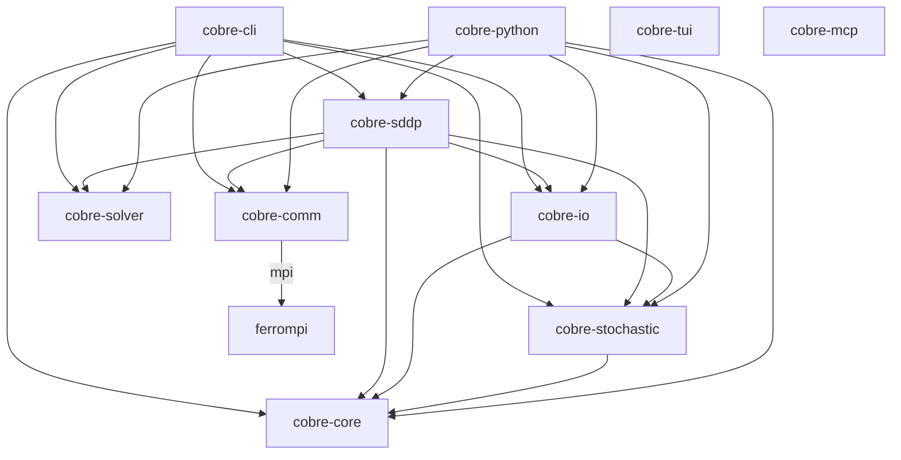

# Implementation Ordering

## 1. Purpose

This document bridges the Cobre specification corpus and the Rust implementation by defining a concrete crate-by-crate build sequence. It identifies the minimal viable SDDP solver -- the smallest subset of the full system that exercises every crate boundary and delivers a production-grade training + simulation binary -- and decomposes it into ordered phases where each phase produces a testable intermediate. Implementers should use this document alongside the [Cross-Reference Index](../cross-reference-index.md) to determine what to build, in what order, and which specs to read at each step.

## 2. Crate Dependency Graph

The following diagram shows the dependency relationships among all 11 crates (10 workspace crates + 1 external repository). Arrow direction is from dependent to dependency. Feature-gated edges are annotated with the required Cargo feature.


```mermaid
graph TD
    cli[cobre-cli] --> sddp[cobre-sddp]
    cli --> io[cobre-io]
    cli --> core[cobre-core]
    cli --> solver[cobre-solver]
    cli --> comm[cobre-comm]
    cli --> stochastic[cobre-stochastic]

    sddp --> core
    sddp --> stochastic
    sddp --> solver
    sddp --> comm
    sddp --> io

    io --> core
    io --> stochastic

    stochastic --> core

    comm -->|mpi| ferrompi[ferrompi]

    python[cobre-python] --> sddp
    python --> io
    python --> core
    python --> stochastic
    python --> solver
    python --> comm

    tui[cobre-tui]
    mcp[cobre-mcp]
```

**Notes on the graph:**

- `ferrompi` is a **separate repository**, not a workspace crate. It is consumed as a `path` or registry dependency by `cobre-comm` when the `mpi` feature is enabled.
- `cobre-comm` is a standalone crate with no workspace dependencies. Its only optional dependency is `ferrompi` (via the `mpi` feature).
- `cobre-mcp` and `cobre-tui` are **empty stubs** with no dependencies. They are workspace members reserved for future development.
- `cobre-python` is excluded from the workspace (built separately via maturin) but depends on the same set of crates as `cobre-cli`.
- `cobre-sddp` depends on `cobre-io` for output writing and stochastic artifact export.
- `cobre-io` depends on `cobre-stochastic` for PAR model types used in scenario loading.

## 3. Minimal Viable SDDP Solver Definition

The minimal viable solver satisfies the following eight stakeholder requirements:

1. **Full architecture, one variant per trait.** The solver instantiates the complete trait-parameterized architecture with exactly one variant for each abstraction point: Expectation (risk measure), Level-1 (cut selection), Finite (horizon mode), and InSample (sampling scheme). All five stopping rules are active as a composite set.
2. **Real crates, real boundaries.** All 11 crate boundaries from the [Crate Overview](https://cobre-rs.github.io/cobre/crates/overview.html) are respected. No functionality leaks across crate boundaries -- for example, `cobre-sddp` never touches files directly, and `cobre-solver` never generates scenarios.
3. **MPI-first production binary.** The solver ships as a single binary invoked via `mpiexec -n N cobre CASE_DIR`. No Python bindings, TUI, MCP server, TCP backend, or shared-memory backend are required.
4. **Minimal system elements.** Five element types are fully modeled: Buses, Lines, Thermals, Hydros, and Non-Controllable Sources (promoted from stub in v0.1.7). Remaining element types (Contracts, Pumping Stations) have code-path stubs that satisfy the type system but contribute no variables or constraints to the LP.
5. **Constant hydro productivity only.** The hydro production function uses a constant productivity coefficient $\rho_i$ (MW per m3/s). FPHA hyperplanes and head-dependent models are deferred.
6. **Single scenario input path.** Scenarios are loaded from Parquet files in the case directory following the PAR(p) model specification. PAR parameter fitting from historical data, external scenario injection, and historical replay are deferred.
7. **Training + simulation + parallel + reproducibility.** Both the training loop and the simulation pipeline are implemented, distributed across MPI ranks, and produce deterministic results given the same inputs and random seed, independently on the number of ranks and threads per rank.
8. **Full output chain.** Training convergence data and simulation results are written to Hive-partitioned Parquet output following the schemas in [Output Schemas](../data-model/output-schemas.md), with manifests and metadata as specified in [Output Infrastructure](../data-model/output-infrastructure.md).

## 4. Crates Required for Minimal Viable

| Crate                                                                         | Role in Minimal Viable                                                                                                             |
| ----------------------------------------------------------------------------- | ---------------------------------------------------------------------------------------------------------------------------------- |
| [`cobre-core`](https://cobre-rs.github.io/cobre/crates/core.html)             | In-memory data model: entity registries (Bus, Line, Thermal, Hydro), internal structures, penalty resolution, topology validation  |
| [`cobre-io`](https://cobre-rs.github.io/cobre/crates/io.html)                 | Input loading (case directory, JSON registries, Parquet scenarios), output writing (Hive-partitioned Parquet, manifests, metadata) |
| [`cobre-stochastic`](https://cobre-rs.github.io/cobre/crates/stochastic.html) | PAR(p) preprocessing, correlated noise generation, opening tree construction, InSample forward sampling                            |
| [`cobre-solver`](https://cobre-rs.github.io/cobre/crates/solver.html)         | LP solver abstraction with HiGHS backend, solver workspaces, basis warm-starting, cut injection                                    |
| [`cobre-sddp`](https://cobre-rs.github.io/cobre/crates/sddp.html)             | SDDP training loop (forward/backward pass, cut generation, convergence monitoring), simulation pipeline, FCF management            |
| [`cobre-comm`](https://cobre-rs.github.io/cobre/crates/comm.html)             | Communicator trait with MPI backend (via ferrompi), collective operations for cut sync and bound aggregation                       |
| [`cobre-cli`](https://cobre-rs.github.io/cobre/crates/cli.html)               | Binary entrypoint, execution lifecycle (startup through finalize), exit codes, config resolution                                   |
| [`ferrompi`](https://cobre-rs.github.io/cobre/crates/ferrompi.html)           | Safe MPI bindings: collectives (allgatherv, allreduce, broadcast), SharedWindow, topology detection                                |

**Deferred crates** (not required for minimal viable):

| Crate                                                                 | Reason Deferred                                                                           |
| --------------------------------------------------------------------- | ----------------------------------------------------------------------------------------- |
| [`cobre-python`](https://cobre-rs.github.io/cobre/crates/python.html) | PyO3 bindings are a secondary interface; MPI-first binary is the primary deliverable      |
| [`cobre-tui`](https://cobre-rs.github.io/cobre/crates/tui.html)       | Terminal UI is a monitoring convenience; convergence data is available via Parquet output |
| [`cobre-mcp`](https://cobre-rs.github.io/cobre/crates/mcp.html)       | MCP server is an agent-composability interface; not required for HPC batch execution      |

## 5. Implementation Phases

Each phase produces a testable intermediate. Phases are ordered so that every dependency is satisfied before a phase begins.

### Phase 1: cobre-core -- Data Model and Registries

| Attribute                 | Value                                                                                                                                                                                                                                                                                                                                                                                                                                                                                                                                             |
| ------------------------- | ------------------------------------------------------------------------------------------------------------------------------------------------------------------------------------------------------------------------------------------------------------------------------------------------------------------------------------------------------------------------------------------------------------------------------------------------------------------------------------------------------------------------------------------------- |
| **Crates**                | `cobre-core`                                                                                                                                                                                                                                                                                                                                                                                                                                                                                                                                      |
| **What becomes testable** | Entity creation (Bus, Line, Thermal, Hydro), entity registry population, topology validation (bus-connectivity, cascade ordering), three-tier penalty resolution (global/entity/stage), canonical ID ordering, internal structure construction                                                                                                                                                                                                                                                                                                    |
| **Blocked by**            | Nothing -- this is the foundation crate with no in-workspace dependencies                                                                                                                                                                                                                                                                                                                                                                                                                                                                         |
| **Spec reading list**     | [Notation Conventions](../overview/notation-conventions.md), [Hydro Production Models](../math/hydro-production-models.md), [Design Principles](../overview/design-principles.md), [Input System Entities](../data-model/input-system-entities.md), [Input Hydro Extensions](../data-model/input-hydro-extensions.md), [Penalty System](../data-model/penalty-system.md), [Internal Structures](../data-model/internal-structures.md), [System Elements](../math/system-elements.md), [Equipment Formulations](../math/equipment-formulations.md) |

### Phase 2: cobre-io -- Input Loading and Validation

| Attribute                 | Value                                                                                                                                                                                                                                                                                                                                                                                                                                                                                                                                                                            |
| ------------------------- | -------------------------------------------------------------------------------------------------------------------------------------------------------------------------------------------------------------------------------------------------------------------------------------------------------------------------------------------------------------------------------------------------------------------------------------------------------------------------------------------------------------------------------------------------------------------------------- |
| **Crates**                | `cobre-io` (depends on `cobre-core`)                                                                                                                                                                                                                                                                                                                                                                                                                                                                                                                                             |
| **What becomes testable** | Load a case directory into internal structures: JSON config parsing, JSON entity registry deserialization, Parquet scenario loading, five-layer validation pipeline (structural, schema, referential integrity, dimensional consistency, semantic), error collection and reporting                                                                                                                                                                                                                                                                                               |
| **Blocked by**            | Phase 1 (`cobre-core` entity types and internal structures)                                                                                                                                                                                                                                                                                                                                                                                                                                                                                                                      |
| **Spec reading list**     | [Input Directory Structure](../data-model/input-directory-structure.md), [Input Scenarios](../data-model/input-scenarios.md), [Input Constraints](../data-model/input-constraints.md), [Output Schemas](../data-model/output-schemas.md), [Output Infrastructure](../data-model/output-infrastructure.md), [Binary Formats](../data-model/binary-formats.md), [Validation Architecture](../architecture/validation-architecture.md), [Input Loading Pipeline](../architecture/input-loading-pipeline.md), [Configuration Reference](../configuration/configuration-reference.md) |

### Phase 3: ferrompi + cobre-solver -- MPI Bindings and LP Solver

| Attribute                 | Value                                                                                                                                                                                                                                                                                                                                                                                                                                                                                                                                                                                                                                                                                                                                                                     |
| ------------------------- | ------------------------------------------------------------------------------------------------------------------------------------------------------------------------------------------------------------------------------------------------------------------------------------------------------------------------------------------------------------------------------------------------------------------------------------------------------------------------------------------------------------------------------------------------------------------------------------------------------------------------------------------------------------------------------------------------------------------------------------------------------------------------- |
| **Crates**                | `ferrompi` (separate repository), `cobre-solver` (standalone; no workspace dependencies)                                                                                                                                                                                                                                                                                                                                                                                                                                                                                                                                                                                                                                                                                  |
| **What becomes testable** | `ferrompi`: MPI init/finalize, allreduce, allgatherv, broadcast, barrier, SharedWindow creation, topology detection. `cobre-solver`: load a stage LP into HiGHS, solve, extract primals/duals/reduced costs, warm-start from basis, add cut rows via batch `addRows`                                                                                                                                                                                                                                                                                                                                                                                                                                                                                                      |
| **Blocked by**            | Nothing -- `cobre-solver` has no workspace dependencies (LP layout types are defined in `cobre-solver` itself). `ferrompi` has no in-workspace dependencies. Both can be developed in parallel with Phases 1-2                                                                                                                                                                                                                                                                                                                                                                                                                                                                                                                                                            |
| **Spec reading list**     | `ferrompi`: [Hybrid Parallelism](../hpc/hybrid-parallelism.md), [Communication Patterns](../hpc/communication-patterns.md), [Shared Memory Aggregation](../hpc/shared-memory-aggregation.md), [Synchronization](../hpc/synchronization.md). `cobre-solver`: [Solver Abstraction](../architecture/solver-abstraction.md), [Solver Interface Trait](../architecture/solver-interface-trait.md), [Solver Interface Testing](../architecture/solver-interface-testing.md), [Solver HiGHS Implementation](../architecture/solver-highs-impl.md), [Solver Workspaces](../architecture/solver-workspaces.md), [LP Formulation](../math/lp-formulation.md), [Memory Architecture](../hpc/memory-architecture.md), [Solver CLP Implementation](../architecture/solver-clp-impl.md) |

### Phase 4: cobre-comm -- Communication Backend Abstraction

| Attribute                 | Value                                                                                                                                                                                                                                                                                                                   |
| ------------------------- | ----------------------------------------------------------------------------------------------------------------------------------------------------------------------------------------------------------------------------------------------------------------------------------------------------------------------- |
| **Crates**                | `cobre-comm` (optionally depends on `ferrompi` via `mpi` feature; no workspace dependencies)                                                                                                                                                                                                                            |
| **What becomes testable** | `Communicator` trait with MPI backend: multi-rank allreduce (Sum, Min, Max), allgatherv with variable-length buffers, broadcast from root, barrier synchronization. `LocalCommunicator` for single-process testing. Backend selection factory (`create_communicator()`). Integration test: 4-rank allgatherv round-trip |
| **Blocked by**            | Phase 3 (`ferrompi` provides the MPI primitives that `MpiCommunicator` wraps)                                                                                                                                                                                                                                           |
| **Spec reading list**     | [Communicator Trait](../hpc/communicator-trait.md), [Backend Selection](../hpc/backend-selection.md), [Backend: Ferrompi](../hpc/backend-ferrompi.md), [Backend: Local](../hpc/backend-local.md), [Backend Testing](../hpc/backend-testing.md)                                                                          |

### Phase 5: cobre-stochastic -- Scenario Generation

| Attribute                 | Value                                                                                                                                                                                                                                                                                                                                                                   |
| ------------------------- | ----------------------------------------------------------------------------------------------------------------------------------------------------------------------------------------------------------------------------------------------------------------------------------------------------------------------------------------------------------------------- |
| **Crates**                | `cobre-stochastic` (depends on `cobre-core`)                                                                                                                                                                                                                                                                                                                            |
| **What becomes testable** | PAR(p) parameter preprocessing (reverse-standardization, contiguous layout), Cholesky-factored correlated noise generation, opening tree construction (fixed discrete realizations with probabilities), InSample forward sampling, reproducible scenario generation given a seed                                                                                        |
| **Blocked by**            | Phase 1 (`cobre-core` internal structures for AR model parameters). Can proceed in parallel with Phases 3-4                                                                                                                                                                                                                                                             |
| **Spec reading list**     | [Scenario Generation](../architecture/scenario-generation.md), [PAR Inflow Model](../math/par-inflow-model.md), [Inflow Non-Negativity](../math/inflow-nonnegativity.md), [Sampling Scheme Trait](../architecture/sampling-scheme-trait.md), [Sampling Scheme Testing](../architecture/sampling-scheme-testing.md), [Input Scenarios](../data-model/input-scenarios.md) |

### Phase 6: cobre-sddp Training -- Forward/Backward Pass and Cuts

| Attribute                 | Value                                                                                                                                                                                                                                                                                                                                                                                                                                                                                                                                                                                                                                                                                                                                                                                                                                                                                                                                                                                                                                                                                                                                                                                                                                                                                         |
| ------------------------- | --------------------------------------------------------------------------------------------------------------------------------------------------------------------------------------------------------------------------------------------------------------------------------------------------------------------------------------------------------------------------------------------------------------------------------------------------------------------------------------------------------------------------------------------------------------------------------------------------------------------------------------------------------------------------------------------------------------------------------------------------------------------------------------------------------------------------------------------------------------------------------------------------------------------------------------------------------------------------------------------------------------------------------------------------------------------------------------------------------------------------------------------------------------------------------------------------------------------------------------------------------------------------------------------- |
| **Crates**                | `cobre-sddp` (depends on `cobre-core`, `cobre-stochastic`, `cobre-solver`, `cobre-comm`)                                                                                                                                                                                                                                                                                                                                                                                                                                                                                                                                                                                                                                                                                                                                                                                                                                                                                                                                                                                                                                                                                                                                                                                                      |
| **What becomes testable** | Stage LP construction from internal structures, forward pass (sample scenarios, solve stage LPs, record visited states), backward pass (evaluate openings, extract duals, compute cut coefficients $\alpha_t^k$ and $\beta_t^k$, aggregate single-cut), cut synchronization via allgatherv, convergence monitoring (lower bound, statistical upper bound, gap, all 5 stopping rules), FCF management (pre-allocated cut pool, Level-1 selection, activity tracking). Integration test: train a 3-bus, 2-hydro, 1-thermal, 12-stage case on 4 MPI ranks until convergence                                                                                                                                                                                                                                                                                                                                                                                                                                                                                                                                                                                                                                                                                                                      |
| **Blocked by**            | Phases 1-5 (all four dependency crates must be testable)                                                                                                                                                                                                                                                                                                                                                                                                                                                                                                                                                                                                                                                                                                                                                                                                                                                                                                                                                                                                                                                                                                                                                                                                                                      |
| **Spec reading list**     | [SDDP Algorithm](../math/sddp-algorithm.md), [LP Formulation](../math/lp-formulation.md), [Block Formulations](../math/block-formulations.md), [Discount Rate](../math/discount-rate.md), [Cut Management](../math/cut-management.md), [Risk Measures](../math/risk-measures.md), [Stopping Rules](../math/stopping-rules.md), [Upper Bound Evaluation](../math/upper-bound-evaluation.md), [Training Loop](../architecture/training-loop.md), [Convergence Monitoring](../architecture/convergence-monitoring.md), [Cut Management Implementation](../architecture/cut-management-impl.md), [Work Distribution](../hpc/work-distribution.md), [Synchronization](../hpc/synchronization.md), [Risk Measure Trait](../architecture/risk-measure-trait.md), [Risk Measure Testing](../architecture/risk-measure-testing.md), [Horizon Mode Trait](../architecture/horizon-mode-trait.md), [Horizon Mode Testing](../architecture/horizon-mode-testing.md), [Cut Selection Strategy Trait](../architecture/cut-selection-trait.md), [Cut Selection Testing](../architecture/cut-selection-testing.md), [Stopping Rule Trait](../architecture/stopping-rule-trait.md), [Stopping Rule Testing](../architecture/stopping-rule-testing.md), [Extension Points](../architecture/extension-points.md) |

### Phase 7: cobre-sddp Simulation + cobre-io Output

| Attribute                 | Value                                                                                                                                                                                                                                                                                                                                                                                                                                                                                                                                   |
| ------------------------- | --------------------------------------------------------------------------------------------------------------------------------------------------------------------------------------------------------------------------------------------------------------------------------------------------------------------------------------------------------------------------------------------------------------------------------------------------------------------------------------------------------------------------------------- |
| **Crates**                | `cobre-sddp` (simulation pipeline), `cobre-io` (output writing)                                                                                                                                                                                                                                                                                                                                                                                                                                                                         |
| **What becomes testable** | Simulation pipeline: replay trained FCF on a large scenario set distributed across MPI ranks, solve stage LP sequence per scenario, stream per-scenario results. Output pipeline: Hive-partitioned Parquet writes (convergence, simulation results), manifest files for crash recovery, metadata dictionaries (variable catalog, entity catalog, scenario codebook). FlatBuffers serialization of FCF cuts for checkpoint/resume. Integration test: full train + simulate cycle on 4 ranks, verify output Parquet schema and row counts |
| **Blocked by**            | Phase 6 (trained FCF is the input to simulation)                                                                                                                                                                                                                                                                                                                                                                                                                                                                                        |
| **Spec reading list**     | [Simulation Architecture](../architecture/simulation-architecture.md), [Output Schemas](../data-model/output-schemas.md), [Output Infrastructure](../data-model/output-infrastructure.md), [Binary Formats](../data-model/binary-formats.md), [Checkpointing](../hpc/checkpointing.md), [Production Scale Reference](../overview/production-scale-reference.md)                                                                                                                                                                         |

### Phase 8: cobre-cli -- Lifecycle, Configuration, Exit Codes

| Attribute                 | Value                                                                                                                                                                                                                                                                                                                                                                                                    |
| ------------------------- | -------------------------------------------------------------------------------------------------------------------------------------------------------------------------------------------------------------------------------------------------------------------------------------------------------------------------------------------------------------------------------------------------------- |
| **Crates**                | `cobre-cli` (depends on `cobre-sddp`, `cobre-io`, `cobre-core`, `cobre-solver`, `cobre-comm`, `cobre-stochastic`)                                                                                                                                                                                                                                                                                        |
| **What becomes testable** | Full execution lifecycle: MPI initialization, command-line parsing, config resolution from `config.json`, rank-0 validation pipeline, data broadcast to worker ranks, training phase, simulation phase, finalization. Exit code scheme (0-5 + signal codes). `--validate-only` mode. Integration test: `mpiexec -n N cobre CASE_DIR` produces expected output directory structure with correct exit code |
| **Blocked by**            | Phases 6-7 (training and simulation must be functional)                                                                                                                                                                                                                                                                                                                                                  |
| **Spec reading list**     | [CLI and Lifecycle](../architecture/cli-and-lifecycle.md), [Configuration Reference](../configuration/configuration-reference.md), [Validation Architecture](../architecture/validation-architecture.md), [SLURM Deployment](../hpc/slurm-deployment.md), [Structured Output](../interfaces/structured-output.md), [Ecosystem Guidelines](../overview/ecosystem-guidelines.md)                           |

### Phase Dependency Summary

```
Phase 1 (core) ──────┬──> Phase 2 (io) ────────────────────────────────────────┐
                      │                                                        │
                      └──> Phase 5 (stochastic) ──────────────────────────┐    │
                                                                          │    │
Phase 3 (ferrompi + solver) ──> Phase 4 (comm) ───────────────────────┐  │    │
                                                                      │  │    │
                                                                      v  v    v
                                                                 Phase 6 (sddp training)
                                                                      │
                                                                      v
                                                                 Phase 7 (simulation + output)
                                                                      │
                                                                      v
                                                                 Phase 8 (cli)
```

## 6. Trait Variant Selection

Each trait abstraction point is instantiated with exactly one variant for the minimal viable solver. The table below maps traits to their selected variants, with the spec file defining the trait contract.

| Trait                  | Minimal Variant   | Rationale                                                                                                    | Spec File                                                              |
| ---------------------- | ----------------- | ------------------------------------------------------------------------------------------------------------ | ---------------------------------------------------------------------- |
| `RiskMeasure`          | Expectation       | Risk-neutral aggregation $\mathbb{E}[\cdot]$; simplest correct baseline                                      | [Risk Measure Trait](../architecture/risk-measure-trait.md)            |
| `CutSelectionStrategy` | Level-1           | Keeps cuts active at least once; preserves finite convergence while controlling pool growth                  | [Cut Selection Strategy Trait](../architecture/cut-selection-trait.md) |
| `HorizonMode`          | Finite            | Linear stage chain $t \in \{1, \ldots, T\}$ with zero terminal value $V_{T+1}(\cdot) = 0$                    | [Horizon Mode Trait](../architecture/horizon-mode-trait.md)            |
| `SamplingScheme`       | InSample          | Forward samples drawn from the same opening tree used in the backward pass                                   | [Sampling Scheme Trait](../architecture/sampling-scheme-trait.md)      |
| `StoppingRule`         | All 5 (composite) | IterationLimit + TimeLimit + BoundStalling + SimulationBased + GracefulShutdown composed via StoppingRuleSet | [Stopping Rule Trait](../architecture/stopping-rule-trait.md)          |
| `SolverInterface`      | HiGHS             | Open-source, high-performance LP solver with C API; dual simplex supports warm-starting                      | [Solver Interface Trait](../architecture/solver-interface-trait.md)    |
| `Communicator`         | MPI (ferrompi)    | Production backend for distributed HPC execution via `mpiexec`                                               | [Communicator Trait](../hpc/communicator-trait.md)                     |

**Implemented beyond minimal viable** (delivered post-v0.1.0):

- `RiskMeasure::CVaR` -- risk-averse aggregation via EAVaR convex combination (delivered in v0.1.1)
- `CutSelectionStrategy::LML1` -- Limited Memory Level 1 (delivered in v0.2.0)

**Deferred variants** (not yet implemented):

- `HorizonMode::Cyclic` -- infinite horizon with discount factor
- `SamplingScheme::External` and `SamplingScheme::Historical` -- alternative scenario sources
- `SolverInterface::CLP` -- alternative open-source LP backend
- `Communicator::Tcp`, `Communicator::Shm` -- non-MPI backends

## 7. System Element Scope

The solver fully models five element types and provides code-path stubs for two deferred types. Stubs satisfy the type system and appear in entity registries, but they contribute zero variables and zero constraints to the stage LP.

| Element          | Status       | Notes                                                                                                                                                                                |
| ---------------- | ------------ | ------------------------------------------------------------------------------------------------------------------------------------------------------------------------------------ |
| Bus              | Full         | Network topology nodes. Power balance constraint per bus per block.                                                                                                                  |
| Line             | Full         | Transmission links between buses. Flow variable with MW capacity bounds.                                                                                                             |
| Thermal          | Full         | Dispatchable generation. Generation variable with MW bounds and cost coefficient.                                                                                                    |
| Hydro            | Full         | Reservoir storage, turbined outflow, spillage. Constant productivity and FPHA (precomputed + computed from geometry). Evaporation linearization, water withdrawal, cascade coupling. |
| Contract         | Stub (NO-OP) | Entity type exists in `cobre-core` registry. Code path in LP construction is reached but adds no variables or constraints.                                                           |
| Pumping Station  | Stub (NO-OP) | Entity type exists in `cobre-core` registry. Code path in LP construction is reached but adds no variables or constraints.                                                           |
| Non-Controllable | Full         | Generation variable bounded by stochastic availability factor (from `non_controllable_stats.parquet`), block factor scaling, curtailment penalty.                                    |

**Why stubs, not omissions:** Requirement 2 (real crate boundaries) demands that `cobre-core` defines all entity types from the start, and `cobre-sddp` LP construction iterates over all element types. Stubs ensure the iteration code path exists and is tested even when no entities of a given type are present in the case data. This avoids "first-time integration" surprises when full formulations are added later.

## 8. Cross-References

| Target                                                                  | Relevance                                                               |
| ----------------------------------------------------------------------- | ----------------------------------------------------------------------- |
| [Crate Overview](https://cobre-rs.github.io/cobre/crates/overview.html) | Canonical dependency graph and crate responsibilities                   |
| [Cross-Reference Index](../cross-reference-index.md)                    | Per-crate reading lists and spec-to-crate mappings (sections 1-2)       |
| [Training Loop](../architecture/training-loop.md)                       | Iteration lifecycle, forward/backward pass architecture, event emission |
| [Simulation Architecture](../architecture/simulation-architecture.md)   | Policy evaluation pipeline, scenario distribution, output streaming     |
| [CLI and Lifecycle](../architecture/cli-and-lifecycle.md)               | Execution phases, exit codes, config resolution, MPI initialization     |
| [Risk Measure Trait](../architecture/risk-measure-trait.md)             | Expectation variant selected for minimal viable                         |
| [Cut Selection Strategy Trait](../architecture/cut-selection-trait.md)  | Level-1 variant selected for minimal viable                             |
| [Horizon Mode Trait](../architecture/horizon-mode-trait.md)             | Finite variant selected for minimal viable                              |
| [Sampling Scheme Trait](../architecture/sampling-scheme-trait.md)       | InSample variant selected for minimal viable                            |
| [Stopping Rule Trait](../architecture/stopping-rule-trait.md)           | All 5 rules composed via StoppingRuleSet                                |
| [Solver Interface Trait](../architecture/solver-interface-trait.md)     | HiGHS variant selected for minimal viable                               |
| [Communicator Trait](../hpc/communicator-trait.md)                      | MPI backend via ferrompi selected for minimal viable                    |
| [Backend Selection](../hpc/backend-selection.md)                        | Feature flag mechanism for compile-time backend selection               |
| [Configuration Reference](../configuration/configuration-reference.md)  | `config.json` and `stages.json` schema definitions                      |
| [How to Use This Specification](./spec-usage-guide.md)                  | Abstraction boundary between specs and implementation; worked example   |

## 9. Minimum Viable Reading List

The 10 specs below are the entry point for any developer starting on the Cobre implementation. They are ordered by conceptual dependency: conventions and notation first, then mathematical foundations, then data model, then architecture, then HPC execution model. After reading these 10 files, a developer has the context needed to understand behavioral contracts across all crates and to draft implementation tickets for any phase.

1. [Design Principles](../overview/design-principles.md) — Format selection criteria, declaration-order invariance, and agent-readability rules that govern every spec in the corpus.
2. [Notation Conventions](../overview/notation-conventions.md) — Mathematical notation used throughout all math and architecture specs; establish this vocabulary before reading anything else.
3. [SDDP Algorithm](../math/sddp-algorithm.md) — The core algorithm: forward/backward passes, cut generation, state transitions, and convergence — the mathematical heart of Cobre.
4. [LP Formulation](../math/lp-formulation.md) — Stage LP structure, variable layout, constraint categories, and dual variable semantics — defines what the solver must solve at each stage.
5. [Internal Structures](../data-model/internal-structures.md) — `SystemRepresentation`, `StageTemplate`, LP variable layout, and the in-memory data model shared across all crates.
6. [Training Loop](../architecture/training-loop.md) — Iteration lifecycle, forward/backward pass orchestration, `TrajectoryRecord`, state management, and event emission.
7. [Solver Interface Trait](../architecture/solver-interface-trait.md) — LP solver abstraction, dispatch mechanism, error contracts, warm-start protocol, and dual normalization guarantee.
8. [Communicator Trait](../hpc/communicator-trait.md) — Communication abstraction, collective operations, thread-safety contract, and backend interchangeability.
9. [Hybrid Parallelism](../hpc/hybrid-parallelism.md) — MPI+threads execution model, rank/thread topology, rayon integration, and NUMA placement strategy.
10. [Implementation Ordering](../overview/implementation-ordering.md) (this document, sections 1–8) — Build sequence, phase dependencies, minimal viable solver definition, and trait variant selection.

For phase-specific deep dives, consult the per-phase reading lists in section 5. For an overview of the abstraction boundary between specs and implementation planning, see [How to Use This Specification](./spec-usage-guide.md).
